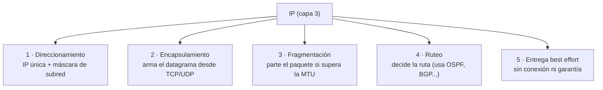

# 08 · Protocolo de capa 3 — Internet Protocol (IP)

> 🧩 **Guía de estudio para llegar a la clase con el tema masticado.**
> Basada en la PPT 08 de la cátedra (*Protocolo Capa 3 — Internet Protocol*) y el temario del plan de estudios.

---

## 🎯 En una frase

**IP** es el protocolo de **capa 3 (red)** que le pone una **dirección** a cada dispositivo y **enruta** los paquetes entre redes distintas; lo hace **sin conexión** y **sin garantías** ("best effort"), por eso cuando hace falta fiabilidad se apoya en **TCP** por encima.

---

## 🧭 ¿Por qué importa / dónde encaja?

IP es **el corazón de Internet**: es lo que hace que redes heterogéneas (Wi-Fi, fibra, satélite) se entiendan como una sola. Es el tema central de la materia y la base de las clases que siguen (enrutamiento, TCP/UDP). Todo lo anterior (medios, capa 2) existía; IP es lo que lo **unificó**.

---

## 💡 La idea con una analogía

IP es el **sistema postal mundial**: cada casa tiene una **dirección única** (la IP), y los **carteros/oficinas** (routers) van pasando el sobre de mano en mano, cada uno decidiendo **hacia dónde sigue** mirando la dirección de destino. El correo **no te garantiza** que la carta llegue ni en qué orden (best effort) — si querés certeza de entrega, mandás una carta certificada con acuse de recibo: **eso es TCP**.

---

## 🗺️ Las 5 funciones de IP

---

## 📊 Conceptos clave

### Qué hace IP

| Función | En criollo |
| --- | --- |
| **Direccionamiento** | Le da una IP única a cada dispositivo; con la **máscara** define qué parte es red y qué parte host |
| **Encapsulamiento** | Recibe datos de TCP/UDP y los mete en un **datagrama IP** |
| **Fragmentación** | Si el paquete supera la **MTU** del enlace (Ethernet: 1500 bytes), lo parte en fragmentos |
| **Ruteo** | Decide por dónde mandar el paquete usando tablas de enrutamiento |
| **Best effort** | **No garantiza** entrega, orden ni integridad → por eso existe TCP |

### IP pública vs. privada

| | Pública | Privada |
| --- | --- | --- |
| Alcance | Única a nivel **mundial**, visible en Internet | Solo dentro de la **LAN** (oficina, casa) |
| Ejemplo de uso | Un servidor web | Tu PC en la red de casa (se conecta afuera vía NAT/VPN) |

### Un poco de historia (para el "por qué")

- Años 70: hacía falta interconectar redes heterogéneas → **internetworking**.
- **1973**: Cerf y Kahn crean **TCP**; en **1978** se separa en **TCP** (transporte, garantiza) + **IP** (red, direcciona/enruta).
- **1981**: se publica **IPv4** (RFC 791). El **1/1/1983** ARPANET adopta TCP/IP → nace Internet.

### IP sobre otras capas (encapsulamiento)

IP puede viajar sobre distintas tecnologías de capas inferiores:
- **IP/MPLS**: agrega una **etiqueta** para reenvío rápido sin mirar la IP (VPNs, ingeniería de tráfico).
- **IP/ATM**: sobre celdas de 53 bytes (con adaptación AAL5).
- **IP/POS** (Packet over SONET/SDH): IP directo sobre fibra óptica, mínimo overhead (backbones).

### Peering y tránsito

- **Peering**: dos redes intercambian tráfico **directamente** (relación entre iguales, sin pagar a un tercero) → reduce costo y mejora rendimiento.
- **Tránsito**: le pagás a un ISP para que transporte tu tráfico al resto de Internet.

---

## ❓ Preguntas para autoevaluarte

1. ¿Por qué se dice que IP es "sin conexión" y "best effort"? ¿Qué protocolo cubre esa falta de garantía?
2. ¿Para qué sirve la **máscara de subred**?
3. ¿Qué es la **fragmentación** y cuándo ocurre? (pista: MTU)
4. Diferenciá **IP pública** de **IP privada**.
5. ¿Qué aporta **MPLS** al reenvío de paquetes IP?
6. ¿Qué diferencia hay entre **peering** y **tránsito** IP?

---

## 📌 Qué prestar atención en la clase

- Las **5 funciones de IP**: son el esqueleto de la clase.
- La idea de **best effort** y por qué obliga a TCP (enlaza con la próxima clase de TCP/UDP).
- **Pública vs privada** y cómo se sale a Internet.
- No te pierdas en MPLS/ATM/POS: alcanza con saber que **IP puede encapsularse sobre varias capas 2/1**.

---

⚙️ Guía basada en la PPT 08 de la cátedra (Volpi / Giorgi / Llasat).
