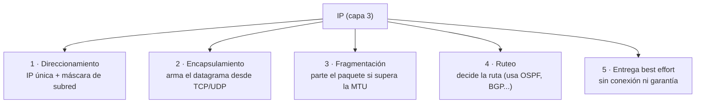
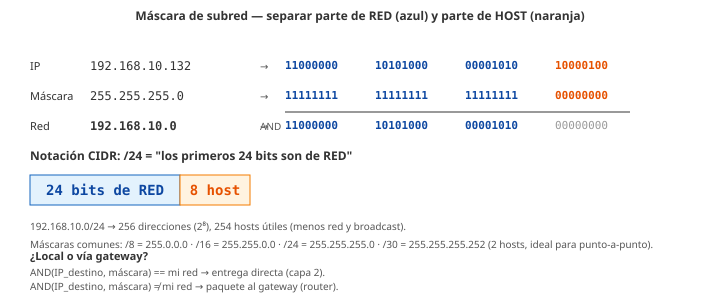

# 08 · Protocolo de capa 3 — Internet Protocol (IP)

> 🧩 **Guía de estudio para llegar a la clase con el tema masticado.**
> Basada en la PPT 08 de la cátedra (*Protocolo Capa 3 — Internet Protocol*) y el temario del plan de estudios.

---

## 🎯 En una frase

**IP** es el protocolo de **capa 3 (red)** que le pone una **dirección** a cada dispositivo y **enruta** los paquetes entre redes distintas; lo hace **sin conexión** y **sin garantías** ("best effort"), por eso cuando hace falta fiabilidad se apoya en **TCP** por encima.

---

## 🧭 ¿Por qué importa / dónde encaja?

IP es **el corazón de Internet**: es lo que hace que redes heterogéneas (Wi-Fi, fibra, satélite) se entiendan como una sola. Es el tema central de la materia y la base de las clases que siguen (enrutamiento, TCP/UDP). Todo lo anterior (medios, capa 2) existía; IP es lo que lo **unificó**.

---

## 💡 La idea con una analogía

IP es el **sistema postal mundial**: cada casa tiene una **dirección única** (la IP), y los **carteros/oficinas** (routers) van pasando el sobre de mano en mano, cada uno decidiendo **hacia dónde sigue** mirando la dirección de destino. El correo **no te garantiza** que la carta llegue ni en qué orden (best effort) — si querés certeza de entrega, mandás una carta certificada con acuse de recibo: **eso es TCP**.

---

## 🗺️ Las 5 funciones de IP


```mermaid
flowchart TD
    A["IP (capa 3)"] --> B["1 · Direccionamiento<br/>IP única + máscara de subred"]
    A --> C["2 · Encapsulamiento<br/>arma el datagrama desde TCP/UDP"]
    A --> D["3 · Fragmentación<br/>parte el paquete si supera la MTU"]
    A --> E["4 · Ruteo<br/>decide la ruta (usa OSPF, BGP...)"]
    A --> F["5 · Entrega best effort<br/>sin conexión ni garantía"]
```

---

## 📊 Conceptos clave

### Qué hace IP

| Función | En criollo |
| --- | --- |
| **Direccionamiento** | Le da una IP única a cada dispositivo; con la **máscara** define qué parte es red y qué parte host |
| **Encapsulamiento** | Recibe datos de TCP/UDP y los mete en un **datagrama IP** |
| **Fragmentación** | Si el paquete supera la **MTU** del enlace (Ethernet: 1500 bytes), lo parte en fragmentos |
| **Ruteo** | Decide por dónde mandar el paquete usando tablas de enrutamiento |
| **Best effort** | **No garantiza** entrega, orden ni integridad → por eso existe TCP |

### Máscara y AND lógico (cae seguro en el parcial)



### IP pública vs. privada

| | Pública | Privada |
| --- | --- | --- |
| Alcance | Única a nivel **mundial**, visible en Internet | Solo dentro de la **LAN** (oficina, casa) |
| Ejemplo de uso | Un servidor web | Tu PC en la red de casa (se conecta afuera vía NAT/VPN) |

### Un poco de historia (para el "por qué")

- Años 70: hacía falta interconectar redes heterogéneas → **internetworking**.
- **1973**: Cerf y Kahn crean **TCP**; en **1978** se separa en **TCP** (transporte, garantiza) + **IP** (red, direcciona/enruta).
- **1981**: se publica **IPv4** (RFC 791). El **1/1/1983** ARPANET adopta TCP/IP → nace Internet.

### IP sobre otras capas (encapsulamiento)

IP puede viajar sobre distintas tecnologías de capas inferiores:
- **IP/MPLS**: agrega una **etiqueta** para reenvío rápido sin mirar la IP (VPNs, ingeniería de tráfico).
- **IP/ATM**: sobre celdas de 53 bytes (con adaptación AAL5).
- **IP/POS** (Packet over SONET/SDH): IP directo sobre fibra óptica, mínimo overhead (backbones).

**La regla general del encapsulamiento:** en cada capa, el **payload + overhead** de la capa de arriba pasa a ser el **payload** de la capa inmediata inferior, que le suma su propio overhead.

```
Capa 3 (Red)     [        Payload        | OH3 ]
Capa 2 (Enlace)  [        Payload              | OH2 ]
Capa 1 (Física)  [        Payload                    | OH1 ]
```

| | IP/MPLS | IP/ATM | IP/POS |
| --- | --- | --- | --- |
| **Qué agrega** | Una **etiqueta** (label) entre capa 2 y 3 | Adaptación **AAL5** → celdas de **53 bytes** (5 de encabezado + 48 de carga) | **PPP** (o HDLC) directo sobre SONET/SDH |
| **Ventaja** | Reenvío rápido sin mirar la IP; **label stack** para VPNs e ingeniería de tráfico | Celdas fijas, buen manejo de voz/datos | Overhead mínimo, sin MAC (es punto a punto), la fiabilidad la da SONET/SDH |
| **Costo** | — | Mantener circuitos virtuales (VPI/VCI), más gestión | — |
| **Dónde** | Núcleo de operadores | Operadores y acceso DSL (legacy) | Backbones de ISP (OC-3, OC-12, OC-48) |

> 💡 POS da **gestión de red** gracias a SONET/SDH; si la capa 3 se monta directo sobre **fibra oscura**, esa gestión se pierde.

### La cabecera IPv4 (los campos que importan)

| Campo | Para qué sirve |
| --- | --- |
| **Versión** (4 bits) | 4 para IPv4 |
| **IHL** (4 bits) | Largo de la cabecera (20 bytes sin opciones) |
| **Tipo de servicio** (ToS / DSCP) | Prioridad del paquete (QoS) |
| **Longitud total** (16 bits) | Cabecera + datos |
| **Identificación, flags y desplazamiento** | Para **fragmentar y reensamblar** según la MTU |
| **TTL** (Time To Live) | Cada router lo decrementa; al llegar a 0 se descarta → **evita bucles** infinitos |
| **Protocolo** | Qué hay adentro: **TCP = 6**, **UDP = 17**, **ICMP = 1** |
| **Checksum de cabecera** | Verifica la integridad **solo de la cabecera** |
| **IP de origen / destino** (32 bits c/u) | Quién manda y a quién va |

Ejemplos de direcciones: privada `192.168.1.10` · pública `8.8.8.8` · máscara `255.255.255.0` (/24) · red `192.168.1.0` · broadcast `192.168.1.255` · hosts usables `192.168.1.1`–`192.168.1.254`.

> ⚠️ **Límite de IPv4:** solo hay unas **4.300 millones** de direcciones (2³²). Por eso existe **NAT** (muchas IPs privadas salen por una pública) y se impulsa **IPv6**.

### ICMP — el protocolo de control de la capa 3

**ICMP** (*Internet Control Message Protocol*) **no transporta datos de usuario**: manda **mensajes de control y error** para diagnosticar la red. Es lo que usan `ping` y `traceroute`.

| Tipo | Mensaje | Cuándo aparece |
| --- | --- | --- |
| **8** | Echo Request | `ping` pregunta "¿estás ahí?" |
| **0** | Echo Reply | El destino responde "sí, estoy acá" |
| **3** | Destination Unreachable | El destino no se puede alcanzar |
| **11** | Time Exceeded | El **TTL llegó a 0** (traceroute se apoya en esto) |
| **5** | Redirect | Un router avisa que hay una ruta mejor |

### Peering y tránsito

- **Peering**: dos redes intercambian tráfico **directamente** (relación entre iguales, *peer* = par), normalmente **sin pagarse** entre sí → reduce costos, mejora la latencia y descongestiona enlaces internacionales. Se hace en un **IXP** (*Internet Exchange Point*), puede ser **público** (muchos participantes) o **privado**, y suele darse entre redes de **tamaño parecido**.
- **Tránsito**: le pagás a un proveedor de **mayor jerarquía** para que lleve tu tráfico **al resto de Internet**. Técnicamente:
  - Se intercambian rutas con **BGP**: el cliente anuncia su bloque de IPs públicas y el proveedor le anuncia **todas las rutas de Internet**.
  - Se cobra según el **ancho de banda** contratado (Mbps / Gbps).
  - El contrato tiene un **SLA**: disponibilidad, latencia, jitter y pérdida de paquetes.

> Peering, tránsito y **Sistemas Autónomos** siguen en la [guía 09](09%20-%20Enrutamiento%20est%C3%A1tico%20y%20din%C3%A1mico%20%28BGP%20y%20OSPF%29.md).

---

## ❓ Preguntas para autoevaluarte

1. ¿Por qué se dice que IP es "sin conexión" y "best effort"? ¿Qué protocolo cubre esa falta de garantía?
2. ¿Para qué sirve la **máscara de subred**?
3. ¿Qué es la **fragmentación** y cuándo ocurre? (pista: MTU)
4. Diferenciá **IP pública** de **IP privada**.
5. ¿Qué aporta **MPLS** al reenvío de paquetes IP?
6. ¿Qué diferencia hay entre **peering** y **tránsito** IP?
7. ¿Para qué sirve el campo **TTL**? ¿Qué mensaje ICMP se genera cuando llega a 0?
8. ¿Qué es **ICMP**? ¿Qué tipos de mensaje usa `ping`?
9. En la cabecera IPv4, ¿qué indica el campo **Protocolo**? ¿Qué valor tiene para TCP y para UDP?
10. Dada la red `192.168.1.0/24`, ¿cuál es la dirección de broadcast y cuál el rango de hosts?
11. ¿Por qué IPv4 obligó a usar **NAT** y a pensar en **IPv6**?
12. Explicá la regla general del **encapsulamiento** (payload + overhead) entre capas.

---

## 📌 Qué prestar atención en la clase

- Las **5 funciones de IP**: son el esqueleto de la clase.
- La idea de **best effort** y por qué obliga a TCP (enlaza con la próxima clase de TCP/UDP).
- **Pública vs privada** y cómo se sale a Internet.
- No te pierdas en MPLS/ATM/POS: alcanza con saber que **IP puede encapsularse sobre varias capas 2/1**.
- **ICMP** y los campos **TTL / Protocolo** de la cabecera: aparecen en la versión 2026 de la PPT.

---

<sub>⚙️ Guía basada en la PPT 08 de la cátedra (Volpi / Giorgi / Llasat) y en la versión ampliada de la clase #9 de la cursada 2026 (ICMP, cabecera IPv4, peering/tránsito, Sistemas Autónomos y routing).</sub>
