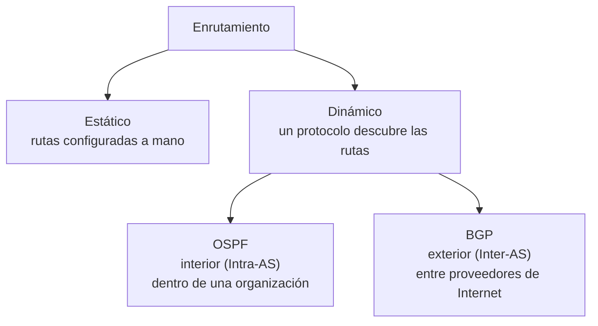

# 09 · Enrutamiento estático y dinámico (BGP y OSPF)

> 🧩 **Guía de estudio para llegar a la clase con el tema masticado.**
> Basada en el resumen de la clase del 07/11 (Ing. Giorgi) de la cátedra y el temario del plan de estudios.
> ⚠️ La PPT de esta clase todavía no está en el repo; esta guía sale del resumen de clase (ver [`../Resúmenes/`](../Res%C3%BAmenes/)).

---

## 🎯 En una frase

**Enrutar** es decidir por qué camino mandar un paquete hacia otra red: se puede hacer **a mano** (estático, seguro pero no escala) o dejar que un **protocolo lo descubra solo** (dinámico) — **OSPF** dentro de una organización y **BGP** entre proveedores de Internet.

---

## 🧭 ¿Por qué importa / dónde encaja?

Es lo que hace que Internet **funcione a escala**: sin enrutamiento dinámico, cada cambio de topología habría que configurarlo a mano en cada router. Fue la **última clase teórica** del cuatrimestre y cierra el bloque de capa 3 (después de IP).

---

## 💡 La idea con una analogía

- **Ruteo estático** = darle a alguien indicaciones escritas a mano: *"para ir a la sucursal, girá en tal esquina"*. Si se corta una calle, la persona **se queda trabada** porque nadie actualizó el papel.
- **Ruteo dinámico** = un **GPS (Waze)**: si una calle se corta, **recalcula** solo una ruta alternativa. Más cómodo, pero consume "batería" (CPU, memoria, ancho de banda) y "escucha" el tránsito de todos.

---

## 🗺️ El mapa del enrutamiento

---

## 📊 Conceptos clave

### Estático vs. dinámico

| | **Estático** | **Dinámico** |
| --- | --- | --- |
| Cómo | Rutas a mano en cada router | Un protocolo las descubre y anuncia solo |
| Seguridad | 🔒 Más seguro (solo anuncia lo configurado) | Menos seguro por defecto (se mitiga con ACLs/firewall) |
| Recursos | No consume CPU/memoria/BW extra | Consume CPU, memoria y ancho de banda |
| Escalabilidad | ❌ Tedioso, no escala | ✅ Automático; si se cae un enlace, **recalcula** |
| Diagnóstico | Fácil (la ruta es siempre la misma) | Más complejo |

### Los dos protocolos

| | **OSPF** | **BGP** |
| --- | --- | --- |
| Tipo | Interior (**Intra-AS**) | Exterior (**Inter-AS**) |
| Dónde | Dentro de una red corporativa/proveedor | Entre **Sistemas Autónomos** (distintos proveedores) |
| Es "el protocolo de…" | Redes internas grandes | **Internet** (conecta redes de distintos ISP) |

> 🔑 **AS (Sistema Autónomo)**: un conjunto de redes bajo una misma administración. **OSPF** enruta *dentro* de un AS; **BGP** enruta *entre* AS.

---

## ❓ Preguntas para autoevaluarte

1. ¿Cuándo conviene ruteo **estático** y cuándo **dinámico**? Nombrá una ventaja y una desventaja de cada uno.
2. ¿Qué diferencia hay entre **OSPF** y **BGP**? ¿Cuál usa Internet para conectar proveedores?
3. ¿Qué es un **Sistema Autónomo (AS)**?
4. Si se cae un enlace, ¿qué hace un protocolo de ruteo dinámico?
5. ¿Por qué el ruteo estático es "más seguro por defecto"?

---

## 📌 Qué prestar atención en la clase

- La distinción **interior (OSPF) vs. exterior (BGP)** y el concepto de **AS** — es el núcleo.
- El **trade-off** seguridad/recursos vs. escalabilidad entre estático y dinámico.
- Los **anuncios administrativos** de esa clase (recuperatorio, TP, modalidad del final) si aplican.
- 👉 Cuando consigas la **PPT 09**, sumala a `../Teoría (PPTs de la cátedra)/` y actualizamos esta guía.

---

⚙️ Guía basada en el resumen de la clase del 07/11 de la cátedra (Giorgi / Llasat). Falta la PPT oficial.
