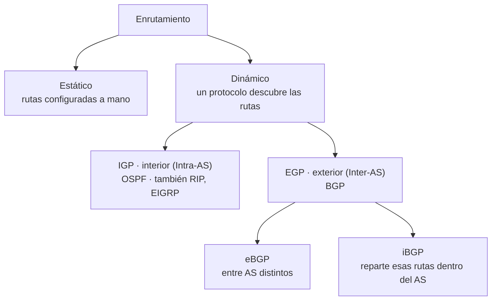
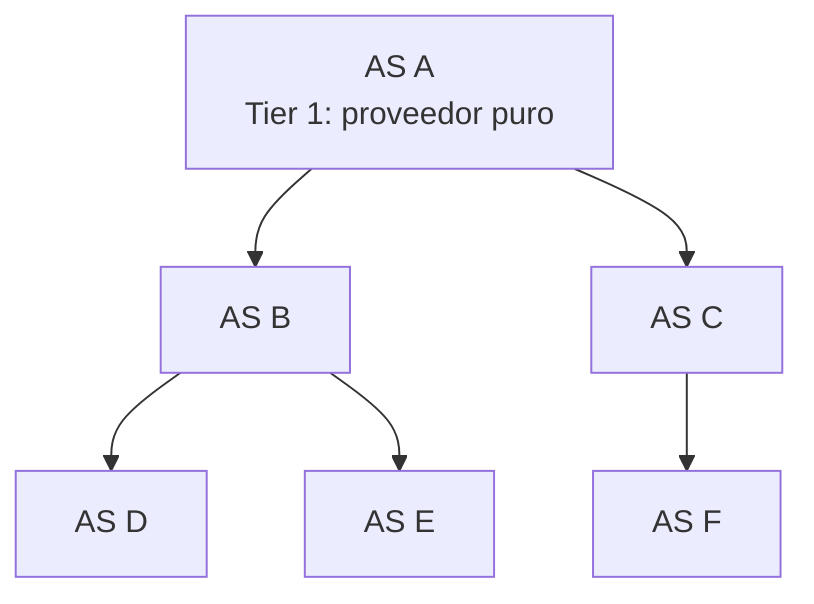
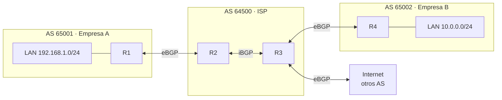

# 09 · Enrutamiento estático y dinámico (BGP y OSPF)

> 🧩 **Guía de estudio para llegar a la clase con el tema masticado.**
> Basada en la PPT de la clase #9 de la cursada 2026 (*Protocolo Capa 3 — Internet Protocol*: Sistemas Autónomos y Routing), el resumen de la clase de enrutamiento (Ing. Giorgi) y el temario del plan de estudios.

---

## 🎯 En una frase

**Enrutar** es decidir por qué camino mandar un paquete hacia otra red: se puede hacer **a mano** (estático, seguro pero no escala) o dejar que un **protocolo lo descubra solo** (dinámico). **OSPF** resuelve el camino **dentro** de un Sistema Autónomo y **BGP** intercambia rutas **entre** Sistemas Autónomos: así se arma Internet.

---

## 🧭 ¿Por qué importa / dónde encaja?

Es lo que hace que Internet **funcione a escala**: sin enrutamiento dinámico, cada cambio de topología habría que configurarlo a mano en cada router. Cierra el bloque de **capa 3**: la [guía 08](08%20-%20Protocolo%20de%20capa%203%20-%20Internet%20Protocol%20%28IP%29.md) explica **cómo** se direcciona un paquete y esta explica **por dónde** viaja.

> *Corolario de la cátedra:* sin enrutamiento los datos no sabrían cómo llegar a destino. Gracias a él podés usar un servicio cuyo servidor está en otra punta del mundo, y las redes pueden **crecer sin perder eficiencia**.

---

## 💡 La idea con una analogía

- **Ruteo estático** = darle a alguien indicaciones escritas a mano: *"para ir a la sucursal, girá en tal esquina"*. Si se corta una calle, la persona **se queda trabada** porque nadie actualizó el papel.
- **Ruteo dinámico** = un **GPS (Waze)**: si una calle se corta, **recalcula** solo una ruta alternativa. Más cómodo, pero consume "batería" (CPU, memoria, ancho de banda) y "escucha" el tránsito de todos.
- **OSPF vs. BGP** = el **GPS de tu ciudad** (conoce cada calle y busca el camino más corto) vs. los **acuerdos entre países** en la frontera (no buscan el camino más corto: deciden por **políticas** qué tráfico dejan pasar y por dónde).

---

## 🗺️ El mapa del enrutamiento

```mermaid
flowchart TD
    A["Enrutamiento"] --> B["Estático<br/>rutas configuradas a mano"]
    A --> C["Dinámico<br/>un protocolo descubre las rutas"]
    C --> D["IGP · interior (Intra-AS)<br/>OSPF · también RIP, EIGRP"]
    C --> E["EGP · exterior (Inter-AS)<br/>BGP"]
    E --> F["eBGP<br/>entre AS distintos"]
    E --> G["iBGP<br/>reparte esas rutas dentro del AS"]
```

---

## 📊 Conceptos clave

### Estático vs. dinámico

| | **Estático** | **Dinámico** |
| --- | --- | --- |
| Cómo | Rutas a mano en cada router (las carga un administrador) | Los routers **intercambian información** y actualizan sus tablas solos |
| Seguridad | 🔒 Más seguro (solo anuncia lo configurado) | Menos seguro por defecto (se mitiga con ACLs/firewall) |
| Recursos | No consume CPU/memoria/BW extra | Consume CPU, memoria y ancho de banda |
| Escalabilidad | ❌ Tedioso, no escala; no se actualiza si algo cambia | ✅ Automático; si se cae un enlace, **recalcula** |
| Ideal para | Redes **chicas** | Redes **grandes o complejas** |
| Diagnóstico | Fácil (la ruta es siempre la misma) | Más complejo |

### Sistemas Autónomos (AS)

Un **Sistema Autónomo** es un **conjunto de redes IP bajo una misma administración** y una misma **política de routing**.

- Cada AS tiene un número único: el **ASN** (ej. **AS15169** = Google, **AS27747** = Telecentro, **AS3269** = Telecom Italia).
- Tiene **independencia operativa**: administra sus propias rutas y direcciones IP, y decide con reglas propias cómo maneja el tráfico.
- Se conecta con otros AS por **peering** o **tránsito** (ver [guía 08](08%20-%20Protocolo%20de%20capa%203%20-%20Internet%20Protocol%20%28IP%29.md)), y los routers de AS distintos hablan **BGP**.
- Las direcciones IP y los ASN los asignan los **registros regionales (RIR)**: **ARIN** (Norteamérica), **LACNIC** (Latinoamérica y Caribe — el nuestro), **RIPE NCC** (Europa y Medio Oriente), **AfriNIC** (África) y **APNIC** (Asia-Pacífico).

| Tipo de AS | Qué hace | Ejemplos |
| --- | --- | --- |
| **Proveedor de servicios (ISP)** | Da conectividad a otros AS o a usuarios finales | Telecom Argentina, Movistar, IPLAN, Telecentro |
| **Contenido o empresa** | Organizaciones con muchísimo tráfico propio | Google, Facebook, Netflix |
| **Académico o institucional** | Universidades y redes científicas | Universidades nacionales |

**Jerarquía cliente → proveedor:** los AS chicos son **clientes** de los que tienen arriba, que a su vez son clientes de otros más grandes. En la cima están los **carriers de Tier 1** (ej. Level 3, Verizon), que son **proveedores sin ser clientes de nadie**.

```mermaid
flowchart TD
    A["AS A<br/>Tier 1: proveedor puro"] --> B["AS B"]
    A --> C["AS C"]
    B --> D["AS D"]
    B --> E["AS E"]
    C --> F["AS F"]
```

**Los AS más grandes del mundo** (ranking de la cátedra): Level 3 (AS3356), Cogent (AS174), NTT (AS2914, Japón), Google (AS15169), Facebook (AS32934), Amazon (AS16509), Microsoft (AS8075)… Casi todos de EE. UU.

**¿Qué le da visibilidad global a un AS?**
1. **Infraestructura global**: mucha capilaridad, data centers distribuidos y **PoPs** (puntos de presencia) → baja latencia y alta disponibilidad.
2. **Calidad de sus AS**: cantidad de prefijos IP anunciados, cantidad de peers y estabilidad de sus rutas.
3. **Participación en IXPs**: reduce los tiempos de tránsito entre redes.
4. **Métricas de visibilidad BGP**: herramientas como *CAIDA AS Rank* o *BGPStream* miden desde cuántos puntos se ve su actividad BGP.
5. **Uptime**: un SLA de **99,99%** o más indica una infraestructura resiliente.

> 🟢 **Ejemplo de la cátedra — Telecentro (AS27747):** un **peer BGP** es otro AS con el que se intercambian rutas **directamente** por sesiones BGP. Se hace por **redundancia**, para **mejorar la performance** con interconexión directa y para **evitar pagar tránsito** a terceros.

### BGP — Border Gateway Protocol

**El protocolo fundamental de Internet:** intercambia información de rutas **entre Sistemas Autónomos**.

- **eBGP** intercambia rutas **entre AS distintos**.
- **iBGP** distribuye esas rutas **dentro de un mismo AS**.
- Permite aplicar **políticas de routing**: elegir qué rutas **anunciar**, cuáles **aceptar** y cuáles **preferir**.
- Lo usan ISPs, carriers, grandes empresas, proveedores cloud y redes de contenido.
- 🔑 **Su objetivo no es encontrar el camino más corto**, sino elegir la **mejor ruta según políticas y atributos BGP**.

### OSPF — Open Shortest Path First

**Protocolo de routing interno (IGP)**: busca las mejores rutas **dentro de un mismo AS**.

- Es de **estado de enlace** (*link-state*): cada router arma un **mapa completo de la topología**.
- Calcula las rutas con el algoritmo **SPF** (*Shortest Path First*, el algoritmo de **Dijkstra**).
- Usa el **costo** del enlace como métrica principal.
- Divide redes grandes en **áreas**; el **Área 0** es el **backbone** al que se conectan las demás.
- Se usa en redes corporativas, campus, data centers y redes internas de operadores.

### OSPF vs. BGP, lado a lado

| | **OSPF** | **BGP** |
| --- | --- | --- |
| Tipo | Interior — **IGP** (Intra-AS) | Exterior — **EGP** (Inter-AS) |
| Dónde | Dentro de un AS | Entre AS (eBGP) y para repartirlas adentro (iBGP) |
| Cómo decide | **Camino más corto** (SPF, costo) | **Políticas y atributos** |
| Qué conoce | La topología completa de su AS | Rutas hacia prefijos de otros AS |
| Organización | Áreas (Área 0 = backbone) | Sesiones entre peers |
| "Es el protocolo de…" | Redes internas grandes | **Internet** |

> 🔑 **Para recordar (cátedra):** *OSPF resuelve el routing dentro del AS; BGP resuelve el intercambio de rutas entre AS.* Dentro de un operador conviven **iBGP + OSPF** (u otro IGP); hacia afuera habla **eBGP** con otros Sistemas Autónomos.

### Esquema de routing: cómo se ve en la práctica

El ejemplo de la PPT: dos empresas, cada una con su AS, conectadas a través de un ISP que también les da salida a Internet.

```mermaid
flowchart LR
    subgraph A1["AS 65001 · Empresa A"]
        LA["LAN 192.168.1.0/24"] --- R1["R1"]
    end
    subgraph ISP["AS 64500 · ISP"]
        R2["R2"] <-->|iBGP| R3["R3"]
    end
    subgraph A2["AS 65002 · Empresa B"]
        R4["R4"] --- LB["LAN 10.0.0.0/24"]
    end
    R1 <-->|eBGP| R2
    R3 <-->|eBGP| R4
    R3 <-->|eBGP| NET["Internet<br/>otros AS"]
```

| Router | Destino | Next hop | De dónde salió la ruta |
| --- | --- | --- | --- |
| **R1** (Empresa A) | 192.168.1.0/24 | — | **Conectada** (es su propia LAN) |
| **R1** | 0.0.0.0/0 (todo lo demás) | 203.0.113.2 (R2) | **BGP**: todo lo no local se manda al ISP |
| **R2** (ISP) | 192.168.1.0/24 | 203.0.113.1 (R1) | eBGP con la Empresa A |
| **R2** | 10.0.0.0/24 | 198.51.100.2 (R4) | La aprendió **vía iBGP** desde R3 |
| **R2** | 0.0.0.0/0 | hacia Internet | El ISP da la salida |

Conclusiones del ejemplo:
- El tráfico **entre las dos empresas** pasa **por el ISP**.
- El ISP **propaga las rutas** de sus clientes y además les da **salida a Internet**.
- Cada AS aplica **sus propias políticas**.

> ⚠️ En la PPT la ruta a `10.0.0.0/24` de R2 figura con origen "eBGP". R2 no tiene sesión con R4: la aprende **por iBGP** desde R3, aunque el next hop siga siendo la IP de R4 (BGP no cambia el next hop al pasarlo por iBGP).

---

## ❓ Preguntas para autoevaluarte

1. ¿Cuándo conviene ruteo **estático** y cuándo **dinámico**? Nombrá una ventaja y una desventaja de cada uno.
2. ¿Qué diferencia hay entre **OSPF** y **BGP**? ¿Cuál usa Internet para conectar proveedores?
3. ¿Qué es un **Sistema Autónomo (AS)**? ¿Y un **ASN**?
4. Si se cae un enlace, ¿qué hace un protocolo de ruteo dinámico?
5. ¿Por qué el ruteo estático es "más seguro por defecto"?
6. ¿Qué diferencia hay entre **eBGP** e **iBGP**?
7. ¿Por qué se dice que BGP **no** busca el camino más corto? ¿Con qué criterio elige?
8. ¿Qué significa que OSPF sea de **estado de enlace**? ¿Qué algoritmo usa y qué métrica?
9. ¿Qué es el **Área 0** en OSPF?
10. Nombrá los tres **tipos de AS** con un ejemplo de cada uno.
11. ¿Qué es un **peer BGP** y por qué un ISP como Telecentro querría tener muchos?
12. ¿Qué organismo asigna IPs y ASN en Argentina? ¿Cuáles son los otros RIR?
13. En el esquema de routing, ¿por qué R1 tiene una ruta `0.0.0.0/0` apuntando al ISP?

---

## 📌 Qué prestar atención en la clase

- La distinción **interior (OSPF) vs. exterior (BGP)** y el concepto de **AS** — es el núcleo.
- La frase de la cátedra: **OSPF dentro del AS, BGP entre AS** (iBGP + IGP adentro, eBGP afuera).
- El **trade-off** seguridad/recursos vs. escalabilidad entre estático y dinámico.
- Cómo leer la **tabla de routing** del esquema (destino, máscara, next hop, origen).
- Los **anuncios administrativos** de esa clase (recuperatorio, TP, modalidad del final) si aplican.

---

⚙️ Guía basada en la PPT de la clase #9 de la cursada 2026 (Volpi / Giorgi / Llasat), guardada como `08b` en la carpeta de PPTs porque amplía la PPT 08, y en el resumen de la clase de enrutamiento de la cátedra.
