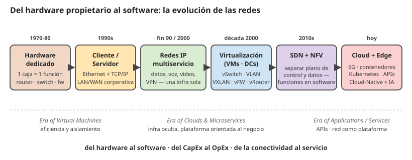

# 10 · NFV — Virtualización de funciones de red

> 🧩 **Guía de estudio para llegar a la clase con el tema masticado.**
> Basada en la PPT 10 de la cátedra (*NFV — Virtualización de Funciones de Red*) y el temario del plan de estudios.

---

## 🎯 En una frase

**NFV (Network Functions Virtualization)** es la idea de tomar funciones de red que antes vivían en **hardware dedicado** (routers, firewalls físicos) y correrlas como **software sobre servidores genéricos** — el mismo salto que llevó de las máquinas físicas a las **VMs, la nube y los contenedores**.

---

## 🧭 ¿Por qué importa / dónde encaja?

Es la mirada **moderna y de tendencia** de la materia: cómo evolucionó la infraestructura de red hacia lo **definido por software**. Conecta redes con **cloud, DevOps y Kubernetes**, temas centrales de la industria hoy. Muestra hacia dónde va todo lo anterior.

---

## 💡 La idea con una analogía

Antes, cada función de red era un **electrodoméstico dedicado**: una tostadora para tostar, una licuadora para licuar (un equipo por tarea). **NFV es la Thermomix**: un solo hardware genérico que, con **software distinto**, hace de tostadora, licuadora o lo que necesites. Ganás flexibilidad y ahorrás espacio/plata, a cambio de un poco más de complejidad para orquestar todo.

---

## 🗺️ La evolución hacia NFV (línea completa)

> Cada paso es un **desacople**: primero el hardware se desacopla del proveedor único, después la aplicación se desacopla del hardware (VMs), después la infra se desacopla del cliente (cloud), y al final la **función de red** se desacopla de la caja física (NFV).

### Los 8 pasos que resumen la cursada (Volpi/Giorgi/Llasat)

1. **Redes basadas en HW propietario** (70-80): 1 caja física = 1 función. Redes **caras y rígidas**.
2. **Cliente / Servidor** (90): Ethernet + TCP/IP + LAN/WAN. Las apps migran a servidores conectados por IP.
3. **Consolidación de IP** (fin 90 - 2000): datos, voz, video y VPN sobre la **misma infra IP** (nodo de servicio multiservicio).
4. **Virtualización de servidores** (2000): un servidor físico corre **varias VMs**. Se prueba que **hardware y función se pueden separar**.
5. **Data Centers y redes virtuales**: aparecen **vSwitch, VLAN, VXLAN, vFirewall, vRouter, vLoad-balancer**.
6. **Separación Control / Data Plane**: cambia la forma de administrar los paquetes.
7. **SDN** (Software-Defined Networking): control por software, la red se **programa**.
8. **NFV** (Network Function Virtualization): las funciones de red **dejan de ser hardware** y pasan a ser software. Habilita **SDN + NFV + Cloud + Contenedores + Kubernetes + Network Automation + Cloud-Native**.

---

## 📊 Conceptos clave

### Las eras de la infraestructura

| Era | Idea | Aislamiento |
| --- | --- | --- |
| **Purpose-built** | Hardware específico por función | Físico (1 caja = 1 función) |
| **Virtualización (VMs)** | Varios SO sobre un mismo hardware vía **hipervisor** | A nivel de SO |
| **Nube** | Infraestructura elástica, bajo demanda; modelo **CapEx → OpEx** | Servicios gestionados |
| **Contenedores** | Empaquetar app + dependencias en unidades ligeras (**Docker**) | Por contenedor |
| **Cloud native** | Contenedores orquestados (**Kubernetes**, **OpenStack**) | Automático y escalable |

### Los tres "drivers" de la red (recap de la clase)

| Driver | Qué prioriza |
| --- | --- |
| **Voice driven** | Redes TDM tradicionales (telefonía) |
| **Data driven** | Redes IP |
| **Deterministic driven** | Plataformas basadas en software, **QoS predecible** (latencia, jitter, pérdidas bajo control) |

### VM vs. contenedor (la distinción clave)

- **VM**: incluye un **sistema operativo completo** → más pesada, más aislada.
- **Contenedor**: comparte el SO del host, solo empaqueta la app y sus dependencias → **más liviano y portable**.
- Beneficios de virtualizar: mejor uso del hardware, aislamiento de cargas, escalabilidad simplificada.

### Las tres "eras" según la cátedra

| Era | Idea | Foco |
| --- | --- | --- |
| **Era of Virtual Machines** | Eficiencia y aislamiento a nivel SO | Aprovechar mejor el hardware |
| **Era of Clouds & Microservices** | Infra oculta, plataformas orientadas al negocio | Servicios "listos para usar" |
| **Era of Applications / Services** | APIs, plataformas orientadas al desarrollador | La red **es** una plataforma |

> 🔑 **Nuevo paradigma:** la red deja de ser solamente **conectividad** y se convierte en una **plataforma de servicios** que genera valor para el negocio (APIs, microservicios, IA incorporada).

---

## ❓ Preguntas para autoevaluarte

1. ¿Qué propone **NFV** frente al hardware de red dedicado?
2. Ordená la evolución: contenedores, VMs, hardware dedicado, cloud native.
3. ¿Qué diferencia hay entre una **VM** y un **contenedor**?
4. ¿Qué significa el cambio de modelo **CapEx → OpEx** que trajo la nube?
5. ¿Qué es **Kubernetes** y qué rol cumple en la era cloud native?
6. ¿Qué prioriza un enfoque **deterministic driven** (pista: QoS)?

---

## 📌 Qué prestar atención en la clase

- El hilo **hardware dedicado → VMs → nube → contenedores → orquestación**.
- La distinción **VM vs. contenedor** (peso, aislamiento) — suele tomarse.
- Cómo NFV se apoya en **hardware genérico (COTS)** y software.
- Los nombres de herramientas (**Docker, Kubernetes, OpenStack**): saber qué es cada una a grandes rasgos.

---

⚙️ Guía basada en la PPT 10 de la cátedra (Volpi / Giorgi / Llasat, versión 2026 — "El Factor Tecnológico en la Evolución de las Redes"). Enriquecida con los 8 pasos de la línea evolutiva y las tres eras (VMs / Clouds / Apps).
