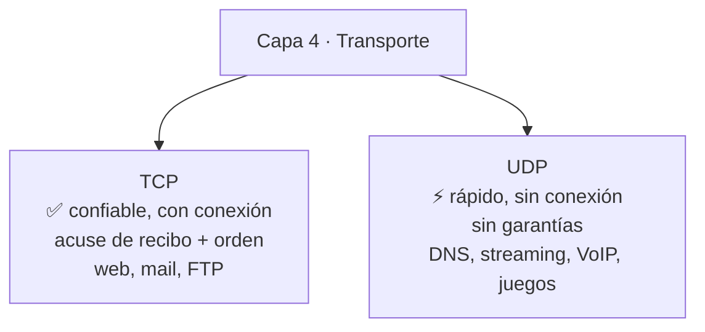

# 11 · Datagrama IP, TCP y UDP

> 🧩 **Guía de estudio para llegar a la clase con el tema masticado.**
> Basada en la PPT 11 de la cátedra (*Datagrama IP / TCP / UDP*) y el temario del plan de estudios.

---

## 🎯 En una frase

Acá se abre el "sobre" de IP para ver su **cabecera y direccionamiento** (clases, máscara, gateway), y se comparan los dos protocolos de **transporte** que viajan adentro: **UDP** (rápido y sin garantías) y **TCP** (confiable, con acuse de recibo).

---

## 🧭 ¿Por qué importa / dónde encaja?

Es la clase que **junta capa 3 (IP) y capa 4 (transporte)** con el nivel de detalle que se toma en el parcial: leer una dirección IP, calcular una red con la máscara, decidir si un destino es local o remoto, y elegir entre TCP y UDP según la aplicación. Es de las más "de ejercicio" de la materia.

---

## 💡 La idea con una analogía

- **UDP** = mandar **postales**: las tirás al buzón, son baratas y rápidas, pero no sabés si llegaron ni en qué orden. Ideal para cosas donde perder una no importa (streaming, juegos, DNS).
- **TCP** = mandar **cartas certificadas con acuse de recibo**: más trámite (establecer conexión, confirmar cada entrega), pero **te garantiza** que llegó todo y en orden. Ideal para web, mail, transferencias.

---

## 🗺️ TCP vs. UDP

---

## 📊 Conceptos clave

### El datagrama IP

- Tiene **cabecera** (fija de **20 bytes** + opcional de 0–40 bytes) y **datos**.
- La longitud de la cabecera siempre es **múltiplo de 4** (frontera de 32 bits → procesamiento eficiente).

### Direccionamiento IPv4

- Una **IP** es un número de **32 bits**, escrito en **decimal punteado**: `192.168.123.132` (4 octetos).
- Configurar TCP/IP requiere: **dirección IP + máscara de subred + puerta de enlace (gateway)**.

**Clases de direcciones** (por el primer octeto):

| Clase | Primer octeto | Uso |
| --- | --- | --- |
| **A** | 0–127 | Redes muy grandes |
| **B** | 128–191 | Redes medianas |
| **C** | 192–223 | Redes pequeñas |
| **D** | 224–239 | Multicast |
| **E** | 240–255 | Experimental |

### Máscara de subred y ruteo básico

- La **máscara** separa la parte de **red** de la parte de **host**. Se aplica un **AND lógico** bit a bit entre la IP y la máscara → da la **dirección de red**.
- **Regla de decisión**: si origen y destino están en la **misma red** (mismos bits de red) → entrega **directa**. Si no → se manda al **gateway (router)**, que la lleva a la otra red.

### UDP en detalle

Encabezado UDP (simple): **puerto origen (16 bits)**, **puerto destino (16 bits)**, **longitud (16 bits)**, **checksum (16 bits)**. Los **puertos** (números de 16 bits) identifican la aplicación dentro del host.

> 🔑 **TCP vs UDP** es la comparación estrella: confiable+lento vs. rápido+sin garantía. Elegís según lo que la app necesite.

---

## ❓ Preguntas para autoevaluarte

1. ¿Cuántos bits tiene una dirección IPv4? ¿Cómo se escribe habitualmente?
2. Dada `192.168.100.50`, ¿de qué **clase** es? (mirá el primer octeto)
3. ¿Cómo se obtiene la **dirección de red** a partir de la IP y la máscara?
4. Si `200.3.107.200` quiere hablar con `10.10.0.7`, ¿entrega directa o vía gateway? ¿Por qué?
5. ¿Cuándo usarías **UDP** y cuándo **TCP**? Dame un ejemplo de app de cada uno.
6. ¿Qué campos tiene el encabezado **UDP**?

---

## 📌 Qué prestar atención en la clase

- El **cálculo de red con la máscara (AND)** y decidir local vs. remoto: **cae seguro en el parcial**.
- Las **clases de IP** por el primer octeto.
- La comparación **TCP vs UDP** (garantías, conexión, casos de uso).
- El rol del **gateway** cuando el destino está en otra red.

---

⚙️ Guía basada en la PPT 11 de la cátedra (Volpi / Giorgi / Llasat).
