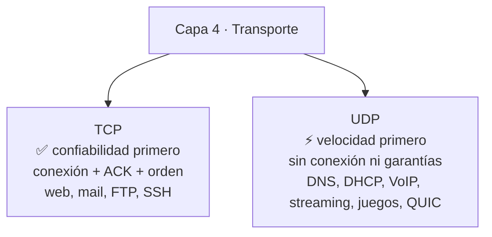
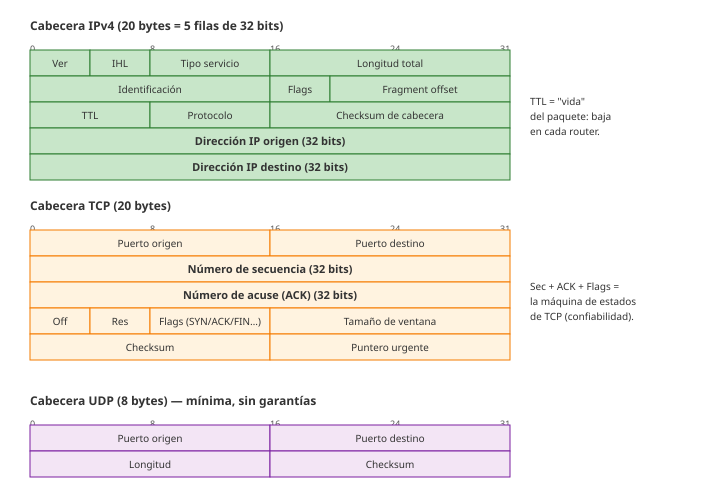
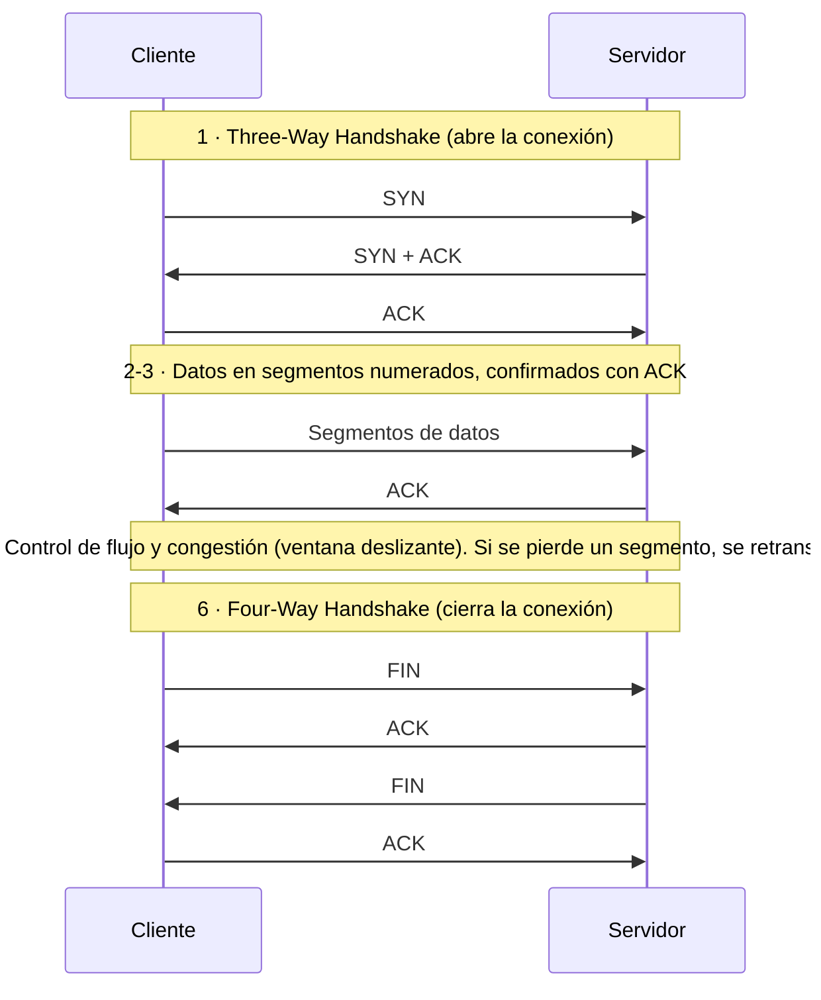

# 11 · Datagrama IP, TCP y UDP

> 🧩 **Guía de estudio para llegar a la clase con el tema masticado.**
> Basada en la PPT 11 de la cátedra (*Datagrama IP / TCP / UDP*), la PPT de la clase #10 de la cursada 2026 (*Protocolos Capa 4*) y el temario del plan de estudios.

---

## 🎯 En una frase

Acá se abre el "sobre" de IP para ver su **cabecera y direccionamiento** (clases, máscara, gateway), y se comparan los dos protocolos de **transporte (capa 4)** que viajan adentro: **TCP** (confiable, ordenado, con conexión) y **UDP** (rápido, liviano y sin garantías).

---

## 🧭 ¿Por qué importa / dónde encaja?

Es la clase que **junta capa 3 (IP) y capa 4 (transporte)** con el nivel de detalle que se toma en el parcial: leer una dirección IP, calcular una red con la máscara, decidir si un destino es local o remoto, y **elegir entre TCP y UDP** según lo que necesite la aplicación. Es de las más "de ejercicio" de la materia.

---

## 💡 La idea con una analogía

- **UDP** = mandar **postales**: las tirás al buzón, son baratas y rápidas, pero no sabés si llegaron ni en qué orden. Ideal para cosas donde perder una no importa (streaming, juegos, DNS).
- **TCP** = mandar **cartas certificadas con acuse de recibo**: más trámite (establecer conexión, confirmar cada entrega), pero **te garantiza** que llegó todo y en orden. Ideal para web, mail, transferencias.

---

## 🗺️ TCP vs. UDP

```mermaid
flowchart TD
    A["Capa 4 · Transporte"] --> B["TCP<br/>✅ confiabilidad primero<br/>conexión + ACK + orden<br/>web, mail, FTP, SSH"]
    A --> C["UDP<br/>⚡ velocidad primero<br/>sin conexión ni garantías<br/>DNS, DHCP, VoIP, streaming, juegos, QUIC"]
```

---

## 📊 Conceptos clave

### El datagrama IP

- Tiene **cabecera** (fija de **20 bytes** + opcional de 0–40 bytes) y **datos**.
- La longitud de la cabecera siempre es **múltiplo de 4** (frontera de 32 bits → procesamiento eficiente).

### Direccionamiento IPv4

- Una **IP** es un número de **32 bits**, escrito en **decimal punteado**: `192.168.123.132` (4 octetos).
- Configurar TCP/IP requiere: **dirección IP + máscara de subred + puerta de enlace (gateway)**.

**Clases de direcciones** (por el primer octeto):

| Clase | Primer octeto | Uso |
| --- | --- | --- |
| **A** | 0–127 | Redes muy grandes |
| **B** | 128–191 | Redes medianas |
| **C** | 192–223 | Redes pequeñas |
| **D** | 224–239 | Multicast |
| **E** | 240–255 | Experimental |

**¿Cuántas direcciones utilizables tiene un bloque?** 🎯 *(pregunta de parcial)*
- Un bloque **/n** deja **32 − n** bits para hosts → tiene **2^(32−n)** direcciones.
- Hay que restar **2**:
  - la **primera** identifica a la **red**;
  - la **última** es el **broadcast**.
- **Utilizables = 2^(32−n) − 2.**

| Bloque | Totales | Utilizables |
| --- | --- | --- |
| /30 | 4 | **2** (típico de un enlace punto a punto entre routers) |
| **/29** | **8** | **6** |
| /28 | 16 | 14 |
| /24 | 256 | 254 |

### Máscara de subred y ruteo básico

- La **máscara** separa la parte de **red** de la parte de **host**. Se aplica un **AND lógico** bit a bit entre la IP y la máscara → da la **dirección de red**.
- **Regla de decisión**: si origen y destino están en la **misma red** (mismos bits de red) → entrega **directa**. Si no → se manda al **gateway (router)**, que la lleva a la otra red.

### Las tres cabeceras lado a lado

> Fijate el tamaño: **IP y TCP = 20 bytes cada una** (mínimo), **UDP = 8 bytes**. Por eso UDP es tan liviano — no tiene toda la maquinaria de secuencia/ACK que sí tiene TCP.

---

## 🔗 TCP en detalle — *Transmission Control Protocol*

Protocolo de transporte **orientado a conexión** que garantiza la entrega **confiable y ordenada** de los datos entre dos extremos.

### Cómo vive una conexión TCP

```mermaid
sequenceDiagram
    participant C as Cliente
    participant S as Servidor
    Note over C,S: 1 · Three-Way Handshake (abre la conexión)
    C->>S: SYN
    S->>C: SYN + ACK
    C->>S: ACK
    Note over C,S: 2-3 · Datos en segmentos numerados, confirmados con ACK
    C->>S: Segmentos de datos
    S->>C: ACK
    Note over C,S: 4-5 · Control de flujo y congestión (ventana deslizante). Si se pierde un segmento, se retransmite
    Note over C,S: 6 · Four-Way Handshake (cierra la conexión)
    C->>S: FIN
    S->>C: ACK
    S->>C: FIN
    C->>S: ACK
```

### Qué garantiza TCP (ventajas)

| Mecanismo | Qué resuelve |
| --- | --- |
| **Orientado a conexión** | Establece y mantiene una **sesión** (three-way handshake) antes de mandar datos |
| **Entrega confiable** | Detecta pérdidas con **ACKs** y **retransmite** lo que falta |
| **Entrega ordenada** | Los **números de secuencia** permiten entregar a la aplicación en el mismo orden en que se mandó |
| **Control de flujo** | Con el **tamaño de ventana**, el receptor le dice al emisor cuánto puede recibir → **no lo satura** |
| **Control de congestión** | Adapta la velocidad al **estado de la red** |
| **Integridad** | Checksum; no entrega duplicados ni segmentos mal armados |
| **Full-duplex** | Los dos extremos transmiten **a la vez** |

> 🔑 **Control de flujo ≠ control de congestión.** El de **flujo** protege al **receptor** (que no lo tapen de datos); el de **congestión** protege a la **red** (que no se sature en el medio).

### Lo que cuesta (limitaciones)

- **Más overhead**: encabezado mínimo de **20 bytes** (vs. 8 de UDP).
- **Más latencia inicial**: hay que hacer el handshake antes de mandar nada.
- **Retransmisiones** que alargan la entrega cuando hay pérdidas.
- **Head-of-Line Blocking (HoL)**: un segmento perdido **frena la entrega de todos los siguientes** hasta que se recupera.
- **Más complejo** y **consume recursos**: guarda el **estado** de cada conexión.
- **Malo para tiempo real**: voz, video interactivo o juegos sufren con las retransmisiones y la variación de latencia.

> *Highlight de la cátedra:* TCP ofrece **confiabilidad a costa de overhead, complejidad y potencial latencia**.

### El encabezado TCP (20 a 60 bytes)

| Campo | Para qué sirve |
| --- | --- |
| **Puerto origen / destino** (16 bits c/u) | Identifican la **aplicación** emisora y receptora |
| **Número de secuencia** (32 bits) | Número del **primer byte de datos** de este segmento |
| **Número de acuse (ACK)** (32 bits) | El **próximo byte que se espera** recibir |
| **Longitud de encabezado** (4 bits) | Tamaño del encabezado en múltiplos de 4 bytes (*Data Offset*) |
| **Flags** | Controlan el establecimiento, mantenimiento y cierre de la conexión |
| **Tamaño de ventana** (16 bits) | **Control de flujo** |
| **Checksum** (16 bits) | Integridad del encabezado y los datos |
| **Puntero urgente** (16 bits) | Marca dónde terminan los datos urgentes |
| **Opciones** | Funciones extra (ej. **MSS**, *window scale*) |

**Flags principales:** **SYN** (inicia la conexión, sincroniza secuencias) · **ACK** (el campo de acuse es válido) · **FIN** (cierra la conexión) · **RST** (corta la conexión de golpe) · **PSH** (pasá los datos ya a la aplicación) · **URG** (hay datos urgentes) · **ECE / CWR** (aviso de congestión, ECN).

---

## 📨 UDP en detalle — *User Datagram Protocol*

Protocolo de transporte **no orientado a conexión**: manda **datagramas** sin establecer conexión previa.

- **No** hace handshake, **no** usa ACKs, **no** retransmite, **no** garantiza entrega ni orden (puede llegar **desordenado, perdido o duplicado**).
- **Sin control de flujo ni de congestión** propios.
- Encabezado de **solo 8 bytes** → muy bajo overhead y baja latencia.
- **No guarda estado** de conexión → puede manejar **muchísimas comunicaciones simultáneas**.
- Soporta **broadcast y multicast** (mandar a muchos destinos a la vez).
- **Flexible**: si la aplicación necesita confiabilidad, **la implementa ella** (es lo que hace QUIC).

**Encabezado UDP (8 bytes fijos):**

| Campo | Para qué sirve |
| --- | --- |
| **Puerto origen / destino** (16 bits c/u) | Identifican la aplicación |
| **Longitud** (16 bits) | Tamaño total del datagrama (encabezado + datos): **mínimo 8, máximo 65.535 bytes** |
| **Checksum** (16 bits) | Integridad; **opcional en IPv4, obligatorio en IPv6** |

**Lo que hay que tener en cuenta:** como no tiene control de congestión, una aplicación UDP que no se regule **puede contribuir a congestionar la red**; y UDP por sí solo **no asegura calidad de servicio** (ancho de banda, latencia ni ausencia de jitter).

> *Highlight de la cátedra:* UDP **sacrifica confiabilidad y control** para obtener **menor overhead, simplicidad y baja latencia**.

---

## ⚖️ La comparación estrella

| Característica | **TCP** | **UDP** |
| --- | --- | --- |
| Orientado a conexión | Sí (three-way handshake) | No |
| Unidad de datos | **Segmentos** numerados | **Datagramas** |
| Confiabilidad | Sí (ACKs y retransmisiones) | No |
| Orden de entrega | Garantizado | No garantizado |
| Control de flujo | Sí (ventana) | No |
| Control de congestión | Sí | No |
| Encabezado | **20 bytes** (mínimo) | **8 bytes** |
| Latencia | Mayor | Menor |
| Cierre | Four-way handshake (FIN / ACK) | No existe |
| Broadcast / multicast | No | Sí |
| Lema | **Confiabilidad primero** | **Velocidad primero** |

### ¿Cuál elijo?

| Elegí **TCP** cuando… | Elegí **UDP** cuando… |
| --- | --- |
| Los datos tienen que llegar **completos y en orden** | Priorizás **baja latencia y velocidad** |
| La confiabilidad es **crítica** | La aplicación **tolera pérdidas** (o las maneja ella) |
| Podés tolerar más latencia | Necesitás **simplicidad** o **broadcast/multicast** |

| Usa **TCP** | Usa **UDP** |
| --- | --- |
| Web: **HTTP / HTTPS** | Nombres de dominio: **DNS** |
| Archivos: **FTP / SFTP** | Asignar IPs: **DHCP** |
| Correo: **SMTP** (envío), **POP3 / IMAP** (recepción) | Voz: **VoIP**, **RTP / RTCP** |
| Acceso remoto: **SSH**, Telnet | Streaming, videollamadas (Zoom, Teams, WebRTC) |
| **Bases de datos** (MySQL, PostgreSQL, SQL Server) | **Juegos online** |
| **APIs y servicios web** (REST, SOAP), ERP, CRM, SaaS | Monitoreo: **SNMP** · archivos simples: **TFTP** |
| Descargas y backups | Transporte moderno: **QUIC / HTTP/3** |

---

## 🧰 Los protocolos de aplicación de ejemplo

| Protocolo | Transporte | Qué hace | Lo que hay que saber |
| --- | --- | --- | --- |
| **HTTP** | TCP | Protocolo de la web, modelo **request / response** | Recursos identificados por **URL**; métodos **GET, POST, PUT, DELETE**; códigos de estado **200, 404, 500**; **HTTPS** = HTTP sobre TLS |
| **FTP** | TCP | Transferencia de archivos | **Dos conexiones**: control en el **puerto 21** (comandos) y datos en el **20**. Modo **activo** (el servidor inicia la conexión de datos) vs. **pasivo** (el cliente inicia las dos; anda mejor con firewalls). Viaja **en texto claro** → para seguridad, **FTPS** (TLS) o **SFTP** (SSH) |
| **SMTP** | TCP | **Envío** de correo | Puerto **25** entre servidores, **587** para que el cliente envíe autenticado, **465** SMTPS (TLS implícito). RFC 5321; seguridad con SMTP AUTH y STARTTLS |
| **DNS** | UDP (puerto 53) | Traduce **nombres de dominio en IPs** | Sistema **distribuido y jerárquico** (root → TLD → autoritativos). Resolución **recursiva o iterativa**. Registros: **A** (IPv4), **AAAA** (IPv6), **CNAME** (alias), **MX** (correo), **NS** (servidores autoritativos), **TXT**. Usa caché y anycast; seguridad con **DNSSEC**, DoT y DoH |
| **DHCP** | UDP (puertos 67/68) | **Asigna automáticamente** la configuración de red | Proceso **DORA**: **D**iscover (el cliente busca servidores) → **O**ffer (el servidor ofrece una IP) → **R**equest (el cliente la pide) → **A**cknowledge (el servidor confirma). Entrega IP, máscara, gateway, DNS y **lease time**. Riesgo: DHCP spoofing / rogue DHCP |
| **VoIP** | UDP | Voz (y video) sobre redes IP en lugar de la telefonía tradicional (PSTN) | **SIP** inicia las sesiones, **RTP** transporta el audio/video en tiempo real, **RTCP** controla la calidad; seguridad con **SRTP** y QoS para priorizar la voz |

---

## 🔐 Seguridad en la capa 4

La capa de transporte participa en la seguridad **controlando quién se comunica con quién**, mediante protocolos y **puertos**, pero **TCP y UDP no cifran nada por sí mismos**.

| Pieza | Qué aporta |
| --- | --- |
| **Puertos TCP/UDP** | Identifican qué aplicación o servicio usa la comunicación |
| **Firewalls** | Permiten o bloquean tráfico según **IP, protocolo y puerto** |
| **TCP** | Controla el **estado** de la conexión y dificulta tráfico que no pertenece a una sesión válida |
| **UDP** | Sin conexión → necesita mecanismos extra para autenticar o proteger |
| **TLS** | Cifrado, autenticación e integridad, normalmente **sobre TCP** (HTTPS, SMTP, IMAP). No es estrictamente capa 4: se ubica **entre aplicación y transporte** |
| **DTLS** | TLS adaptado a **UDP** (VoIP, IoT) |
| **QUIC** | Usa **UDP** como transporte y trae la seguridad de **TLS 1.3** integrada; es la base de **HTTP/3** |

**Puertos para tener a mano:** TCP 80 (HTTP) · TCP 443 (HTTPS) · TCP 25 (SMTP) · TCP 20/21 (FTP) · TCP 22 (SSH) · UDP 53 (DNS) · UDP 67/68 (DHCP) · UDP 5060 (SIP) · UDP 3478 (STUN).

### Ataques típicos a la capa 4

| Ataque | En qué consiste |
| --- | --- |
| **Port scanning** | Buscar puertos abiertos y servicios disponibles |
| **SYN flood** | Mandar muchísimos **SYN** sin completar el handshake para agotar al servidor |
| **TCP Reset (RST) injection** | Mandar **RST** falsificados para cortar conexiones ajenas |
| **Session hijacking** | Tomar el control de una conexión TCP existente |
| **UDP flood** | Mandar datagramas UDP en masa para consumir recursos o ancho de banda |
| **UDP spoofing** | Falsificar la IP de origen (fácil porque UDP no tiene handshake) |
| **Connection exhaustion** | Abrir tantas conexiones que el servidor se queda sin recursos |
| **Amplificación** | Usar servicios UDP que **responden mucho más grande** que lo que se les pregunta (ej. DNS) contra una víctima |
| **Fragmentación y evasión** | Manipular paquetes para esquivar controles mal configurados |

### Hacia dónde va la capa 4

- **TCP** sigue siendo el pilar de las aplicaciones críticas y evoluciona: **TCP Fast Open**, **Selective ACK (SACK)**, mejores algoritmos de congestión y **Multipath TCP** (usar varios caminos a la vez).
- **UDP** se vuelve la **base de los protocolos nuevos** de baja latencia: **QUIC + HTTP/3** suman confiabilidad y seguridad (TLS 1.3) **encima de UDP** y se comportan mejor ante pérdidas.
- Otras líneas: **multipath y movilidad**, **observabilidad** (monitorear latencia, pérdida y jitter) y **Zero Trust** (acceso según identidad, aplicación y contexto).

> ⚠️ **Ojo con dos simplificaciones de la PPT 2026:**
> - En la lámina de **HTTP (TCP)** aparece HTTP/3: HTTP/1.1 y HTTP/2 van sobre **TCP**, pero **HTTP/3 va sobre QUIC, o sea sobre UDP** (la misma PPT lo dice en las láminas de seguridad y de futuro).
> - **DNS** se presenta como protocolo UDP, y en el uso normal lo es (puerto 53). Pero también usa **TCP** cuando la respuesta es muy grande y para las **transferencias de zona** entre servidores.

---

## ❓ Preguntas para autoevaluarte

1. ¿Cuántos bits tiene una dirección IPv4? ¿Cómo se escribe habitualmente?
2. Dada `192.168.100.50`, ¿de qué **clase** es? (mirá el primer octeto)
3. ¿Cómo se obtiene la **dirección de red** a partir de la IP y la máscara?
4. Si `200.3.107.200` quiere hablar con `10.10.0.7`, ¿entrega directa o vía gateway? ¿Por qué?
5. ¿Cuándo usarías **UDP** y cuándo **TCP**? Dame un ejemplo de app de cada uno.
6. ¿Qué campos tiene el encabezado **UDP**? ¿Cuánto mide?
7. Explicá el **three-way handshake** paso a paso. ¿Y cómo se cierra una conexión TCP?
8. ¿Qué diferencia hay entre **control de flujo** y **control de congestión**? ¿Qué campo del encabezado TCP se usa para el de flujo?
9. ¿Para qué sirven el **número de secuencia** y el **número de ACK**?
10. ¿Qué es el **Head-of-Line Blocking**?
11. ¿Por qué UDP es mejor que TCP para **VoIP** o juegos online?
12. Nombrá los 4 pasos de **DHCP (DORA)**.
13. ¿Por qué FTP usa **dos conexiones**? ¿Qué diferencia hay entre modo activo y pasivo?
14. ¿Qué es un **SYN flood** y qué parte de TCP aprovecha?
15. ¿Qué es **QUIC** y por qué se dice que "trae la confiabilidad a UDP"? ¿Sobre qué transporte va HTTP/3?
16. ¿TCP cifra los datos? ¿Qué se usa para cifrar sobre TCP y qué sobre UDP?

---

## 📌 Qué prestar atención en la clase

- El **cálculo de red con la máscara (AND)** y decidir local vs. remoto: **cae seguro en el parcial**.
- Las **clases de IP** por el primer octeto.
- La **tabla comparativa TCP vs. UDP** (conexión, confiabilidad, orden, flujo, congestión, overhead, latencia, usos): es el corazón de la clase #10.
- El **three-way handshake** y el cierre con **FIN/ACK**.
- Qué protocolo de aplicación va sobre cada transporte (HTTP, FTP, SMTP sobre TCP; DNS, DHCP, VoIP sobre UDP).
- El rol del **gateway** cuando el destino está en otra red.

---

⚙️ Guía basada en la PPT 11 de la cátedra (Volpi / Giorgi / Llasat) y en la PPT de la clase #10 de la cursada 2026 (*Protocolos Capa 4*), guardada como `11b` en la carpeta de PPTs.
