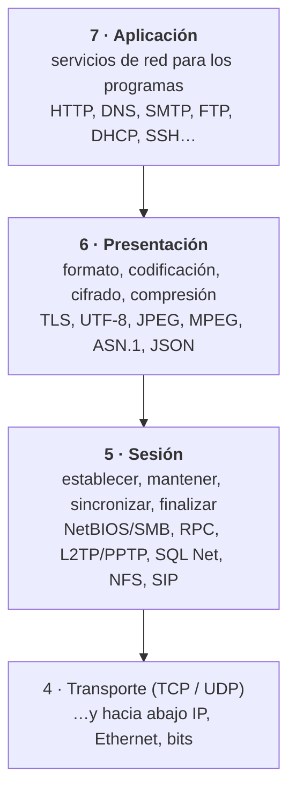
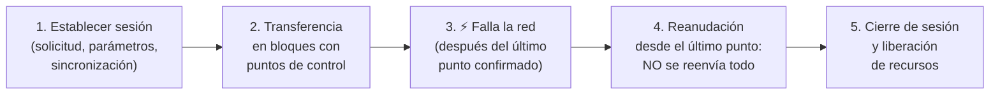
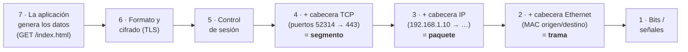

# 12 · Capas 5, 6 y 7 — Sesión, Presentación y Aplicación

> 🧩 **Guía de estudio para llegar a la clase con el tema masticado.**
> Basada en la PPT de la clase #11 de la cursada 2026 (*Protocolos Capa 5, 6, 7*), guardada como `12` en la carpeta de PPTs. Es el **último tema que entra en el primer parcial**.

---

## 🎯 En una frase

Las tres capas de arriba del modelo OSI **acercan la red a la aplicación**:
- la **5 (Sesión)** organiza el **diálogo**;
- la **6 (Presentación)** se asegura de que los datos se **entiendan y estén protegidos**;
- la **7 (Aplicación)** da los **servicios de red** que usan los programas.

Las capas de abajo se ocupan del transporte y la conectividad.

---

## 🧭 ¿Por qué importa / dónde encaja?

Cierra el recorrido por el modelo OSI ([guía 03](03%20-%20Redes%20de%20datos%20y%20modelo%20de%20capas%20%28OSI%29.md)): ya vimos capa 1 (cobre, fibra), capa 2, capa 3 (IP, routing) y capa 4 (TCP/UDP, [guía 11](11%20-%20Datagrama%20IP%2C%20TCP%20y%20UDP.md)).

En **TCP/IP** estas tres capas se juntan en una sola, **Aplicación**. Por eso en la práctica **un mismo protocolo suele hacer funciones de varias capas**: es la conclusión principal de la clase.

---

## 💡 La idea con una analogía

Pensá en una **llamada internacional con intérprete**:
- **Capa 7 (Aplicación):** **lo que querés decir**, por ejemplo "quiero reservar una mesa". Es el servicio que usás.
- **Capa 6 (Presentación):** el **intérprete**. Traduce del español al japonés, **resume** si hace falta y, si es confidencial, **habla en clave**.
- **Capa 5 (Sesión):** el **moderador de la llamada**:
  - la **abre**;
  - decide **quién habla y cuándo**;
  - anota **"hasta acá quedamos"** por si se corta;
  - si se corta, **retoma desde ahí** sin empezar de cero;
  - al final **cuelga ordenadamente**.

---

## 🗺️ Las tres capas de un vistazo

| Capa | Pregunta que responde | Funciones | Protocolos de ejemplo |
| --- | --- | --- | --- |
| **7 · Aplicación** | ¿**Qué servicio** necesita el programa? | Interfaz con las aplicaciones, sintaxis y semántica de los mensajes, autenticación | HTTP/HTTPS, FTP, SMTP, POP3/IMAP, DNS, DHCP, SNMP, NTP, SSH |
| **6 · Presentación** | ¿**Cómo se representan** los datos para que el otro los entienda? | Traducción de formatos, codificación, **cifrado**, **compresión**, estructuración | TLS/SSL, ASCII/Unicode/UTF-8, JPEG/PNG, MPEG/MP4, ASN.1, JSON/XML |
| **5 · Sesión** | ¿**Cómo se organiza el diálogo** en el tiempo? | Establecer, mantener, **controlar el diálogo**, **sincronizar**, recuperar, finalizar | NetBIOS/SMB, RPC, PPTP/L2TP, SQL Net, NFS, SIP |

---

## 5️⃣ Capa 5 — Sesión

**Qué hace:** **establece, mantiene, controla y finaliza** las sesiones de comunicación entre dos aplicaciones, para que el diálogo sea **ordenado durante todo su ciclo de vida**. **No transporta datos**: eso lo hacen las capas inferiores.

### Funciones principales

| Función | Qué hace |
| --- | --- |
| **Establecimiento** | Inicia una sesión lógica; define **quién inicia** y **los parámetros** |
| **Mantenimiento / gestión** | Mantiene el diálogo mientras dura la comunicación (turnos, puntos de control, excepciones) |
| **Control del diálogo** | Coordina **quién transmite y cuándo**: half-duplex, full-duplex, *token management* |
| **Sincronización** | Inserta **puntos de control** (*checkpoints*) dentro de la comunicación |
| **Recuperación** | Ante un fallo, **reanuda desde el último punto de control** confirmado |
| **Finalización** | Cierra **ordenadamente** y **libera los recursos** en ambos extremos |

**Primitivas de servicio:**
- **ESTABLECER**: inicia la sesión.
- **UTILIZAR**: intercambia datos.
- **SINCRONIZAR**: inserta o usa puntos de control.
- **FINALIZAR**: cierra la sesión y libera recursos.

### El ejemplo clave: transferencia de un archivo con sincronización

**Establecimiento paso a paso:**
1. Solicitud de sesión.
2. Aceptación.
3. Negociación de parámetros (opciones, sincronización, diálogo).
4. Confirmación → **sesión establecida**.
5. Intercambio de datos.
6. Liberación.
7. Confirmación de cierre.

### Capa 5 vs. capa 4 (pregunta típica)

| Capa 5 — Sesión | Capa 4 — Transporte |
| --- | --- |
| **Diálogo entre aplicaciones** | Transporte **extremo a extremo** de los datos |
| Creación, gestión y cierre de **sesiones** | **Segmentación** y reensamblado |
| **Sincronización** y puntos de control | Control de **errores** |
| Control de **turnos** y recuperación lógica | Control de **flujo** (ventanas) |
| | Garantiza la **entrega de los datos**, no la sesión |

> 🔑 **En resumen:** la capa 4 asegura que **los datos lleguen**; la capa 5 **organiza el diálogo** entre aplicaciones **en el tiempo**.

### Protocolos relacionados
No hay **un único protocolo universal** de capa 5: sus funciones se reparten entre distintos protocolos y aplicaciones.

| Protocolo | Qué hace en la capa 5 | Uso |
| --- | --- | --- |
| **NetBIOS / SMB** | Establece y controla sesiones en redes Windows | Compartir archivos e impresoras |
| **RPC** (*Remote Procedure Call*) | Crea y administra sesiones para invocar procedimientos remotos | Servicios de directorio, gestión remota |
| **PPTP / L2TP** | Establece y mantiene **túneles VPN** antes de transportar datos | VPN corporativas |
| **SQL Net / Net8** | Administra la sesión cliente–servidor de base de datos | Conexión a Oracle |
| **NFS** | Maneja la "sesión" de operaciones con el servidor de archivos | Montar sistemas de archivos remotos |
| **SIP** | Establece, modifica y finaliza sesiones multimedia | Llamadas VoIP, videollamadas |

**Características:**
- Comunicación **lógica**, no física.
- **Independiente del medio y del transporte**.
- **Recuperación coordinada** ante fallos.
- Puede ser **orientada o no orientada a conexión**, según el protocolo.

**Problemas que resuelve:**
- Evita que dos aplicaciones **transmitan a la vez** cuando no deben.
- Permite **reanudar transferencias sin empezar de cero**.
- Sincroniza el estado del diálogo.
- **Libera recursos** al terminar.

### Ejemplo: L2TP
- L2TP establece y mantiene un **túnel** (una sesión) entre el usuario remoto (cliente L2TP) y el servidor VPN de la red corporativa.
- Por el túnel viajan **paquetes IP completos** de la red interna.
- **Encapsulamiento:** datos de la aplicación → **cabecera L2TP** (capa 5) → **UDP, puerto 1701** → IP → Ethernet → bits.
- **L2TP no cifra**: se usa junto con **IPsec** (L2TP/IPsec).
- Al terminar, la sesión se cierra y se liberan los recursos del túnel.

### Capa 5 y seguridad
Participa **controlando las sesiones** (su estado y que no haya usos no autorizados):
- **gestión de estado**;
- **control de acceso**;
- **time out**;
- **cierre de sesión**;
- **reanudación**;
- **tunelizado**.

---

## 6️⃣ Capa 6 — Presentación

**Qué hace:** transforma los datos a un formato que el **receptor pueda interpretar**, aunque los dos sistemas los representen internamente distinto. Es la **"traductora"** entre la aplicación y la red.

### Funciones principales

| Función | Qué hace | Ejemplos |
| --- | --- | --- |
| **Traducción / conversión de formatos** | Adapta la representación entre sistemas | EBCDIC ↔ ASCII, UTF-8 ↔ UTF-16, JPEG ↔ BMP |
| **Codificación y decodificación** | Pasa los datos a un formato adecuado para transmitir | UTF-8, MIME |
| **Cifrado y descifrado** | Cifra en el emisor y descifra en el receptor | TLS/SSL, AES, DES |
| **Compresión y descompresión** | Reduce el tamaño → menos ancho de banda | gzip, zlib, LZ77 |
| **Estructuración de datos** | Define la sintaxis y semántica de lo que se intercambia | ASN.1, JSON, XML |
| **Negociación de sintaxis** | Asegura que emisor y receptor usen el mismo formato, cifrado y compresión | — |

### Protocolos y formatos relacionados

| Tecnología | Función en capa 6 | Uso |
| --- | --- | --- |
| **TLS / SSL** | Cifrado, autenticación e integridad | HTTPS, IMAPS, SMTPS, LDAPS, VPN |
| **ASCII / Unicode / UTF-8 / UTF-16** | Representación de caracteres | Texto entre sistemas |
| **JPEG / PNG / GIF / BMP** | Formatos de imagen | Imágenes en email, web, apps |
| **MPEG / MP4 / AVI** | Audio y video | Streaming, videoconferencias |
| **ASN.1** | Estructuras de datos y su codificación | SNMP, certificados X.509, LDAP |
| **JSON / XML** | Representación estructurada de datos | APIs REST, servicios web |

### Los tipos que conviene saber

**Codificación:**
| Formato | Característica |
| --- | --- |
| **EBCDIC** | Mainframes IBM |
| **ASCII** | 7 bits, caracteres básicos |
| **Unicode** | Estándar universal de caracteres |
| **UTF-8** | Longitud **variable**, compatible con ASCII |
| **UTF-16** | 16 bits, usado en Windows |

**Cifrado:**
| Tipo | Ejemplos | Cómo funciona |
| --- | --- | --- |
| **Simétrico** | AES, DES | La **misma clave** cifra y descifra |
| **Asimétrico** | RSA, ECC | **Clave pública y privada** |
| **Hash** | SHA-256, MD5 | **No es cifrado** (no se "descifra"): asegura la **integridad** |

**Compresión:**
| Tipo | Ejemplos | Qué pasa con la información |
| --- | --- | --- |
| **Sin pérdida** | gzip, deflate | Se recupera **exacta** |
| **Con pérdida** | JPEG, MP3 | Comprime más, pero **pierde calidad** |

### TLS: el ejemplo estrella de la capa 6
- El cliente escribe `GET /index.html` en **texto claro**.
- **TLS** le aplica formato, **cifrado**, compresión opcional e **integridad**.
- Viaja cifrado por TCP → IP → Ethernet.
- El servidor **descifra**, descomprime y le entrega a la aplicación el pedido original.

**El handshake TLS (HTTPS):**
1. **Client Hello**: el cliente dice qué versiones de TLS y qué *suites* de cifrado soporta.
2. **Server Hello**: el servidor elige una suite y manda su **certificado**.
3. El cliente **verifica el certificado**.
4. **Intercambio de claves**: se acuerda la **clave de sesión** cifrada.
5. Queda establecida la **clave de sesión**.
6. Viajan los **datos cifrados**.

**Características:**
- **Confidencialidad** (cifrado).
- **Integridad**.
- **Autenticación del servidor** (y, opcionalmente, del cliente).
- Es un **estándar ampliamente usado** (HTTPS, etc.).

> El handshake usa **cifrado asimétrico** (certificado, claves pública y privada) para acordar una **clave de sesión simétrica**. Los datos se cifran después con **cifrado simétrico**, que es mucho más rápido.

### Ejemplo: envío de un email
1. **Capa 7:** el usuario redacta y envía el mail.
2. **Capa 6 del emisor:** convierte el texto a **UTF-8**, lo **comprime** (gzip), lo **cifra** (TLS) y lo estructura en formato **MIME**.
3. **Capas 5 a 1:** lo transmiten por la red.
4. **Capa 6 del receptor:** **descifra**, **descomprime**, convierte a UTF-8 y **valida la sintaxis**.
5. **Capa 7 del receptor:** el servidor de correo lo interpreta y lo almacena.

### Capa 6 y seguridad
Su aporte más importante es el **cifrado y descifrado**: protege la información **antes de entregarla a las capas inferiores**. También aporta **confidencialidad**, **autenticación** y **formatos** seguros.

---

## 7️⃣ Capa 7 — Aplicación

**Qué hace:** es la capa **más cercana al usuario**. Da los **servicios de red** que usan directamente los programas, y define los **protocolos, formatos de mensaje, sintaxis, semántica y reglas** del intercambio. **No se ocupa de la transmisión física**, sino del **significado** de la información.

**Funciones:**
- **Interfaz con las aplicaciones**: les da acceso a los servicios de red.
- **Intercambio de información**: cómo se piden y reciben los datos.
- **Identificación de servicios**: qué servicio necesita la aplicación.
- **Gestión de recursos de red**: archivos, correo, web, nombres de dominio.
- **Autenticación y autorización**: ej. HTTPS, SSH, LDAP.
- **Formato e interpretación de los datos**, junto con las otras capas superiores.

### La tabla de protocolos y puertos 🔑

| Protocolo | Función | Puerto | Uso |
| --- | --- | --- | --- |
| **HTTP / HTTPS** | Páginas web y recursos (HTTPS = con TLS) | **80/TCP · 443/TCP** | Navegación, APIs REST, descargas |
| **FTP / FTPS / SFTP** | Transferencia de archivos | **21/TCP** (control) · **20/TCP** (datos) · FTPS **990** · SFTP **22** | Carga y descarga de archivos, backups |
| **SMTP** | **Envío** de correo entre servidores | **25/TCP** (587/465 con cifrado) | Mandar mails |
| **POP3 / IMAP4** | **Recepción** de correo desde el servidor | POP3 **110** · IMAP **143** · IMAPS **993** (TCP) | **POP3 descarga y borra** del servidor; **IMAP sincroniza y mantiene** en el servidor |
| **DNS** | Nombres de dominio ↔ IP | **53/UDP** (TCP para transferencias) | Resolución de nombres |
| **DHCP** | Asignación dinámica de IP y configuración | **67/UDP** (servidor) · **68/UDP** (cliente) | IP, máscara, gateway, DNS automáticos |
| **SNMP** | Monitoreo y gestión de dispositivos | **161/UDP** (consultas) · **162/UDP** (*traps*) | Routers, switches, impresoras, UPS |
| **NTP** | Sincronización de la hora | **123/UDP** | Relojes de servidores y equipos |
| **SSH** | Acceso remoto **seguro** | **22/TCP** | Administración remota |

**Otros frecuentes:**
- **LDAP**: 389/TCP, autenticación y directorios.
- **Telnet**: 23/TCP, acceso remoto **no seguro** (obsoleto).
- **RDP**: 3389/TCP, escritorio remoto de Windows.
- **SIP**: 5060/UDP, señalización VoIP.
- **SMB/CIFS**: 445/TCP, compartir archivos e impresoras.

**Ejemplo HTTP:**
- **Pedido del cliente:** `GET /index.html HTTP/1.1` + `Host: www.ejemplo.com`.
- **Respuesta del servidor:** `HTTP/1.1 200 OK` + `Content-Type: text/html` + el HTML.

**Ejemplo integrador de la cátedra:** al entrar a `www.banco.com` intervienen:
- **DNS**, que resuelve el nombre;
- **HTTPS**, que pide y recibe la página;
- y por debajo **TCP**, **IP** y las capas de acceso a la red.

---

## 📦 Encapsulamiento de punta a punta

En el **receptor** pasa **exactamente lo contrario** (desencapsulamiento): **bits → trama → paquete → segmento → datos de aplicación**.

---

## 🧩 La conclusión de la clase: las capas se mezclan

En las implementaciones modernas, **las funciones de las capas 5, 6 y 7 no aparecen como protocolos separados**: un mismo protocolo puede cumplir funciones de varias capas. Los límites entre las capas superiores son **cada vez menos rígidos**.

**Ejemplo: HTTPS**, donde la cadena es Aplicación → **HTTP → TLS → TCP/QUIC → IP → Ethernet**.

| Protocolo | Lo que aporta | Capa con la que se asocia |
| --- | --- | --- |
| **HTTP** | La lógica de la aplicación | 7 |
| **TLS** | Seguridad y transformación de los datos | 6 (conceptualmente) |
| El contexto de comunicación | Establecerlo y mantenerlo | 5 |
| **TCP** | Transporte extremo a extremo | 4 |
| **IP** | Direccionamiento y encaminamiento | 3 |

**No son cinco protocolos, uno por capa.**

**El ejemplo más claro: QUIC** (*Quick UDP Internet Connections*).
- Lo **diseñó Google** y después lo **estandarizó el IETF**.
- Usa **UDP** como base y en **un solo protocolo** combina **transporte + control de conexiones + seguridad TLS + multiplexación**.
- Reemplaza la pila **TCP + TLS + HTTP/2**. Sobre QUIC va **HTTP/3**.

---

## ⚠️ Ojo con la PPT

| En la PPT | Para tener en cuenta |
| --- | --- |
| L2TP aparece como protocolo de **capa 5** | Para la cátedra es de sesión: establece y mantiene el túnel. Pero su nombre es ***Layer 2** Tunneling Protocol*, porque transporta tramas de capa 2 (PPP), y en otros textos se lo ubica distinto. **En el parcial, respondé como la cátedra: capa 5** |
| "TLS / SSL" | **SSL está obsoleto** (inseguro). Hoy se usa **TLS** (1.2 y 1.3); se sigue diciendo "SSL" por costumbre |
| MD5 como ejemplo de hash | Sirve como ejemplo de hash, pero **ya no se considera seguro** (hay colisiones). Para integridad se usa **SHA-256** |
| QUIC = "TCP + TLS + HTTP/2" | Quiere decir que QUIC **reemplaza** esa pila. Encima de QUIC va **HTTP/3**, no HTTP/2 |
| "Teline (23/TCP)" | Es **Telnet** (errata) |

---

## ❓ Preguntas para autoevaluarte

1. ¿Qué hace cada una de las capas 5, 6 y 7? Dá **dos protocolos** de cada una.
2. Nombrá las **funciones de la capa de sesión**. ¿Qué son los **puntos de sincronización** y para qué sirven?
3. Contá el ejemplo de la **transferencia de archivo con sincronización**: ¿qué pasa si se corta la red?
4. 🔑 ¿En qué se diferencian la **capa 5 y la capa 4**? (pista: diálogo vs. datos)
5. ¿Cuáles son las **primitivas de servicio** de la capa 5?
6. ¿Cómo se encapsula una sesión **L2TP**? ¿Sobre qué protocolo y puerto viaja? ¿Cifra?
7. Nombrá **cinco funciones de la capa de presentación** con un ejemplo de cada una.
8. Diferenciá cifrado **simétrico**, **asimétrico** y **hash**. ¿Por qué el hash "no es cifrado"?
9. Diferenciá compresión **con pérdida** y **sin pérdida**, con ejemplos.
10. Contá los pasos del **handshake TLS**. ¿Qué garantiza TLS?
11. ¿Qué puerto y qué transporte usan **HTTP, HTTPS, FTP, SMTP, POP3, IMAP, DNS, DHCP, SNMP, NTP y SSH**?
12. ¿Qué diferencia hay entre **POP3 e IMAP**? ¿Y entre **SMTP** y POP3/IMAP?
13. Describí el **encapsulamiento** de un pedido HTTPS desde la capa 7 hasta la capa 1. ¿Qué nombre recibe el dato en cada capa?
14. En **HTTPS**, ¿qué protocolo cumple el rol de cada capa?
15. ¿Por qué se dice que **QUIC** muestra que los límites entre capas son cada vez menos rígidos?

---

## 📌 Qué prestar atención en la clase

- La **función de cada capa** en una frase: sesión = **diálogo**, presentación = **formato y cifrado**, aplicación = **servicios**.
- La **diferencia entre capa 5 y capa 4**.
- **TLS** como ejemplo de capa 6, y el **handshake**.
- La **tabla de puertos** de la capa 7: es la clase de cosa que se toma en un parcial.
- La conclusión: **en la práctica las capas se mezclan** (HTTPS, QUIC).

---

⚙️ Guía basada en la PPT de la clase #11 de la cursada 2026, *Protocolos Capa 5, 6, 7* (Volpi / Giorgi / Llasat), incluyendo las infografías de cada capa.
