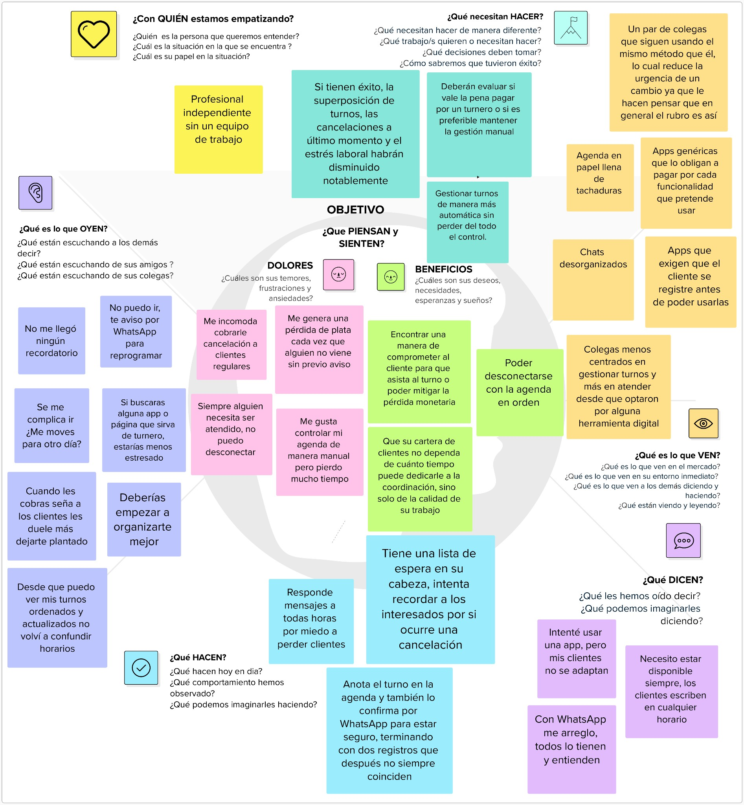

# Mapas de empatía

Para comprender y empatizar con los potenciales clientes se desarrolló un **mapa de empatía** del perfil más representativo del relevamiento: el profesional independiente que gestiona sus turnos de forma manual.

---

## Mapa de empatía — Profesional independiente sin equipo de trabajo

El mapa sintetiza la mirada de un **profesional independiente que gestiona sus turnos de manera manual**, sin un equipo de trabajo. El objetivo es comprender su situación para diseñar una solución a su medida. Se organiza en torno a seis dimensiones: 

- **¿Qué piensa y siente?** Quiere gestionar los turnos de forma más automática **sin perder   del todo el control** de su agenda. Convive con la tensión entre la comodidad de lo manual ("me gusta controlar mi agenda manualmente, pero pierdo mucho tiempo") y el costo que eso le genera. Si tuviera éxito, la superposición de turnos, las cancelaciones de último momento y el estrés laboral disminuirían notablemente.
- **Dolores:** pérdida de dinero cuando alguien no asiste sin avisar, incomodidad al cobrar cancelaciones a clientes regulares e imposibilidad de desconectarse del trabajo.
- **Beneficios / deseos:** comprometer al cliente para que asista (o mitigar la pérdida monetaria), poder desconectarse con la agenda en orden, y que su cartera de clientes dependa de la **calidad de su trabajo** y no del tiempo que dedica a coordinar.
- **¿Qué oye?** Comentarios de colegas que siguen con el método manual (lo que reduce su urgencia de cambiar) y mensajes del estilo "no puedo ir, te aviso por WhatsApp para reprogramar".
- **¿Qué ve?** Un mercado con apps genéricas que obligan a pagar por cada funcionalidad o que exigen al cliente registrarse antes de usarlas, agenda en papel llena de tachaduras y chats desorganizados.
- **¿Qué dice y hace?** Anota el turno en la agenda y además lo confirma por WhatsApp, generando **registros duplicados que no siempre coinciden**; responde mensajes a toda hora por miedo a perder clientes; mantiene una "lista de espera mental" por si ocurre una cancelación.

> **Conclusión:** el profesional necesita una herramienta que **automatice la coordinación** (recordatorios, lista de espera, señas) **sin quitarle el control**, que no agregue fricción al cliente final y que evite la duplicación de información entre la agenda y WhatsApp.
