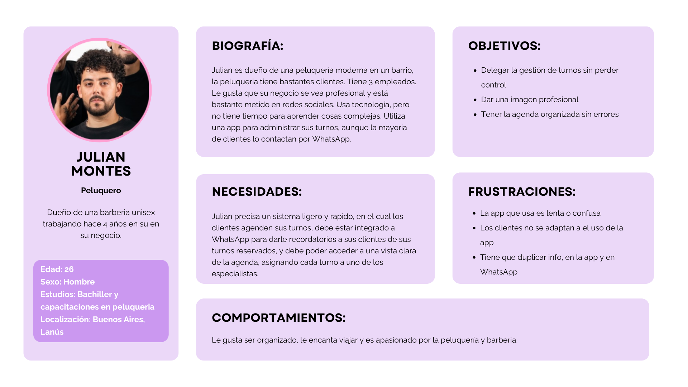
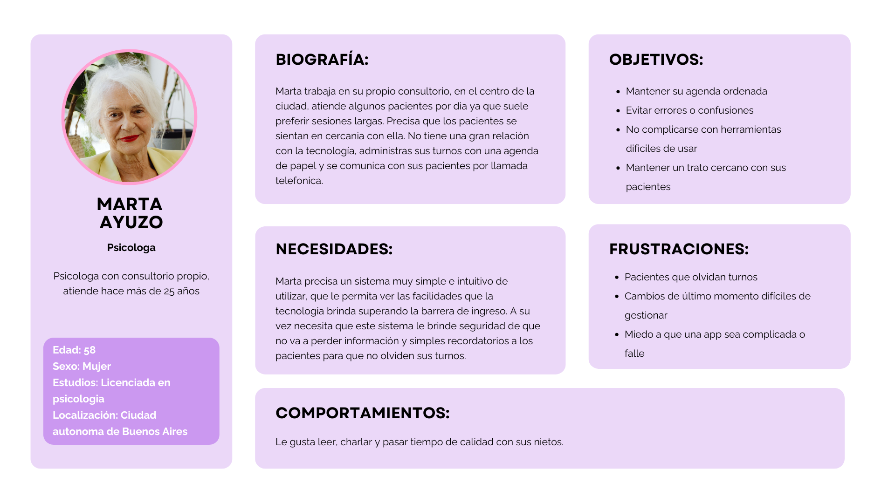
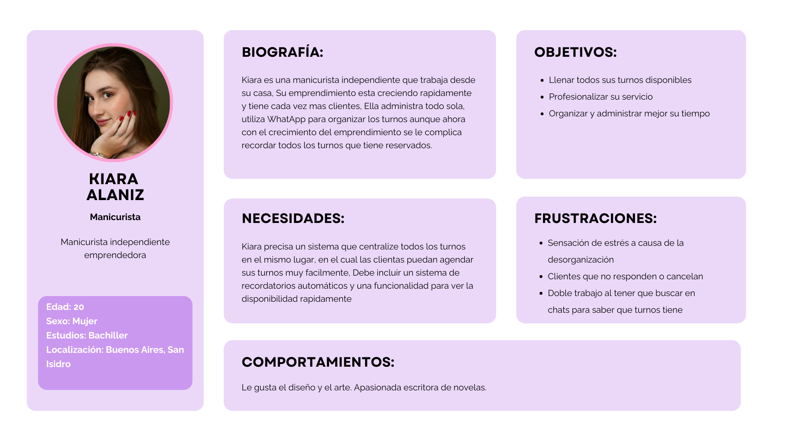

# User Personas

A partir de la información recopilada en el relevamiento se desarrollaron las **User Personas** de los principales perfiles identificados. Cada una representa un tipo de profesional con necesidades, objetivos y frustraciones distintas frente a la gestión de turnos, lo que permitió diseñar una solución que contemple los distintos escenarios de uso.

---

## Julian Montes — Peluquero

Dueño de una **peluquería/barbería unisex con 3 empleados** (26 años, Lanús, Buenos Aires), trabajando hace 4 años. Tiene buen manejo de tecnología y presencia en redes sociales, pero **no dispone de tiempo para aprender herramientas complejas**. Hoy usa una app para administrar turnos, aunque la mayoría de sus clientes lo contactan por WhatsApp.

- **Objetivos:** delegar la gestión de turnos sin perder control, dar una imagen profesional y tener la agenda organizada sin errores.
- **Necesidades:** un sistema **ligero y rápido** donde los clientes agenden solos, integrado a WhatsApp para enviar recordatorios, y con una **vista clara de la agenda** que permita asignar cada turno a uno de los especialistas.
- **Frustraciones:** la app actual es lenta o confusa, sus clientes no se adaptan a usarla y debe **duplicar la información** entre la app y WhatsApp.

> **Por qué es relevante:** representa el caso de **negocio con equipo**, que requiere agenda compartida, asignación de turnos por empleado e integración con los canales que ya usan sus clientes.

---

## Marta Ayuzo — Psicóloga

Psicóloga con **consultorio propio** hace más de 25 años (58 años, CABA). Atiende pocos pacientes por día porque prefiere sesiones largas y un trato cercano. **No tiene una gran relación con la tecnología:** administra sus turnos con agenda de papel y se comunica por llamada telefónica.

- **Objetivos:** mantener su agenda ordenada, evitar errores o confusiones, no complicarse con herramientas difíciles y conservar el trato cercano con sus pacientes.
- **Necesidades:** un sistema **muy simple e intuitivo** que le permita superar la barrera de ingreso a la tecnología, que le dé **seguridad de no perder información** y que envíe recordatorios simples a los pacientes para que no olviden sus turnos.
- **Frustraciones:** pacientes que olvidan turnos, cambios de último momento difíciles de gestionar y el miedo a que una app sea complicada o falle.

> **Por qué es relevante:** representa al **usuario con baja afinidad tecnológica**, clave para validar el requerimiento de **usabilidad y mínima fricción**, tanto para el profesional como para el cliente final.

---

## Kiara Alaniz — Manicurista

**Manicurista independiente y emprendedora** (20 años, San Isidro, Buenos Aires) que trabaja desde su casa. Su emprendimiento crece rápido y suma cada vez más clientes; administra todo sola y usa WhatsApp para organizar los turnos, pero con el crecimiento **se le complica recordar todas las reservas**.

- **Objetivos:** llenar todos sus turnos disponibles, profesionalizar su servicio y organizar/administrar mejor su tiempo.
- **Necesidades:** un sistema que **centralice todos los turnos en un solo lugar**, donde las clientas agenden fácilmente, con **recordatorios automáticos** y una vista rápida de la disponibilidad.
- **Frustraciones:** estrés por la desorganización, clientes que no responden o cancelan, y el **doble trabajo** de buscar en los chats para saber qué turnos tiene.

> **Por qué es relevante:** representa el caso de **profesional independiente en crecimiento**, donde la centralización y los recordatorios automáticos son el principal valor.
