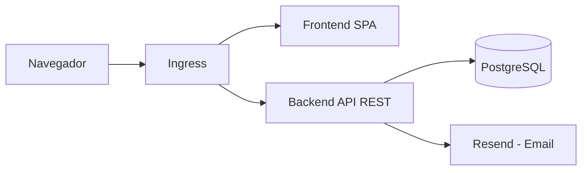
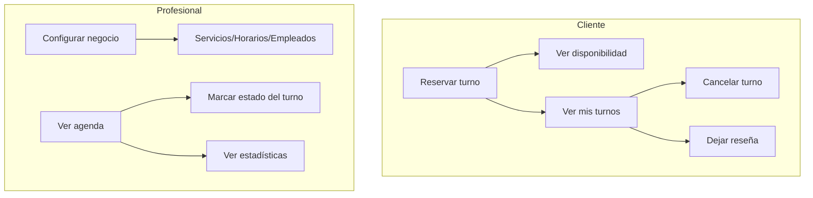
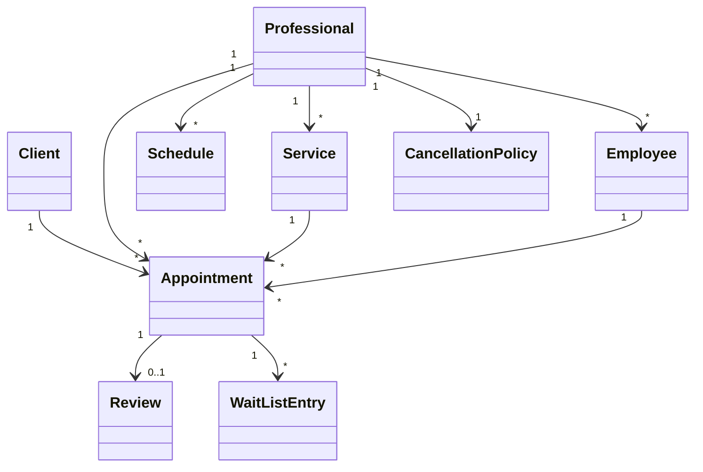
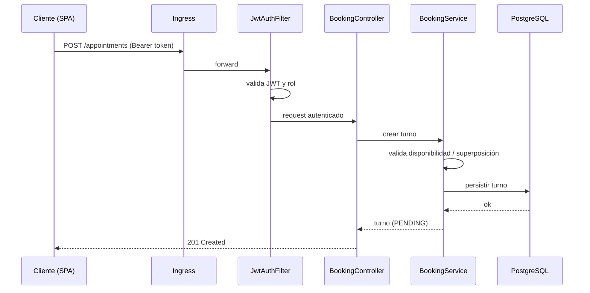
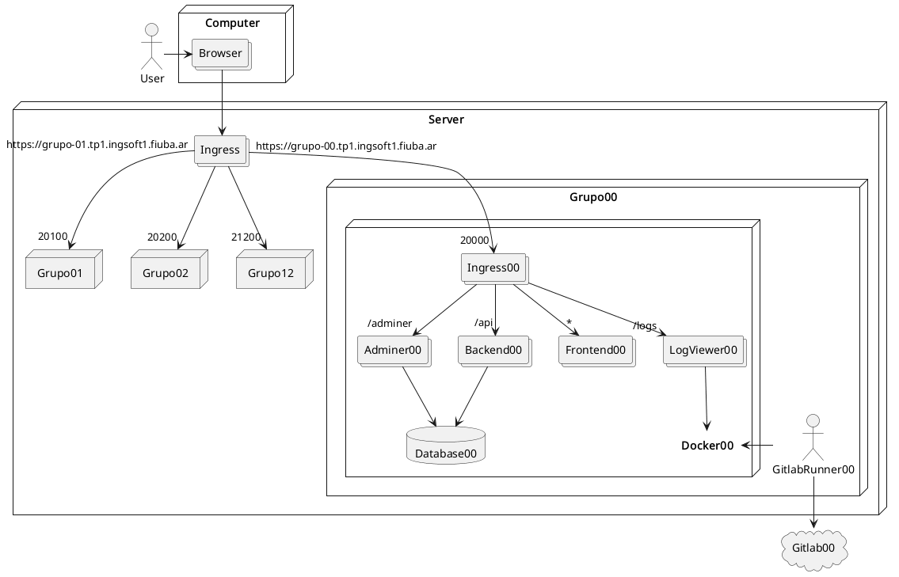
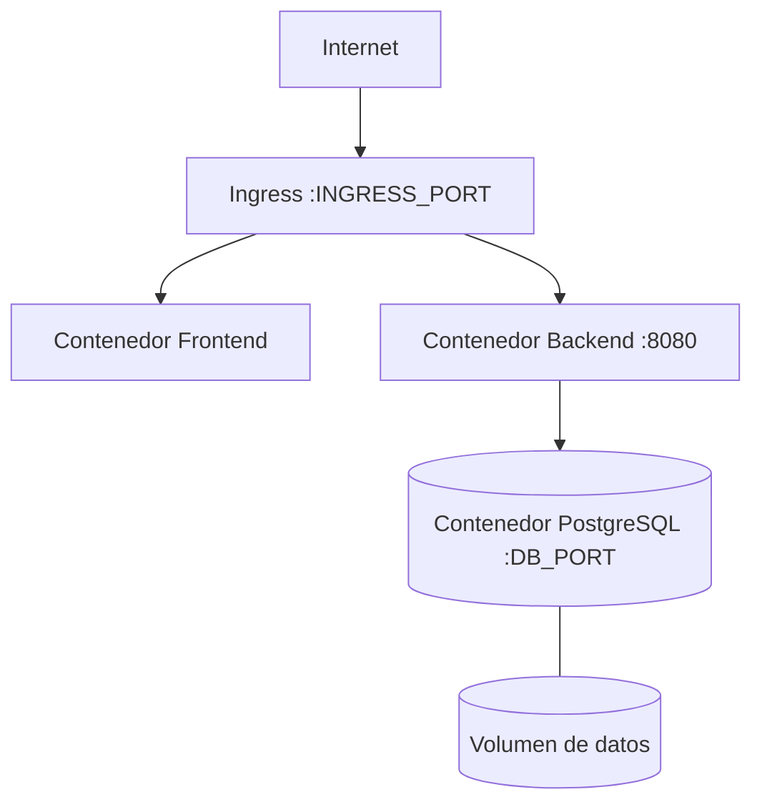

# Documento de arquitectura — Modelo 4+1

Este documento describe la arquitectura del sistema siguiendo el **modelo de vistas 4+1** (Kruchten): vista lógica, vista de procesos, vista de desarrollo, vista física y, en el centro, los escenarios (casos de uso) que articulan las demás.

> Los diagramas referenciados (`diagramas/*.png`) deben agregarse en la carpeta [diagramas/](diagramas/). Donde todavía no hay imagen, se incluye una descripción textual y un diagrama en formato Mermaid como base.

## Visión general

Arquitectura **cliente-servidor** en capas, desplegada en contenedores:

- **Frontend:** SPA web (React + TypeScript) que consume la API REST.
- **Backend:** API REST (Java 21 + Spring Boot) con la lógica de negocio.
- **Base de datos:** PostgreSQL.
- **Ingress:** reverse proxy que unifica los servicios bajo un único dominio.
- **Integraciones externas:** envío de emails (Resend) para recuperación de contraseña y recordatorios.



---

## +1 · Escenarios (casos de uso)

Casos de uso principales que guían la arquitectura:

**Cliente**
- Registrarse / iniciar sesión.
- Ver listado y perfil de profesionales.
- Consultar disponibilidad de un servicio en una fecha.
- Reservar un turno (sin superposición).
- Ver / cancelar / reprogramar sus turnos.
- Dejar una reseña de un turno completado.

**Profesional**
- Registrarse / iniciar sesión / completar perfil.
- Configurar servicios, horarios laborales y empleados.
- Bloquear fechas específicas y configurar política de cancelación.
- Ver su agenda semanal y marcar el estado de los turnos.
- Ver estadísticas del negocio.



---

## Vista lógica

Describe la estructura del dominio. El backend organiza el negocio en módulos por entidad, cada uno con su modelo, repositorio, servicio (lógica) y controlador (API).

Entidades principales del dominio (ver [modelo-de-datos.md](modelo-de-datos.md)):

- **Client**, **Professional** — usuarios del sistema.
- **Service**, **Schedule**, **Schedule_Block** — oferta y disponibilidad del profesional.
- **Employee**, **Employee_Service** — equipo de trabajo.
- **Appointment** — turno (entidad central), con su máquina de estados (PENDING → CONFIRMED → COMPLETED / ABSENT / CANCELLED).
- **Cancellation_Policy**, **Wait_List**, **Review**, **BlockedClient** — reglas y soporte.



---

## Vista de procesos

Describe el comportamiento en tiempo de ejecución y la concurrencia.

- **Request HTTP autenticado:** cada petición pasa por el `JwtAuthFilter`, que valida el access token y carga el usuario autenticado (`JwtUserDetails`) con su rol antes de llegar al controlador. El control de acceso se aplica por rol (CLIENT / PROFESSIONAL).
- **Reserva de turno:** el `BookingService` calcula disponibilidad (`AvailabilityService`) y valida que no haya superposición antes de persistir; ante conflicto, lanza una excepción de negocio que el `GlobalControllerExceptionHandler` traduce al código HTTP  correspondiente (p. ej. 409).
- **Actualización de estado de turnos:** lógica de transición de estados (`AppointmentStatusUpdater`).
- **Envío de emails:** la recuperación de contraseña y los recordatorios se envían a través del servicio de email (Resend), de forma desacoplada del flujo principal.



---

## Vista de desarrollo

Describe la organización del código en módulos.

### Backend (`backend/src/main/java/ar/uba/fi/ingsoft1/turnos/`)
Organización **por feature/dominio**; dentro de cada uno se aplica una separación en capas (modelo · repositorio · servicio · controlador · DTOs):

```
turnos/
├── appointment/      Turnos, disponibilidad, lista de espera (+ dto/)
├── blockedclient/    Bloqueo de clientes por inasistencia
├── client/           Clientes
├── professional/     Profesionales y estadísticas
├── schedule/         Horarios y bloqueos de fechas
├── service/          Servicios del profesional
├── review/           Reseñas
├── password_reset/   Recuperación de contraseña
├── user/             Autenticación
├── common/exception/ Excepciones de negocio (BadRequest, Conflict, Forbidden, NotFound...)
└── config/           Seguridad (JWT), email, OpenAPI, manejo global de excepciones
```

### Frontend (`frontend/src/`)
SPA en React + TypeScript (Vite). Componentes en `src/components/`, consumo de API con TanStack Query, formularios con TanStack Form, validación con Zod y routing con `wouter`.

> Detalle de capas y principios aplicados en [../05-ingenieria-y-calidad/calidad-clean-code-solid.md](../05-ingenieria-y-calidad/calidad-clean-code-solid.md).

---

## Vista física (despliegue)

Describe el mapeo del software a la infraestructura.

- Cada subproyecto se empaqueta en un **contenedor Docker** (`backend/Dockerfile`, `frontend/Dockerfile`, `ingress/`).
- **Docker Compose** (`docker-compose.yml`) orquesta los contenedores: ingress, frontend, backend y base de datos PostgreSQL (con volumen persistente en `VOLUME_DIR`).
- El **ingress** expone todo bajo un único dominio (`EXTERNAL_URL`).
- El **despliegue a la nube** se realiza automáticamente con el pipeline de GitLab CI/CD (`.gitlab-ci.yml`) sobre el servidor de la cátedra. Ambiente productivo: `https://grupo-09.tp1.ingsoft1.fiuba.ar` (configurado con `.env.prod`).





---

## Atributos de calidad

El listado de atributos de calidad seleccionados, con su forma de medición y evaluación, está en [atributos-de-calidad.md](atributos-de-calidad.md).
