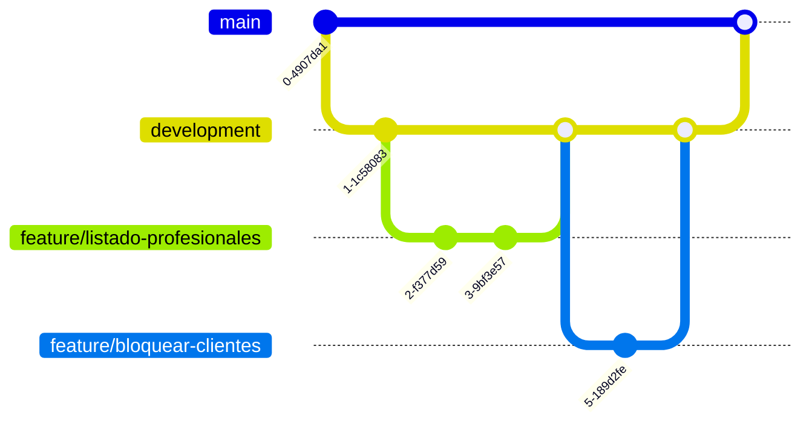

# Control de versiones

El proyecto se versiona con **Git**, alojado en **GitLab** (repositorio del grupo), que es además donde corre el pipeline de CI/CD.

## Estrategia de ramas

Se utilizó un flujo basado en **GitFlow**, con ramas de larga duración y ramas de trabajo de corta duración:

| Rama | Propósito |
|------|-----------|
| `master` | Rama estable / productiva. Refleja lo desplegado. |
| `development` | Rama de integración. Se mergean aquí las features terminadas antes de pasar a `master`. |
| `feature/*` | Una rama por funcionalidad. Ej.: `feature/listado-profesionales`, `feature/bloquear-clientes`, `feature/front/horarios-disponibles`. |
| `fix/*` | Correcciones puntuales. Ej.: `fix/arreglos-codigo`, `fix/correciones-globales`. |

Se observa además una convención de **prefijos por capa** en algunas ramas de frontend (`feature/front/...`) y backend (`feature/back/...` / `feature/backend/...`), lo que ayuda a identificar el alcance de cada rama.

## Flujo de trabajo

1. Se crea una rama `feature/*` (o `fix/*`) a partir de `development`.
2. Se desarrolla la funcionalidad con commits acotados y descriptivos.
3. Se hace un merge hacia `development`.
4. El merge pasa por el **pipeline de CI** (build + tests).
5. Periódicamente, `development` se integra a `master`, que es lo que se despliega.

> Ejemplos reales en el historial: `Merge branch 'Feature/bloquear-clientes' into 'development'`, `Merge branch 'fix/arreglos-codigo' into 'development'`.

## Revisiones de código

- Las revisiones de código se realizaron sobre dev antes de integrar a master.
