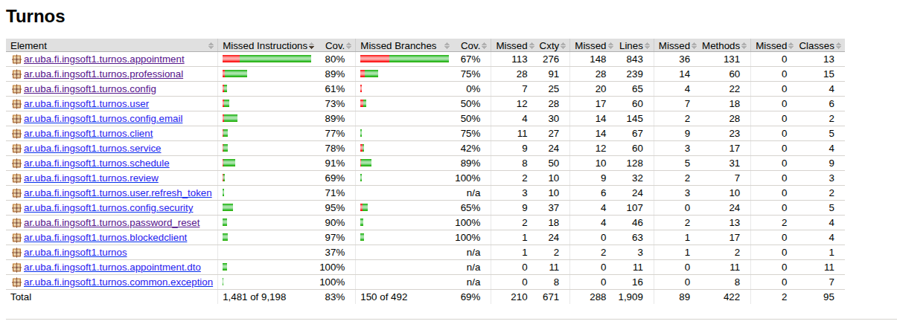
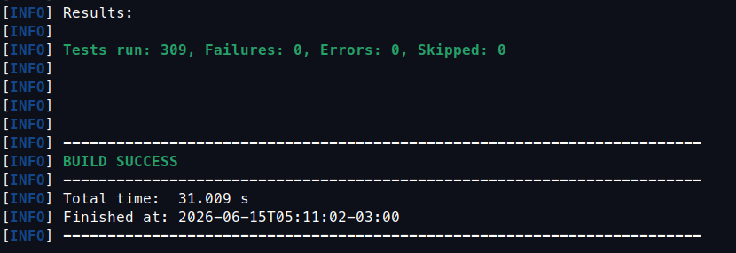

# Evidencias de cobertura — Backend

El backend genera un reporte de cobertura con **JaCoCo** al correr los tests.

```bash
cd backend && ./mvnw test
# Reporte HTML: backend/target/site/jacoco/index.html
```

---



---



## Resultados

- **Tests:** 255 tests (unitarios + integración), todos en verde.
- **Cobertura de instrucciones:** 82,6 %.
- **Cobertura de ramas:** 67,6 %.

---
