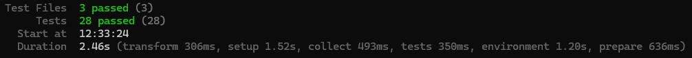

# Evidencias de cobertura — Frontend

Los tests del frontend corren con **Vitest**.

```bash
cd frontend && npm test
# Cobertura (si está configurada): npm test -- --coverage
```

---



## Resultados

- **Tests:** 28 tests de componentes (3 archivos), todos en verde.
- Cubren los flujos críticos del cliente: éxito de reserva (`BookingSuccess`), listado y selección de profesionales (`ProfessionalList`) y selección de servicio + confirmación de reserva (`ProfessionalServiceList`).

---
