# Sistema de Alquiler de Bicicletas

Trabajo Práctico — Programación Concurrente (75.59) — Facultad de Ingeniería, UBA — Primer cuatrimestre 2026

## Integrantes

- Guido Peirano - 98187
- Tomas Goncalves Rei - 111405
- Paul Gonzalo Garcia Lopez - 112363

---

## Tabla de contenidos

1. [Descripción del problema](#1-descripción-del-problema)
2. [Arquitectura general](#2-arquitectura-general)
3. [Aplicaciones y procesos](#3-aplicaciones-y-procesos)
4. [Entidades y actores](#4-entidades-y-actores)
5. [Mensajes del sistema](#5-mensajes-del-sistema)
6. [Protocolos de comunicación](#6-protocolos-de-comunicación)
7. [Herramientas de concurrencia distribuida](#7-herramientas-de-concurrencia-distribuida)
8. [Flujos principales (casos de uso)](#8-flujos-principales-casos-de-uso)
9. [Estructura del proyecto](#9-estructura-del-proyecto)
10. [Cómo ejecutar el sistema](#10-cómo-ejecutar-el-sistema)
11. [Decisiones de diseño](#11-decisiones-de-diseño)
12. [Cambios desde la primera entrega](#12-cambios-desde-la-primera-entrega)
13. [Testing y verificación](#13-testing-y-verificación)

---

## 1. Descripción del problema

Se debe implementar un sistema distribuido para el alquiler y devolución automatizada de bicicletas en una ciudad. El sistema consta de los siguientes elementos:

- **Estaciones** distribuidas por puntos de interés, cada una con entre 10 y 20 slots que pueden albergar una bicicleta. Cuando un slot está vacío, puede detectar una bicicleta que se acerca (simulado por input), tomarla y asegurarla, liberando al usuario y cobrando un monto proporcional al tiempo de uso.
- **Bicicletas** con un identificador único que las estaciones pueden reconocer.
- **Usuarios** que mediante una aplicación móvil consultan estaciones cercanas con disponibilidad, alquilan, devuelven y pagan.
- **Pasarela de pagos** que simula al procesador externo de tarjetas de crédito, ejecutando pre-autorizaciones y cobros.

### Requerimientos transversales

- El sistema debe seguir operando aunque alguna estación pierda conectividad o el usuario no tenga señal celular.
- Se debe minimizar el tráfico de red, comunicándose preferentemente con nodos cercanos.
- Toda la implementación está hecha en Rust, sin bloques `unsafe`.
- Al menos algunas aplicaciones usan el modelo de actores (utilizando `actix`).
- Cada instancia de cada aplicación corre en un proceso independiente.

---

## 2. Arquitectura general

El sistema está compuesto por cuatro tipos de aplicaciones independientes que se comunican por sockets. Cada aplicación corre en un proceso del sistema operativo separado.

### 2.1 Vista de procesos y comunicación

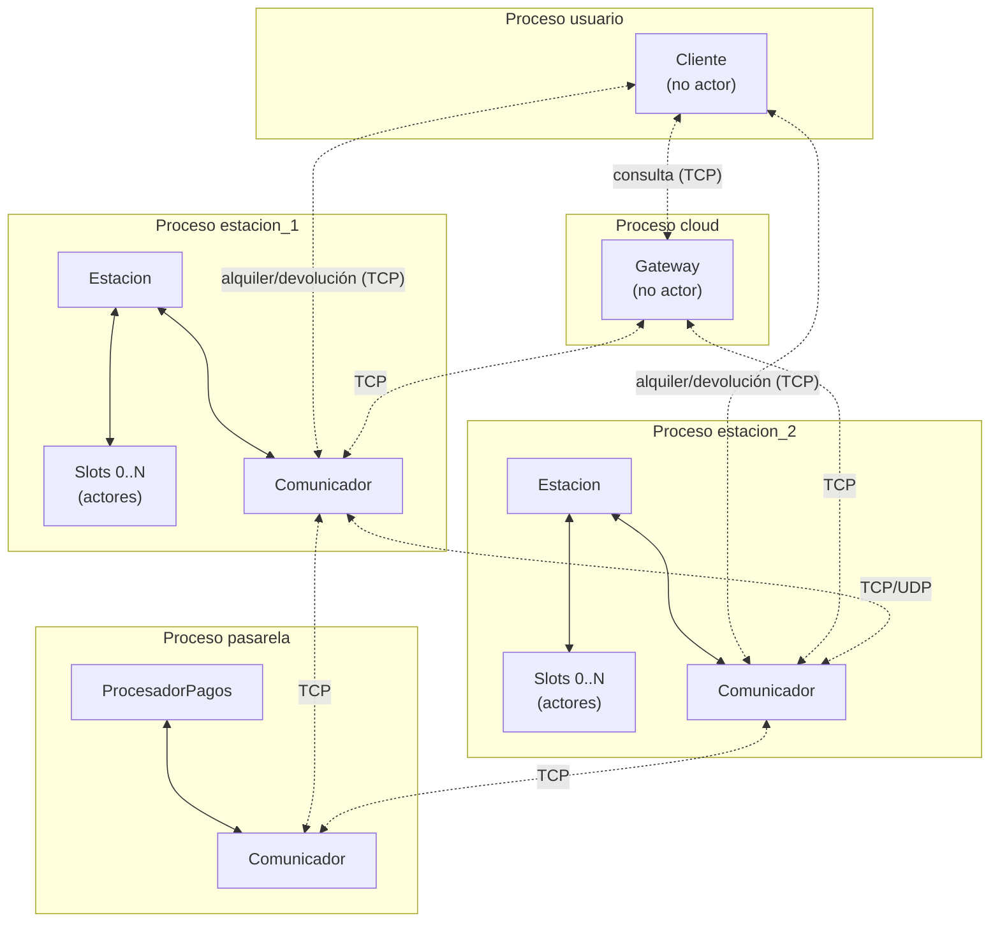

Las líneas continuas son comunicación entre actores del mismo proceso (vía `Addr`). Las líneas punteadas son comunicación entre procesos por socket.

### 2.2 Decisiones de alto nivel

- **Modelo de actores** en las aplicaciones `estacion` y `pasarela`, usando `actix`. Las aplicaciones `cloud` y `usuario` son clientes simples (no necesariamente con actores).
- **Comunicación entre procesos** por sockets TCP (operaciones críticas, request/response) y UDP (estado agregado periódico, no crítico).
- **Comunicación entre actores del mismo proceso** por `Addr`, en memoria, asincrónico.
- **Topología estática**: cada estación arranca con un archivo de configuración que lista los puertos y datos de todas las estaciones, la pasarela y el cloud.
- **Líder dinámico** elegido entre las estaciones por algoritmo Ring. El líder mantiene un registro autoritativo de alquileres abiertos en el sistema.
- **Cada `struct` y cada tipo de actor en su propio archivo fuente**, según el requerimiento del enunciado.

---

## 3. Aplicaciones y procesos

| Aplicación | Cantidad de instancias | Modelo de actores | Rol |
|---|---|---|---|
| `estacion` | M (una por estación física) | Sí (Estacion + Slot + Comunicador) | Maneja slots, libera y asegura bicis, coordina con vecinas y con pagos. Una de las estaciones es el líder. |
| `pasarela` | 1 | Sí (ProcesadorPagos + Comunicador) | Simula la pasarela de pagos. Maneja pre-autorizaciones y cobros. |
| `cloud` | 1 | No | Gateway que reenvía consultas de disponibilidad al líder. |
| `usuario` | N (una por usuario) | No | Cliente que alquila, devuelve, consulta y paga. |

Las cuatro aplicaciones se construyen como binarios independientes dentro de un mismo workspace de Cargo, compartiendo una crate de utilidades (`comun`) donde viven los tipos de mensajes serializables y las definiciones compartidas.

---

## 4. Entidades y actores

### 4.1 Aplicación `estacion`

#### 4.1.1 Actor `Estacion`

**Finalidad.** Coordina el estado agregado de la estación, gestiona los alquileres iniciados en ella, comunica con el exterior a través del `Comunicador`, y opera el algoritmo de elección de líder. Es el coordinador del 2PC para los alquileres.

**Estado interno.**

```rust
struct Estacion {
    id: EstacionId,
    ubicacion: (f64, f64),
    slots: Vec<Addr<Slot>>,
    alquileres_propios: HashMap<RentalId, Alquiler>,
    rol: RolEstacion,
    lider_conocido: EstadoLider,
    term_actual: u64,
    comunicador: Addr<Comunicador>,
    archivo_persistencia: PathBuf,
}

enum RolEstacion {
    Lider {
        registro_alquileres: HashMap<RentalId, Alquiler>,
        cache_estados: HashMap<EstacionId, EstadoEstacion>,
        eventos_procesados: HashSet<EventId>,
    },
    Follower,
}

enum EstadoLider {
    Conocido(EstacionId, SocketAddr),
    EnEleccion,
    Desconocido,
}

struct Alquiler {
    rental_id: RentalId,
    bici_id: BiciId,
    usuario_id: UsuarioId,
    estacion_origen: EstacionId,
    inicio: Instant,
    fin: Option<Instant>,
    preauth_id: String,
    estado: EstadoAlquiler,
}

enum EstadoAlquiler {
    Activo,
    Cerrado,
}
```

**Ciclo de vida del Alquiler.**

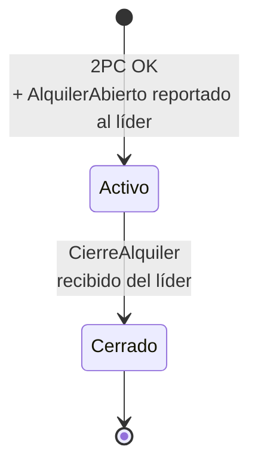

**Mensajes que recibe (selección).**

| Mensaje | Origen | Comportamiento |
|---|---|---|
| `MensajeRecibido(SolicitudAlquiler)` | Comunicador | Inicia el 2PC de alquiler con Slot + Pasarela. |
| `MensajeRecibido(SolicitudDevolucion)` | Comunicador | Acepta físicamente la bici en el Slot, notifica al líder. |
| `Voto(Yes/No)` | Slot / Pasarela | Recolecta votos durante el 2PC. |
| `MensajeRecibido(CierreAlquiler)` | Comunicador | Marca el alquiler local como cerrado. |
| `MensajeRecibido(Election)` | Comunicador | Procesa mensaje del Ring (agrega su ID, forwardea). |
| `MensajeRecibido(Coordinator)` | Comunicador | Actualiza `lider_conocido` y `term_actual`. |
| `LiderNoResponde` | Comunicador | Inicia nueva elección. |
| `MensajeRecibido(SolicitarAlquileresAbiertos)` | Comunicador (cuando es follower) | Responde con sus alquileres propios. |

**Mensajes que envía (selección).**

| Mensaje | Destino | Cuándo |
|---|---|---|
| `Prepare*` / `Commit*` / `Abort*` | Slot, Pasarela | Durante el 2PC de alquiler. |
| `EnviarAlLider(AlquilerAbierto)` | Comunicador | Tras alquiler exitoso (async). |
| `EnviarAlLider(NotificarDevolucion)` | Comunicador | Tras recibir una bici en devolución. |
| `PropagarEstado` | Comunicador | Periódicamente (UDP, snapshot de estado al líder). |
| `EnviarRingMessage` | Comunicador | Durante elecciones. |

#### 4.1.2 Actor `Slot`

**Finalidad.** Representa una posición física donde puede haber o no una bicicleta. Es la unidad atómica que asegura bicis que llegan y libera bicis a usuarios autorizados. Participa como uno de los participantes del 2PC de alquiler.

**Estado interno.**

```rust
struct Slot {
    id: u32,
    bici: Option<BiciId>,
    reservado_para: Option<TransaccionId>,
}
```

**Mensajes que recibe.**

| Mensaje | Origen | Comportamiento |
|---|---|---|
| `PrepareLiberacion { tx_id }` | Estacion | Si tiene bici y no está reservado, marca `reservado_para = Some(tx_id)`, responde `Voto(Yes)`. |
| `CommitLiberacion { tx_id }` | Estacion | Libera la bici (limpia `bici` y `reservado_para`), responde `BiciLiberada`. |
| `AbortLiberacion { tx_id }` | Estacion | Limpia `reservado_para` (no toca la bici). |
| `AceptarBici { bici_id }` | Estacion | Si está vacío, asegura la bici (`bici = Some(bici_id)`), responde `BiciAsegurada`. |
| `ConsultarEstado` | Estacion | Responde `EstadoSlot { ocupado, bici_id }`. |

**Mensajes que envía.**

A `Estacion`: `Voto(Yes/No)`, `BiciLiberada`, `BiciAsegurada`, `EstadoSlot`.

#### 4.1.3 Actor `Comunicador`

**Finalidad.** Aísla la lógica de red. Mantiene los sockets TCP y UDP, gestiona la conexión con vecinas y con el líder, encola mensajes diferidos durante períodos sin conectividad o sin líder conocido.

**Estado interno.**

```rust
struct Comunicador {
    estacion_id: EstacionId,
    estacion_addr: Addr<Estacion>,
    socket_tcp: TcpListener,
    socket_udp: UdpSocket,
    conexiones_tcp: HashMap<EstacionId, TcpStream>,
    vecinas: HashMap<EstacionId, SocketAddr>,
    pasarela_addr: SocketAddr,
    cloud_addr: Option<SocketAddr>,
    cola_para_lider: VecDeque<MensajeAlLider>,
}

struct MensajeAlLider {
    event_id: EventId,
    payload: PayloadSerializado,
    intentos: u32,
}
```

**Mensajes que recibe (selección).**

| Mensaje | Origen | Comportamiento |
|---|---|---|
| `EnviarConfiable { destino, payload }` | Estacion | Envía por TCP. Si falla, reintenta o encola según el destino. |
| `EnviarGossip { destino, payload }` | Estacion | Envía por UDP, fire and forget. |
| `EnviarAlLider { payload }` | Estacion | Si conoce al líder, lo envía. Si no, encola. |
| `MensajeRecibidoDeRed { origen, payload }` | Tasks de escucha | Reenvía al actor `Estacion`. |
| `NuevoLider { id, term }` | Estacion (tras Coordinator) | Actualiza dirección del líder, dispara `FlushCola`. |
| `FlushCola` | self | Reenvía mensajes pendientes al líder actual. |

### 4.2 Aplicación `pasarela`

#### 4.2.1 Actor `ProcesadorPagos`

**Finalidad.** Simula la pasarela bancaria. Maneja pre-autorizaciones (reserva un monto en la tarjeta) y cobros definitivos. Calcula el monto a cobrar a partir de los timestamps `T0` y `T1` y una tarifa configurable. Persiste el estado en un archivo JSON para sobrevivir reinicios. Garantiza idempotencia sobre el `preauth_id`.

**Estado interno.**

```rust
struct ProcesadorPagos {
    pre_autorizaciones: HashMap<String, PreAutorizacion>,
    cobros_realizados: Vec<Cobro>,
    tarifa: TarifaConfig,
    archivo_persistencia: PathBuf,
}

struct PreAutorizacion {
    id: String,
    usuario_id: UsuarioId,
    tarjeta: DatosTarjeta,
    monto_reservado: f64,
    estacion_solicitante: EstacionId,
    timestamp: Instant,
    estado: EstadoPreAuth,
    tx_id: Option<TransaccionId>,
}

enum EstadoPreAuth {
    Preparada,
    Activa,
    Cobrada { monto_final: f64 },
    Anulada,
}

struct TarifaConfig {
    base: f64,
    por_minuto: f64,
}
```

**Mensajes que recibe.**

| Mensaje | Origen | Comportamiento |
|---|---|---|
| `PreparePreauth { tx_id, tarjeta, monto_propuesto }` | Estacion (TCP) | Valida tarjeta, reserva fondos, crea preauth en estado `Preparada`. Responde `Voto(Yes/No)`. |
| `CommitPreauth { tx_id, preauth_id }` | Estacion (TCP) | Marca preauth como `Activa`. Responde `PreauthConfirmada`. |
| `AbortPreauth { tx_id, preauth_id }` | Estacion (TCP) | Libera fondos reservados, marca `Anulada`. |
| `ProcesarCobro { preauth_id, T0, T1 }` | Líder (TCP) | Calcula `monto = tarifa.base + tarifa.por_minuto * (T1 - T0)`. Cobra. Marca `Cobrada`. Responde con el monto. Idempotente: si ya estaba `Cobrada`, devuelve el monto previo. |

#### 4.2.2 Actor `Comunicador` (pasarela)

Análogo al `Comunicador` de la estación, pero más simple. Mantiene un socket TCP en escucha. No participa de elecciones ni de Ring.

### 4.3 Aplicación `cloud`

**Finalidad.** Gateway centralizado que recibe las consultas de disponibilidad de los usuarios y las reenvía al líder actual. No es source of truth; solo enruta.

**Estado interno.**

```rust
struct Cloud {
    lider_conocido: Option<(EstacionId, SocketAddr, u64)>, // id, addr, term
    estaciones_config: HashMap<EstacionId, SocketAddr>,
    socket: TcpListener,
}
```

**Mensajes que recibe.**

| Mensaje | Origen | Comportamiento |
|---|---|---|
| `ConsultaDisponibilidad { ubicacion, radio }` | Usuario (TCP) | Reenvía al líder. Si no conoce líder, descubre uno preguntando a estaciones. |
| `SoyElLider { id, term }` | Estación electa (TCP) | Actualiza `lider_conocido` si el `term` es mayor al actual. |

### 4.4 Aplicación `usuario`

**Finalidad.** Cliente que el usuario opera por consola. Mantiene su estado de alquiler (con o sin bici), envía solicitudes a las estaciones y al cloud, recibe confirmaciones.

**Estado interno.**

```rust
struct Usuario {
    id: UsuarioId,
    ubicacion: (f64, f64),
    tarjeta: DatosTarjeta,
    estado: EstadoUsuario,
    cloud_addr: SocketAddr,
    estaciones_conocidas: HashMap<EstacionId, SocketAddr>,
}

enum EstadoUsuario {
    SinBici,
    ConBici {
        bici_id: BiciId,
        rental_id: RentalId,
    },
}
```

Modelar el estado como `enum` evita estados inválidos por construcción.

---

## 5. Mensajes del sistema

Esta sección consolida los mensajes que viajan por la red. Los mensajes internos entre actores del mismo proceso (vía `Addr`) están descritos en la sección de cada actor.

### 5.1 Usuario ↔ Estación (TCP)

```rust
enum MensajeUsuarioAEstacion {
    SolicitudAlquiler {
        usuario_id: UsuarioId,
        slot_id: u32,
        tarjeta: DatosTarjeta,
    },
    SolicitudDevolucion {
        usuario_id: UsuarioId,
        bici_id: BiciId,
        rental_id: RentalId,
    },
}

enum MensajeEstacionAUsuario {
    AlquilerConfirmado {
        rental_id: RentalId,
        bici_id: BiciId,
        preauth_id: String,
    },
    AlquilerRechazado {
        motivo: String,
    },
    DevolucionAceptada {
        bici_id: BiciId,
    },
    DevolucionCompletada {
        rental_id: RentalId,
        monto_cobrado: f64,
        tiempo_uso_minutos: u32,
    },
}
```

### 5.2 Usuario ↔ Cloud (TCP)

```rust
enum MensajeUsuarioACloud {
    ConsultaDisponibilidad {
        usuario_id: UsuarioId,
        ubicacion: (f64, f64),
        radio_max_km: f64,
    },
}

enum MensajeCloudAUsuario {
    RespuestaDisponibilidad {
        estaciones: Vec<InfoEstacion>,
    },
    ErrorSistema {
        motivo: String,
    },
}

struct InfoEstacion {
    estacion_id: EstacionId,
    ubicacion: (f64, f64),
    bicis_disponibles: u32,
    slots_libres: u32,
    last_seen: Instant,
}
```

### 5.3 Cloud ↔ Líder (TCP)

```rust
enum MensajeCloudAEstacion {
    ConsultaDisponibilidad {
        ubicacion: (f64, f64),
        radio_max_km: f64,
    },
    PreguntarLider,
}

enum MensajeEstacionACloud {
    RespuestaDisponibilidad { estaciones: Vec<InfoEstacion> },
    RespuestaLider { lider_id: Option<EstacionId>, term: u64 },
    SoyElLider { estacion_id: EstacionId, term: u64 },
}
```

### 5.4 Estación ↔ Estación (TCP para crítico, UDP para periódico)

```rust
enum MensajeEntreEstacionesTCP {
    // 2PC del alquiler (no se usa entre estaciones, queda en local)
    
    // Eventos al líder
    AlquilerAbierto {
        event_id: EventId,
        rental_id: RentalId,
        bici_id: BiciId,
        usuario_id: UsuarioId,
        estacion_origen: EstacionId,
        T0: Instant,
        preauth_id: String,
    },
    NotificarDevolucion {
        event_id: EventId,
        bici_id: BiciId,
        estacion_destino: EstacionId,
        T1: Instant,
    },
    DevolucionProcesada {
        event_id: EventId,
        rental_id: RentalId,
        monto_cobrado: f64,
        tiempo_uso_minutos: u32,
    },
    CierreAlquiler {
        rental_id: RentalId,
        T1: Instant,
        monto_cobrado: f64,
    },
    EventoProcesadoAck { event_id: EventId },

    // Reconstrucción de registro
    SolicitarAlquileresAbiertos { term: u64 },
    RespuestaAlquileres { alquileres: Vec<Alquiler> },
    IngresoTardio { alquileres: Vec<Alquiler> },

    // Manejo de bicis huérfanas
    BuscarAlquilerPropio { event_id: EventId, bici_id: BiciId },
    AlquilerEncontrado { event_id: EventId, alquiler: Alquiler },
    NoLoTengo { event_id: EventId, bici_id: BiciId },
    AlquilerNoEncontrado { bici_id: BiciId },
    ReprocesarDevolucion { bici_id: BiciId },
    BiciHuerfanaConfirmada { bici_id: BiciId },

    // Ring de elección
    Election { ids: Vec<EstacionId>, iniciador: EstacionId },
    Coordinator { lider: EstacionId, term: u64 },
}

enum MensajeEntreEstacionesUDP {
    EstadoEstacion {
        estacion_id: EstacionId,
        ubicacion: (f64, f64),
        bicis_disponibles: u32,
        slots_libres: u32,
        timestamp: Instant,
    },
}
```

### 5.5 Estación ↔ Pasarela (TCP)

```rust
enum MensajeEstacionAPasarela {
    PreparePreauth {
        tx_id: TransaccionId,
        usuario_id: UsuarioId,
        tarjeta: DatosTarjeta,
        monto_propuesto: f64,
    },
    CommitPreauth {
        tx_id: TransaccionId,
        preauth_id: String,
    },
    AbortPreauth {
        tx_id: TransaccionId,
        preauth_id: String,
    },
    ProcesarCobro {
        preauth_id: String,
        T0: Instant,
        T1: Instant,
    },
}

enum MensajePasarelaAEstacion {
    Voto { tx_id: TransaccionId, resultado: VotoResultado, preauth_id: Option<String> },
    PreauthConfirmada { preauth_id: String },
    PreauthAnulada { preauth_id: String },
    CobroConfirmado { preauth_id: String, monto: f64 },
    CobroRechazado { preauth_id: String, motivo: String },
}

enum VotoResultado {
    Yes,
    No { motivo: String },
}
```

---

## 6. Protocolos de comunicación

| Enlace | Protocolo | Justificación |
|---|---|---|
| Usuario ↔ Estación (alquiler, devolución) | TCP | Operaciones críticas, request/response. |
| Usuario ↔ Cloud (consulta disponibilidad) | TCP | Request/response, requiere confiabilidad. |
| Cloud ↔ Líder | TCP | Crítico, no se debe perder respuestas. |
| Estación ↔ Pasarela | TCP | Involucra dinero; debe garantizar entrega y orden. |
| Estación → Líder (eventos de alquiler) | TCP | Crítico: perder un evento equivale a perder un cobro. |
| Estación ↔ Estación (Ring de elección) | TCP | Protocolo secuencial, requiere orden y entrega. |
| Estación → Líder (estado agregado periódico) | UDP | Frecuente, perdidas individuales son tolerables (el siguiente snapshot compensa). |

### Justificación de la elección TCP/UDP

**TCP** se usa donde la pérdida de un mensaje genera inconsistencia o pérdida de dinero, donde el orden importa, y donde se necesita confirmación de recepción. La sobrecarga del handshake es aceptable para volúmenes bajos.

**UDP** se usa para el único caso donde los mensajes son frecuentes y la pérdida no es problemática: las actualizaciones de estado agregado de cada estación al líder. Estas se envían cada ~3 segundos por estación; si se pierde uno, el siguiente actualiza la cache del líder con info más fresca.

---

## 7. Herramientas de concurrencia distribuida

El sistema utiliza dos herramientas de concurrencia distribuida vistas en la cátedra, según el requerimiento del enunciado.

### 7.1 Two-Phase Commit (2PC) — Alquiler de bicicleta

**Aplicación:** garantiza la atomicidad del proceso de alquiler entre los tres participantes involucrados.

**Roles:**

- **Coordinador:** Actor `Estacion` (la estación donde el usuario inicia el alquiler).
- **Participantes:**
  - Actor `Slot` (local, el slot específico que liberará la bici).
  - Actor `ProcesadorPagos` (remoto, en proceso `pasarela`).

**Fases:**

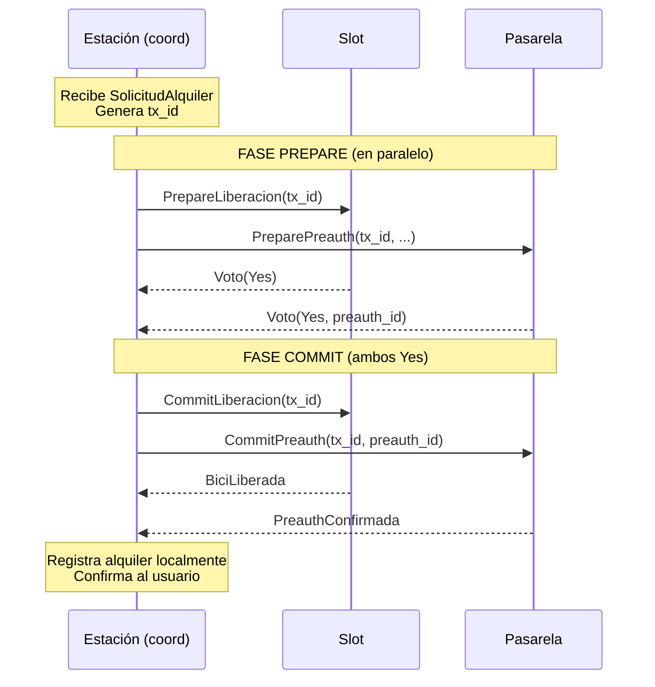

**Si alguno vota No** (slot vacío, tarjeta inválida, etc.) → el coordinador envía `Abort` a ambos participantes. El slot libera la reserva, la pasarela libera fondos reservados. El usuario recibe `AlquilerRechazado`.

**Garantías:** o las dos acciones ocurren (slot libera bici + pasarela retiene fondos) o ninguna. No quedan estados intermedios donde se cobró sin entregar bici, o viceversa.

#### 7.1.1 Manejo de fallas del 2PC
El 2PC clásico tiene puntos de falla conocidos que debemos manejar explícitamente. Documentamos cada uno:

**Caso A — Participante se cae durante Prepare.**
Si un participante (Slot o Pasarela) se cae antes de votar, el coordinador no recibe el voto. Tras un timeout configurado (default: 3 segundos), el coordinador considera el voto como `No` implícito y aborta la transacción enviando `Abort` al participante sobreviviente. El usuario recibe `AlquilerRechazado` con motivo "timeout en preparación".

**Caso B — Coordinador se cae entre Prepare y Commit (caso crítico clásico).**
Es el peor caso del 2PC: los participantes ya votaron `Yes`, reservaron tentativamente sus recursos, y esperan la decisión final que nunca llega. Cada participante implementa un timeout de transacción (default: 10 segundos): si después de votar `Yes` no recibe `Commit` ni `Abort`, aborta unilateralmente y libera el recurso reservado.

- En el **Slot**, esto significa limpiar `reservado_para = None` y mantener la bici asegurada.
- En la **Pasarela**, significa liberar los fondos reservados y marcar la pre-autorización como `Anulada`.

Cuando el usuario reintente el alquiler, arranca un nuevo 2PC con un nuevo `tx_id`. No hay riesgo de doble cobro porque el `preauth_id` anterior quedó anulado.

**Caso C — Coordinador se cae durante Commit (después de que algún participante ya commiteó).**
Acá puede haber inconsistencia temporal: el Slot commiteó (liberó la bici) pero la Pasarela no llegó a commitear. Mitigación:

- Si la Pasarela timeoutea sobre el `Commit` esperado, no aborta: como ya votó `Yes`, sabe que el coordinador decidió commit (o estaba a punto de hacerlo). Espera reintentos. Cuando el coordinador vuelve, persiste sus alquileres pendientes en disco y completa el Commit que le faltaba.
- Si el coordinador no vuelve nunca (caída permanente), la pre-autorización queda en estado `Preparada` indefinidamente. El sistema la detecta como "transacción huérfana" tras un tiempo prudencial (configurable, default: 1 hora) y la marca como `Anulada`. El usuario que se llevó la bici real (porque el Slot sí commiteó) no es cobrado por este alquiler — el alquiler nunca quedó registrado en el sistema. 

**Caso D — Participante recibe un mensaje duplicado.**
Si por reintentos un participante recibe dos veces el mismo `PrepareLiberacion` con el mismo `tx_id`, responde idempotentemente (misma respuesta que la primera vez, sin re-procesar). Lo mismo aplica para `Commit` y `Abort`. Cada participante mantiene un set de `tx_id` ya procesados.

**Timeouts configurables:**

| Timeout | Valor default | Configurable |
|---|---|---|
| Prepare → Voto | 3 segundos | Si |
| Voto Yes → Commit/Abort | 10 segundos | Si |
| Deteccion de transaccion huerfana | 1 hora | Si |

**Persistencia del estado del 2PC.** El coordinador persiste en disco la transacción cuando todos votaron `Yes` y antes de enviar `Commit`. Esto permite recuperarse de un crash del coordinador entre Prepare y Commit: al reiniciar, lee las transacciones pendientes y completa el Commit que tenía pendiente.

### 7.2 Elección de líder por algoritmo Ring

**Aplicación:** seleccionar dinámicamente entre las estaciones cuál cumple el rol de líder del registro de alquileres. Tolera caídas del líder mediante re-elección.

**Topología lógica:** las estaciones forman un anillo, ordenado por `EstacionId`. Cada estación conoce a su "siguiente en el anillo".

**Fases del Ring:**

1. **Detección:** una estación detecta que el líder no responde (timeout sobre intentos previos).
2. **Inicio:** la estación inicia un mensaje `Election` con su ID, lo envía a la siguiente del anillo.
3. **Propagación:** cada estación que recibe `Election` agrega su ID y lo forwardea.
4. **Decisión:** el mensaje vuelve al iniciador con todos los IDs. El ganador es el de ID mayor.
5. **Anuncio:** el iniciador envía `Coordinator(ganador, term)` por el anillo. Cada estación se actualiza.
6. **Reconstrucción del registro:** el nuevo líder solicita a cada estación sus alquileres propios y consolida el registro.
7. **Anuncio al cloud:** el nuevo líder envía `SoyElLider` al cloud.

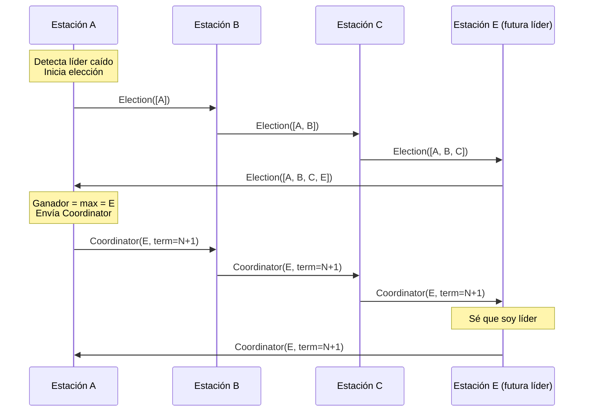

**Detalle sobre `term`:** cada elección incrementa un contador (`term`). Esto previene que un líder "viejo" que vuelve a la vida tras una caída se confunda con el líder actual: si recibe un mensaje con `term` mayor al que tiene, sabe que no es más líder y se actualiza a follower.

**Idempotencia y reintentos:** todos los mensajes al líder (eventos de alquiler, devoluciones) llevan un `event_id`. El líder mantiene un `HashSet<EventId>` de eventos ya procesados. Si recibe un duplicado, responde OK sin reprocesar. Esto permite a las estaciones reintentar indefinidamente durante elecciones sin causar inconsistencias.

---

## 8. Flujos principales (casos de uso)

### 8.1 CU1 — Alquiler exitoso

**Disparador:** El usuario se acerca físicamente a un slot ocupado con una bicicleta y le pide a su app que la alquile.

**Participantes:**

| Proceso | Actores |
|---|---|
| Usuario | (cliente simple) |
| Estación A | Estación, Slot 3, Comunicador |
| Pasarela | ProcesadorPagos, Comunicador |
| Líder (otra estación, async) | Estación en rol líder |

**Diagrama de secuencia:**

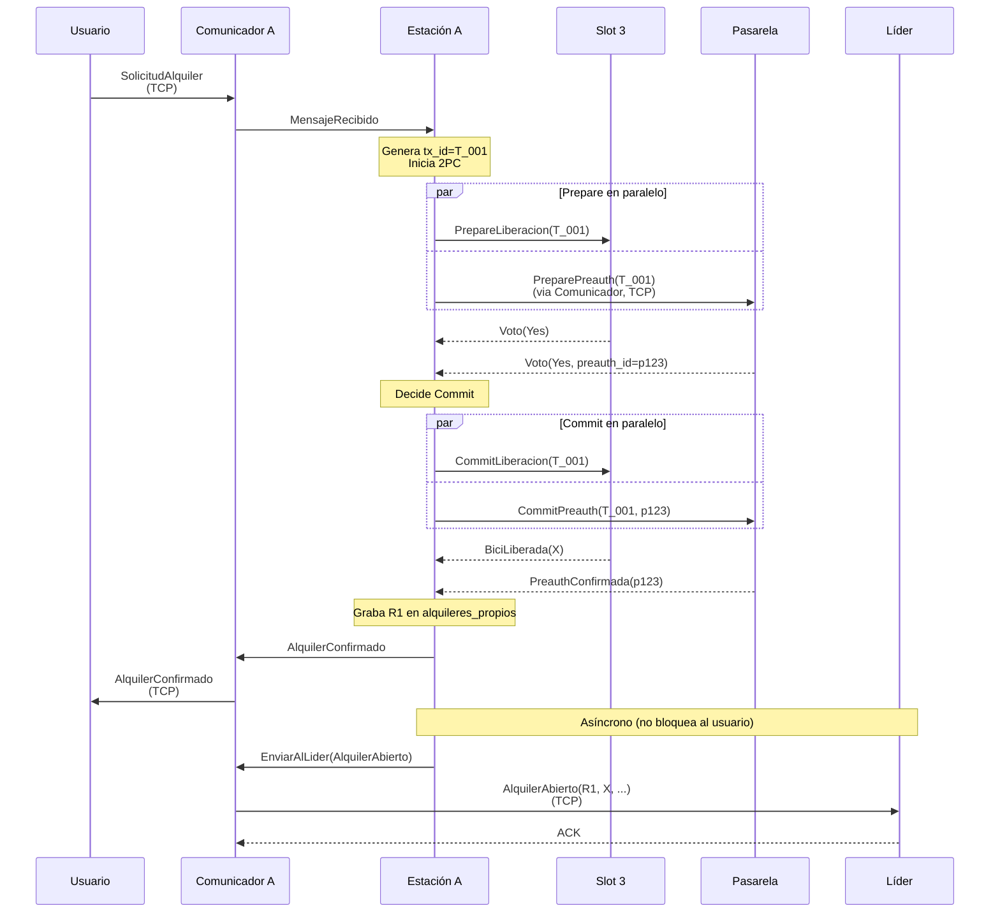

**Resultado:**
- Slot 3 vacío, bici X con el usuario.
- Preauth p123 activa en pasarela.
- R1 en `alquileres_propios` de Estación A y en el registro del líder.
- Usuario en estado `ConBici`.

**Casos de error manejados por el 2PC:**
- Slot vota `No` (slot vacío o ya reservado): aborta, usuario recibe `AlquilerRechazado`.
- Pasarela vota `No` (tarjeta inválida, sin fondos): aborta, slot libera reserva, usuario recibe `AlquilerRechazado`.
- Líder caído al momento del reporte async: Comunicador encola el evento, se despacha al elegirse nuevo líder. El alquiler ya está completado para el usuario.

### 8.2 CU2 — Devolución exitosa

**Disparador:** El usuario llega a una estación distinta a la de origen, se acerca a un slot vacío, indica devolver la bici.

**Participantes:**

| Proceso | Rol |
|---|---|
| Usuario | Cliente |
| Estación B (destino) | Asegura la bici, notifica al líder |
| Líder | Procesa cierre + cobro |
| Pasarela | Calcula monto y cobra |
| Estación A (origen) | Recibe notificación async de cierre |

**Diagrama de secuencia:**

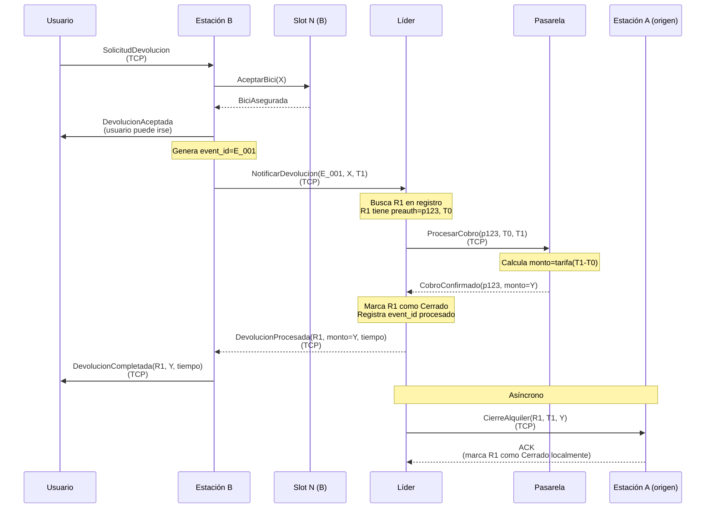

**Resultado:**
- Slot N de Estación B ocupado con bici X.
- Preauth p123 cobrada (monto Y).
- R1 cerrado en registro del líder y en `alquileres_propios` de Estación A.
- Usuario en estado `SinBici`, ve confirmación de cobro.

**Manejo de errores (todos resueltos vía idempotencia):**

| Falla | Recuperación |
|---|---|
| Líder caído al notificar devolución | Comunicador de B encola. Nuevo líder se elige (CU4), recibe el evento, procesa. |
| Pasarela caída en `ProcesarCobro` | Líder reintenta con backoff. La preauth queda como referencia idempotente. Si vuelve y ya estaba cobrada, devuelve idempotente. |
| Estación origen offline al notificar cierre | Líder reintenta. Cuando A vuelve, recibe el cierre y se sincroniza. |
| Bici "huérfana" (no hay alquiler abierto con esa bici_id en el registro del lider) | Ver subsección "Manejo de bicis huérfanas" abajo. |

#### 8.2.1 — Manejo de bicis huerfanas

Una bici se considera **huérfana** cuando llega físicamente a un slot pero el líder no encuentra un alquiler abierto asociado a esa `bici_id` en su registro. Esto puede ocurrir por dos motivos:
- El evento `AlquilerAbierto` original nunca llegó al líder (se perdió durante una caída prolongada, o la estación origen lo persistió pero el reporte async quedó en cola).
- Hubo un cambio de líder reciente y la reconstrucción del registro está incompleta (alguna estación no respondió a `SolicitarAlquileresAbiertos` durante la elección).

**Resultado posible 1 — recuperación automática:** alguna estación tenía el alquiler en sus `alquileres_propios` pero no se había reportado al líder. El líder lo reincorpora al registro y el flujo de devolución continúa normalmente.
**Resultado posible 2 — huérfana confirmada:** ninguna estación reconoce el alquiler. La bici queda asegurada en el slot pero no se cobra (no hay pre-autorización asociada). Se registra en el log de la estación destino para auditoría. La bici está disponible para nuevos alquileres a partir de ese momento.

Este protocolo asegura que el sistema converge a un estado consistente para cualquier bici que llegue a un slot, independientemente de qué eventos se hayan perdido en el camino, sin requerir intervención manual del operador.

### 8.3 CU3 — Consulta de disponibilidad vía cloud

**Disparador:** El usuario abre la app y solicita ver las estaciones cercanas con bicis y slots disponibles.

**Diagrama de secuencia:**

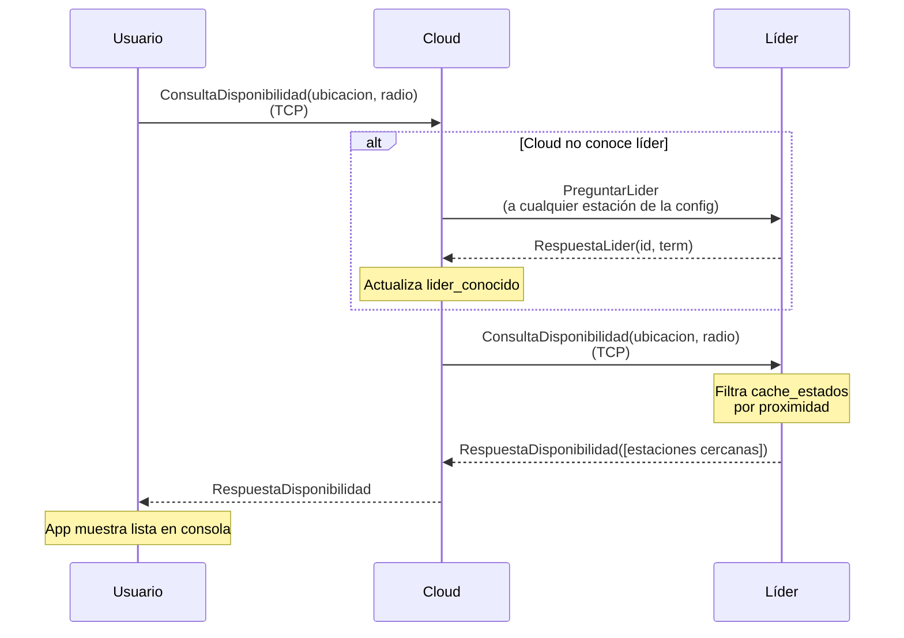

**Resultado:** el usuario ve la lista de estaciones cercanas con sus bicis y slots libres en el momento de la consulta (data con latencia de hasta ~3 segundos, por el ciclo periódico de UDP entre estaciones y líder).

**Casos de error:**

| Falla | Recuperación |
|---|---|
| Cloud no conoce líder | Pregunta a cualquier estación. Si está en elección, reintenta. |
| Líder no responde (timeout) | Cloud marca líder como Desconocido, espera nueva elección. Responde al usuario "sistema reorganizándose". |
| Cache del líder tiene info muy vieja sobre una estación | Líder excluye esa estación de la respuesta o la marca como "stale". |
| Cloud caído | App del usuario muestra "sin conexión, datos cacheados" o error. |

### 8.4 CU4 — Caída del líder y reconstrucción del registro

**Disparador:** Una estación detecta que el líder actual no responde (timeout en intentos previos).

**Diagrama de secuencia:**

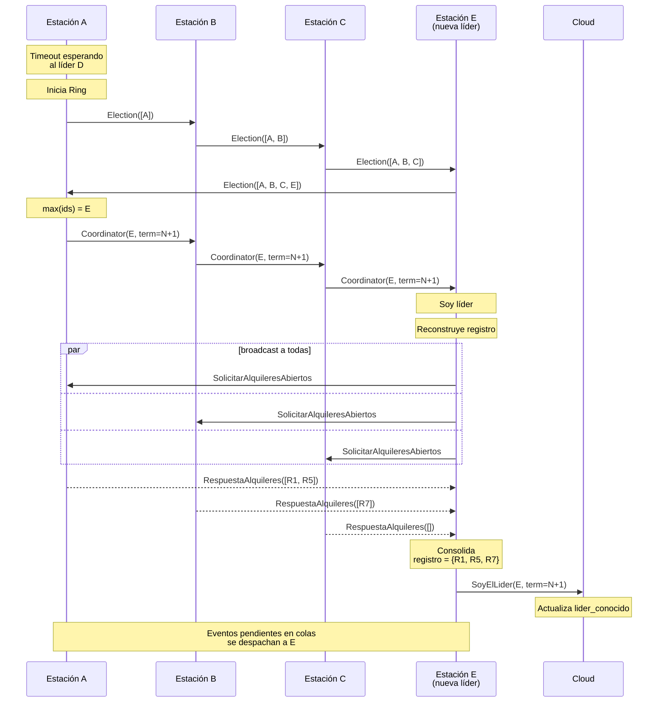

**Resultado:**
- E es el nuevo líder reconocido por todos (estaciones + cloud).
- El registro de alquileres está reconstruido a partir de los `alquileres_propios` de cada estación.
- Los eventos en colas de los Comunicadores se despachan al nuevo líder.
- La transición típicamente dura unos pocos segundos. Durante ese tiempo, las operaciones locales siguen funcionando; solo las que requieren al líder se encolan.

**Casos edge:**

| Caso | Manejo |
|---|---|
| Dos estaciones detectan caída simultáneamente | Ambas inician elección. Los dos mensajes Election circulan en paralelo. Ambos calculan el mismo ganador. Los `Coordinator` con mismo `term` son idempotentes. |
| Una estación está caída durante la elección | El mensaje Election la saltea (timeout + skip). Cuando vuelve, sincroniza el `term` y se reincorpora. |
| El "ex-líder" D vuelve | Recibe Coordinator con `term` mayor. Se actualiza como follower. |
| Una estación está caída durante la reconstrucción | E timeoutea, continúa con datos parciales. Cuando la estación vuelve, envía `IngresoTardio` y el líder consolida. |
| Cloud está caído cuando E manda SoyElLider | E reintenta hasta entregar. Mientras tanto, los usuarios reciben "sistema reorganizándose" del cloud cuando vuelva. |

---

## 9. Estructura del proyecto

```
proyecto-bicis/
├── Cargo.toml                       (workspace root)
├── README.md                        (este archivo)
├── comun/                           (crate library: tipos compartidos)
│   ├── Cargo.toml
│   └── src/
│       ├── lib.rs
│       ├── ids.rs                   (RentalId, BiciId, EstacionId, EventId, ...)
│       ├── mensajes/
│       │   ├── usuario_estacion.rs
│       │   ├── usuario_cloud.rs
│       │   ├── estacion_estacion.rs
│       │   ├── estacion_pasarela.rs
│       │   └── cloud_estacion.rs
│       └── serializacion.rs
├── estacion/                        (crate binary)
│   ├── Cargo.toml
│   └── src/
│       ├── main.rs
│       ├── estacion.rs              (actor Estacion)
│       ├── slot.rs                  (actor Slot)
│       ├── comunicador.rs           (actor Comunicador)
│       ├── alquiler.rs              (Alquiler, EstadoAlquiler)
│       ├── ring.rs                  (lógica del algoritmo de elección)
│       ├── dos_fases.rs             (helpers del 2PC)
│       └── persistencia.rs          (serialización a JSON)
├── pasarela/                        (crate binary)
│   ├── Cargo.toml
│   └── src/
│       ├── main.rs
│       ├── procesador_pagos.rs      (actor ProcesadorPagos)
│       ├── comunicador.rs           (actor Comunicador)
│       ├── tarifa.rs                (cálculo del monto)
│       └── persistencia.rs
├── cloud/                           (crate binary)
│   ├── Cargo.toml
│   └── src/
│       ├── main.rs
│       └── gateway.rs
└── usuario/                         (crate binary)
    ├── Cargo.toml
    └── src/
        ├── main.rs
        ├── usuario.rs
        └── repl.rs                  (lectura de comandos por consola)
```

Cada `struct` y cada tipo de actor en su propio archivo fuente, según el requerimiento del enunciado.

---

## 10. Cómo ejecutar el sistema

**Nota:** la implementación está en curso. Las instrucciones definitivas se actualizarán para la entrega final.

Esquema preliminar:

```bash
# Compilar todo el workspace
cargo build --release

# Lanzar el sistema de pagos
cargo run --release --bin pasarela -- --puerto 9000 --config pasarela.toml

# Lanzar el cloud
cargo run --release --bin cloud -- --puerto 9100 --config cloud.toml

# Lanzar estaciones (en terminales separadas)
cargo run --release --bin estacion -- --id 1 --puerto 8001 --config estaciones.toml
cargo run --release --bin estacion -- --id 2 --puerto 8002 --config estaciones.toml
cargo run --release --bin estacion -- --id 3 --puerto 8003 --config estaciones.toml

# Lanzar usuarios (en terminales separadas)
cargo run --release --bin usuario -- --id alice --cloud localhost:9100
cargo run --release --bin usuario -- --id bob --cloud localhost:9100
```

Cada proceso lee input por consola para simular las acciones (acercarse a un slot, perder/recuperar conectividad, etc.) y escribe el output del sistema también por consola.

### Archivo de configuración de topología (ejemplo)

```toml
# estaciones.toml
[[estaciones]]
id = 1
puerto = 8001
ubicacion = [-34.6037, -58.3816]

[[estaciones]]
id = 2
puerto = 8002
ubicacion = [-34.6100, -58.3850]

[[estaciones]]
id = 3
puerto = 8003
ubicacion = [-34.6200, -58.3900]

[pasarela]
puerto = 9000

[cloud]
puerto = 9100
```

El anillo lógico para Ring se construye por orden de `EstacionId`.

---

## 11. Decisiones de diseño

A continuación se resumen las decisiones tomadas durante el diseño, con su justificación.

**Slots como actores participantes del 2PC.** Cada slot es un actor independiente con su propia mailbox. Modelarlo como actor (en lugar de como un campo `struct` adentro de `Estacion`) responde a tres motivos concretos:
1. **Estado tentativo durante el Prepare:** En la fase Prepare del 2PC, el slot debe reservar la bici sin liberarla todavía. Este estado intermedio "reservado pero no liberado" tiene que ser atómico respecto a otras operaciones concurrentes sobre el mismo slot
2. **Voto significativo:** El slot vota `No` legítimamente si está vacío, si la bici no es la esperada, o si ya está reservado para otra transacción. No es un participante "decorativo": tiene reglas locales que puede rechazar
3. **Aislamiento de fallas:** Si en el futuro un slot necesita lógica más compleja (timeout de reserva, recuperación tras crash, sensores adicionales), está aislada del resto de la estación. La complejidad se contiene en el actor `Slot` sin contaminar `Estacion`.

**Comunicador separado de Estación, Pasarela y Cloud.** Aísla la lógica de red (conexiones, reintentos, encolado por desconexión) del actor de negocio. Permite testear la lógica sin red y centraliza el manejo de fallas de conectividad en un único lugar.

**2PC en el flujo de alquiler, no en la devolución.** En el alquiler, la "abort" tiene un significado claro: no se libera la bici. En la devolución, la bici se acepta físicamente siempre (no se puede "rechazar" una vez que está en el slot), por lo que el patrón natural es secuencial con reintentos idempotentes, no 2PC.

**Líder elegido por algoritmo Ring.** Se elige Ring sobre Bully porque su mensaje `Election` viaja secuencialmente por el anillo, lo que facilita rastrear el estado "en elección" — cada nodo que ya forwardeo el mensaje conoce el estado.

**Costo y escalabilidad.** En Ring, una elección requiere `2N` mensajes (una vuelta de `Election` más una vuelta de `Coordinator`), donde `N` es el número de estaciones. Para las topologías que probaremos en el TP (entre 3 y 5 estaciones), esto representa un volumen bajo y aceptable. Para una red urbana grande con decenas de estaciones, el costo de cada elección crecería linealmente y la latencia sería notable, dado que el algoritmo es secuencial.

**Mitigacion a futuro.** Una topología más escalable agruparía las estaciones por zonas geográficas y elegiría un líder por zona, comunicando solo a los líderes entre sí. Esto está fuera del alcance del TP, pero se menciona como mejora natural si el sistema escalara a más nodos. Encaja además con el requerimiento general del enunciado de minimizar tráfico comunicándose solo con nodos cercanos.

**Pasarela centralizada (single instance).** El enunciado no exige una pasarela distribuida. Una pasarela única simula realisticamente al banco/procesador externo, simplifica el diseño y no compromete los requerimientos. La replicación de la pasarela se menciona como mejora futura.

**Tarifa calculada en la pasarela.** Las estaciones y el líder solo manejan timestamps. La pasarela tiene la lógica de tarifas (base + por_minuto). Esto desacopla: cambios de precios no afectan al resto del sistema.

**El registro de alquileres es source of truth en el líder, pero cada estación tiene su propia copia local de sus alquileres propios.** Esto permite reconstruir el registro consultando a las estaciones cuando se elige un nuevo líder. La fuente última de cada alquiler es la estación que lo originó.

**Idempotencia generalizada vía IDs únicos.** Cada mensaje crítico al líder lleva un `event_id`; cada alquiler tiene un `rental_id`; cada pago tiene un `preauth_id`. Los actores mantienen los conjuntos de IDs ya procesados para responder idempotente a reintentos. Esto permite reintentos seguros durante elecciones y caídas parciales.

**Reporte al líder asíncrono.** Tras un alquiler exitoso, el reporte al líder se hace en background (Comunicador encola si el líder no está disponible). El usuario no espera por esto. Si el líder está caído al momento del alquiler, el alquiler sucede igual; el reporte llega cuando se elige nuevo líder.

**TCP para crítico, UDP para estado periódico.** TCP donde no se puede perder un mensaje (alquileres, devoluciones, pagos, Ring de elección). UDP solo para el estado agregado periódico de cada estación al líder, que se renueva con frecuencia y donde una pérdida individual es tolerable.

**Cloud como gateway de consultas.** El cloud no es source of truth y no participa de elecciones. Su rol es ser el endpoint estable para las consultas de disponibilidad de los usuarios, reenviándolas al líder actual. Justifica el uso del rol de líder como agregador. Se notifica al cloud por push cuando se elige nuevo líder.

**Conocimiento de la topología por configuración estática.** Cada estación arranca con un archivo de config que lista todas las estaciones (id, dirección, ubicación). El anillo se construye por orden de `EstacionId`. El descubrimiento dinámico se deja como mejora futura.

**Persistencia mínima en archivos JSON.** Cumple el requerimiento de no usar base de datos ni GUI. Cada actor con estado importante (Estacion, ProcesadorPagos) serializa periódicamente y al cambiar estados críticos. Al reiniciar, lee del archivo y reanuda.

**Estados de usuario y alquiler como `enum`.** Modelar los estados como `enum` con variantes con datos asociados impide construir estados inválidos por construcción (por ejemplo, un usuario no puede "consultar bici" si está en variante `SinBici`).

---

## 12. Cambios desde la primera entrega

### 12.1 Cómo leer esta sección

Las secciones 1 a 11 documentan el diseño tal como lo presentamos en la **primera entrega** (antes de implementar). Esta sección documenta toda la evolución hasta la **entrega final**. No repetimos lo que ya está explicado arriba: solo lo que cambió, lo que se agregó y los mecanismos que el diseño en papel no obligaba a resolver y aparecieron al implementar.

Los cambios tienen **tres orígenes**, y la sección está organizada según eso:

- **§12.2 — Corrección de la cátedra.** Cambios que respondieron directamente a los comentarios del corrector sobre la primera entrega.
- **§12.3 — Implementación.** Decisiones que surgieron al escribir el código y que el diseño en papel no forzaba a tomar.
- **§12.4 — Pruebas manuales.** Bugs de concurrencia que aparecieron operando el sistema a mano y su corrección.

Cierra con **§12.5 — Limitaciones conocidas y mejoras futuras**.

**Tabla resumen (diseño original → implementación final).**

| Tema | Diseño original (§1–11) | Implementación final | Origen |
|---|---|---|---|
| Proceso `cloud` | Gateway centralizado para consultas | **Eliminado**; el usuario habla directo con las estaciones | §12.2.1 |
| Cobro en la devolución | Lo ejecuta el **líder** | Lo ejecuta la **estación destino** | §12.2.2 |
| `CobroFallido` | Estado de la pasarela | Auditado en la **estación de origen** | §12.2.2 |
| Usuario sin señal | No contemplado explícitamente | `ModoConectividad::SoloLocal` + CU5 | §12.2.3 |
| Estación sin pasarela | No contemplado | Alquiler **offline** (Caso E) + `PagoPendiente` + CU6 | §12.2.4 |
| Timestamps | `std::time::Instant` | `Timestamp` (millis epoch, serializable) | §12.3.1 |
| Caso C del 2PC | "Transacción huérfana a la hora" | Write-ahead de COMMIT + reintento idempotente | §12.3.2 |
| Timeouts | "Configurables en runtime" | Constantes con nombre (tests las acortan) | §12.3.2 |
| Ring | Sin ACK | `EventoProcesadoAck` + timeout de lectura TCP | §12.3.3 |
| `cola_para_lider` | En el `Comunicador` | En la `Estacion` (`eventos_pendientes`) | §12.3.4 |
| `ServiciosAlcanzables` | Flag pasarela/líder | Mapa por dirección con re-sondeo | §12.3.4 |
| Protocolo de huérfanas | 6 mensajes | 3 mensajes (dirigido por la destino) | §12.3.5 |
| Persistencia | Siempre activa (`archivo_persistencia`) | Opt-in (`--estado`), escritura atómica | §12.3.6 |
| Mensajes usuario↔estación | Dos enums sueltos | Envelope `MensajeUsuario { Operacion, Consulta }` | §12.3.7 |
| Config | TOML | JSON (sin dependencia de parsing extra) | §12.3.8 |
| Módulos | `estacion.rs` único | Submódulos por flujo + `eleccion.rs`/`registro.rs` | §12.3.9 |
| Discovery del líder (app) | Una sola estación | Recorre todas hasta que una responde | §12.4.1 |
| Reinicio de estación | Asume el líder de config | `QuienEsLider`/`LiderActual` (anti split-brain) | §12.4.2 |

---

### 12.2 Cambios pedidos por la corrección de la cátedra

#### 12.2.1 Eliminación del proceso `cloud` (gateway centralizado)

> *Comentario del corrector:* «La entidad de gateway no tiene mucho sentido y centraliza un proceso innecesariamente, convirtiéndose en un single point of failure. Idealmente busquen manejar la comunicación entre el usuario y las estaciones de forma más directa, sin este intermediario.»

El diseño original (sección 4.3) tenía un proceso `cloud` que recibía las `ConsultaDisponibilidad` de los usuarios y las reenviaba al líder. Era un **punto único de falla sin lógica propia**: si caía, ningún usuario podía consultar disponibilidad aunque todas las estaciones funcionaran.

**Qué se hizo:** se eliminó por completo el proceso `cloud`. La aplicación quedó en **tres tipos de proceso** (`estacion`, `pasarela`, `usuario`). El usuario ahora habla **directamente con las estaciones** para todo: alquiler, devolución, consulta de disponibilidad y descubrimiento del líder.

Para consultar disponibilidad, el usuario hace un paso previo de **discovery**: pregunta `PreguntarLider` a las estaciones de su config hasta que una responde con el líder vigente, y después le consulta disponibilidad directo. (El detalle de robustez de ese discovery se trata en §12.4.1.)

**Impacto en el resto del diseño:**

- Desaparece el struct `Cloud` (sección 4.3) y los cuatro enums de mensajes asociados: `MensajeUsuarioACloud`, `MensajeCloudAUsuario` (sección 5.2) y `MensajeCloudAEstacion`, `MensajeEstacionACloud` (sección 5.3).
- El paso 7 del Ring («Anuncio al cloud», sección 7.2) **desaparece**: ya no hay a quién anunciarle. Los usuarios que consulten durante una elección reciben `EnEleccion` / `LiderDesconocido` y reintentan solos.
- Los mensajes de discovery y consulta pasan a viajar usuario↔estación (ver §12.3.7).

**Arquitectura final (reemplaza el diagrama de la sección 2.1):**

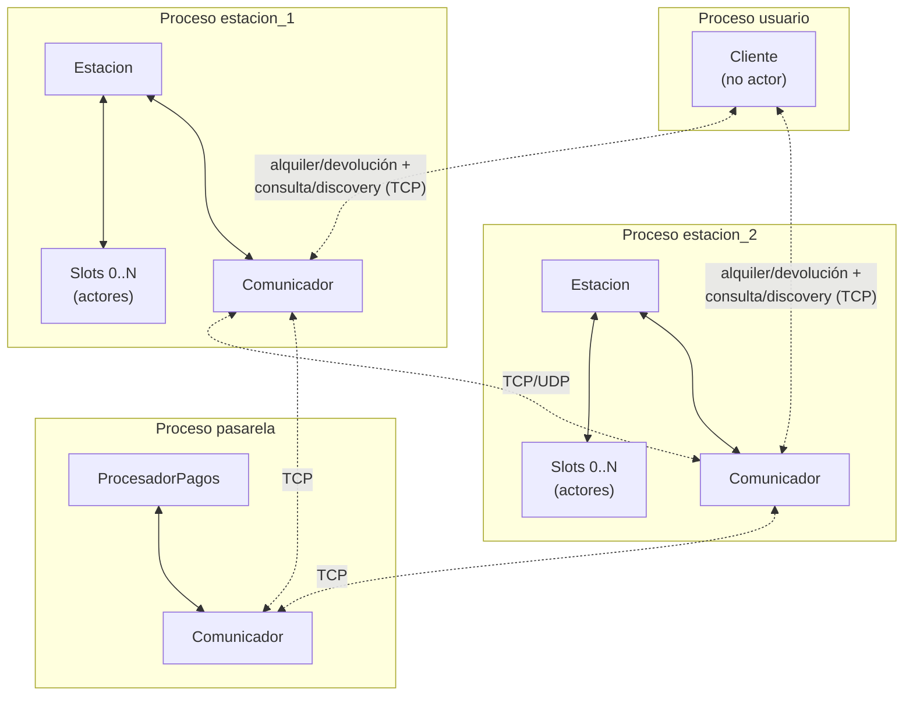

#### 12.2.2 Responsabilidades de la pasarela en casos borde — la estación destino cobra, no el líder

> *Comentario del corrector:* «Revisar las responsabilidades de la pasarela de pagos en los casos borde. No asignarle tareas que no estén relacionadas con su dominio. O tener una clara justificación de por qué la pasarela hace las cosas que hace.»

En el diseño original (CU2, sección 8.2) el **líder** era quien recibía `NotificarDevolucion`, llamaba a la pasarela con `ProcesarCobro` y resolvía el cierre. Eso ponía lógica de pagos en el líder, que no es su dominio, y lo dejaba en el **camino crítico** del cierre: si el líder se caía después de notificar la devolución, el cobro quedaba en el aire.

**Qué se hizo:** el cobro lo dispara ahora la **estación que recibe la bici** (la estación destino), que es quien naturalmente habla con la pasarela. El líder pasa a tener un rol acotado: buscar el alquiler en su registro y devolver los datos para cobrar.

El flujo nuevo:

1. La estación destino asegura la bici y manda `NotificarDevolucion` al líder.
2. El líder busca el alquiler y responde con `DatosParaCobro { rental_id, preauth_id, t0, estacion_origen }` (o `NoRegistradoAun` si todavía no lo tiene; ver §12.2.4 y huérfanas).
3. La estación destino llama ella misma a `ProcesarCobro` contra la pasarela.
4. Una vez cobrado, la destino notifica el cierre **a ambos**: al líder (`DevolucionProcesada`, para el registro) y a la estación de origen directamente (`CierreAlquiler`), reintentando cada uno hasta su ACK.

**Por qué cierra una ventana de falla:** una vez que la destino recibió `DatosParaCobro`, tiene todo lo necesario (`preauth_id`, `t0`, `estacion_origen`) para terminar la devolución por su cuenta. Si el líder se cae después de ese punto, la destino igual cobra, igual le manda `CierreAlquiler` directo al origen y reintenta `DevolucionProcesada` contra el líder (o el nuevo líder electo) cuando vuelva. Ambas notificaciones son idempotentes (por `rental_id` / `event_id`).

**Mensajes nuevos** (sección 5.4, entre estaciones): `DatosParaCobro` y `NoRegistradoAun`. La pasarela **dejó de recibir mensajes del líder**: `ProcesarCobro` ahora viene de la estación destino.

**`CobroFallido` se audita en la estación, no en la pasarela.** El diseño original ponía un resultado de cobro fallido como estado de la pasarela. Pero un `Prepare` rechazado (p. ej. una pre-autorización diferida que la pasarela rechaza por tarjeta inválida) **no deja ninguna pre-autorización que marcar**: el dato solo existe del lado de la **estación de origen**, que lo lleva como un contador `cobros_fallidos` para auditoría. La pasarela y el líder no guardan ese resultado.

**Diagrama de secuencia de CU2 (reemplaza al de la sección 8.2):**

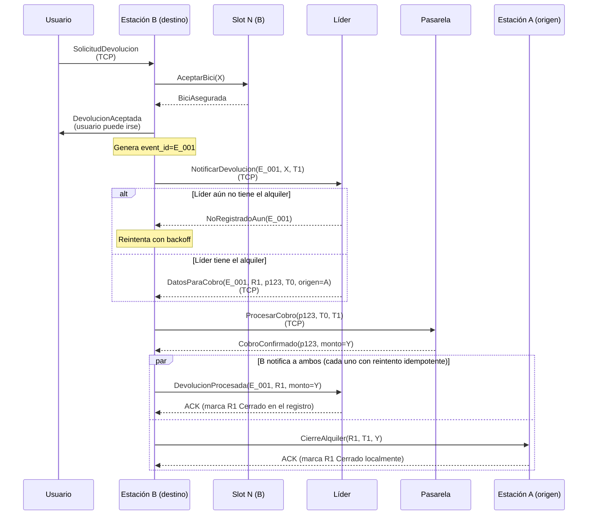

#### 12.2.3 Usuario sin conexión: distinción entre acceso local y global (CU5)

> *Comentario del corrector:* «Un usuario "sin conexión" no puede conectarse a la red de estaciones para consultar [...] el estado global de la red. Pero sí puede conectarse "localmente" a una estación que se encuentra físicamente cerca para retirar una bicicleta. [...] en la práctica la consulta a la red global podría ser por TCP y la conexión "local" también por TCP. Simplemente tienen que contemplar [...] el estado de la conexión y la distancia para distinguir ambos tipos de conexiones.»

El diseño original modelaba el estado del usuario solo como `SinBici` / `ConBici`, sin contemplar la falta de señal. Se agregó un segundo eje de estado:

```rust
enum ModoConectividad {
    Conectado, // puede alcanzar al líder para consultas de disponibilidad
    SoloLocal, // solo puede conectarse a estaciones físicamente cercanas
}
```

- En `Conectado`, el usuario puede descubrir al líder y consultar disponibilidad global (CU3).
- En `SoloLocal`, **no puede** consultar la red global (eso requiere alcanzar al líder), pero **sí puede alquilar y devolver** conectándose por TCP a una estación cercana. Ambas conexiones son TCP, como sugirió el corrector; la distinción es de **alcance** (a quién puede llegar), no de protocolo.

El modo se simula por consola con `desconectar` / `conectar` en la app del usuario.

**CU5 — Alquiler con usuario sin conectividad global:** el flujo dentro de la estación es idéntico al normal; la estación procesa el alquiler según **su propia** conectividad (CU1 si alcanza la pasarela, o Caso E si no — ver §12.2.4). Lo único que el usuario no puede hacer en `SoloLocal` es la consulta global.

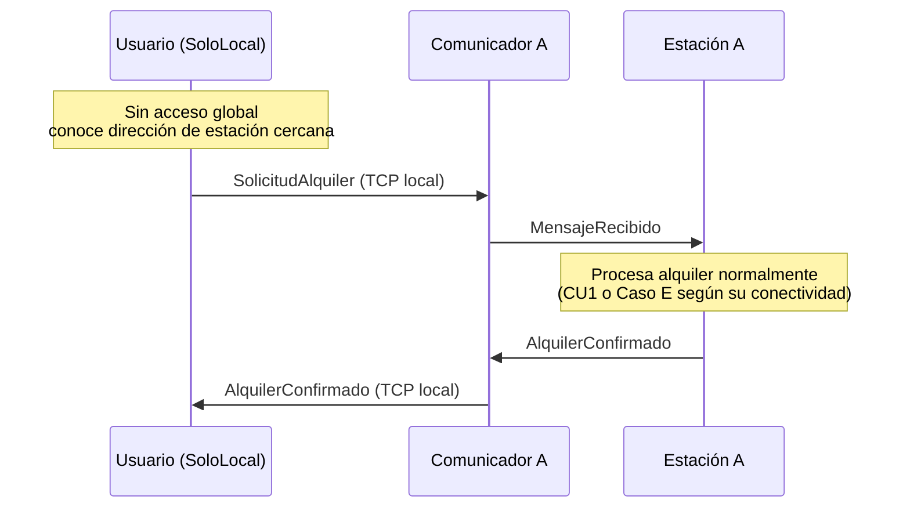

El comentario también aclara que «que una estación no tenga conexión con la red no quiere decir que no se pueda comunicar localmente con un usuario». Eso se cumple por construcción: la estación siempre escucha su socket TCP local y atiende a usuarios cercanos aunque no alcance al líder o a la pasarela.

#### 12.2.4 Pago de una estación sin conexión — alquiler offline y `PagoPendiente` (Caso E, CU6)

> *Comentario del corrector:* «Un usuario SÍ puede retirar una bici si la estación no tiene conexión [...]. Tendrán que manejar y justificar el caso sin conexión para los pagos de una estación. Registrar pago pendiente, o un enfoque que se les ocurra.»

El diseño original asumía que la pasarela siempre estaba alcanzable durante el alquiler. Se agregó el **Caso E** del 2PC: qué hacer cuando la estación no puede llegar a la pasarela.

**Qué se hizo.** Cuando la estación va a alquilar y la pasarela no es alcanzable, resuelve el alquiler **solo con el voto del `Slot`**, omitiendo al participante `ProcesadorPagos`. Esto ocurre en dos situaciones: (a) el `Comunicador` ya tenía marcada la pasarela como inalcanzable y omite el `Prepare` de entrada; o (b) intenta el `Prepare` pero la pasarela no responde dentro del plazo (cae a offline en ese mismo intento; ver §12.4.3). En ambos casos, la estación:

1. Registra el alquiler en `alquileres_propios` con `preauth_id = None`.
2. Persiste un `PagoPendiente` en disco.
3. Confirma el alquiler al usuario (que se lleva la bici).
4. **No reporta el alquiler al líder** (por la regla de abajo).
5. Cuando el `Comunicador` recupera el acceso a la pasarela, procesa cada `PagoPendiente`: obtiene la pre-autorización, completa el alquiler con el `preauth_id` real y recién entonces lo reporta al líder (`AlquilerAbierto`). **El cobro no ocurre acá**: sucede cuando la bici se devuelve, por el flujo normal de CU2.

```rust
/// Alquiler completado localmente sin pasar por la pasarela.
/// Se persiste en disco y se procesa cuando se restaura el acceso a la pasarela.
struct PagoPendiente {
    rental_id: RentalId,
    bici_id: BiciId,
    usuario_id: UsuarioId,
    tarjeta: DatosTarjeta,
    t0: Timestamp,
}
```

**Cambio de tipo asociado.** El campo `preauth_id` del `Alquiler` pasó de `String` a `Option<String>`: vale `None` mientras un alquiler offline no se regularizó.

**Regla clave: ningún alquiler se reporta al líder sin pre-autorización.** En el caso normal se cumple solo (el 2PC incluye la preauth antes de confirmar). En modo offline, el reporte al líder se **difiere** hasta obtener la preauth. Como consecuencia, el registro del líder solo contiene alquileres con `preauth_id` válido, y por eso el `preauth_id` que el líder entrega en `DatosParaCobro` (§12.2.2) puede ser `String` (nunca `None`).

**Nota de consistencia (la justificación que pedía el corrector).** En modo offline se relaja deliberadamente la atomicidad estricta del 2PC: la bici puede entregarse antes de que exista una pre-autorización confirmada. Es una decisión consciente que prioriza la **disponibilidad** (que el usuario pueda sacar la bici aunque la estación no alcance al banco) por sobre la atomicidad, en línea con el requerimiento del enunciado de funcionar desconectado. Si la pre-autorización diferida fracasa (tarjeta inválida), el alquiler queda registrado como `CobroFallido` en la auditoría de la estación de origen y no se cobra nunca.

**CU6 — Alquiler offline y posterior reconexión:**

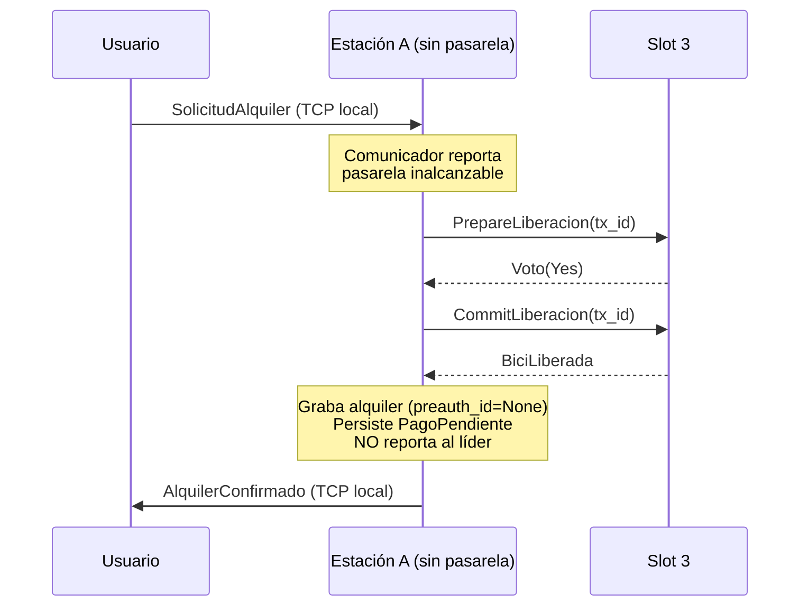

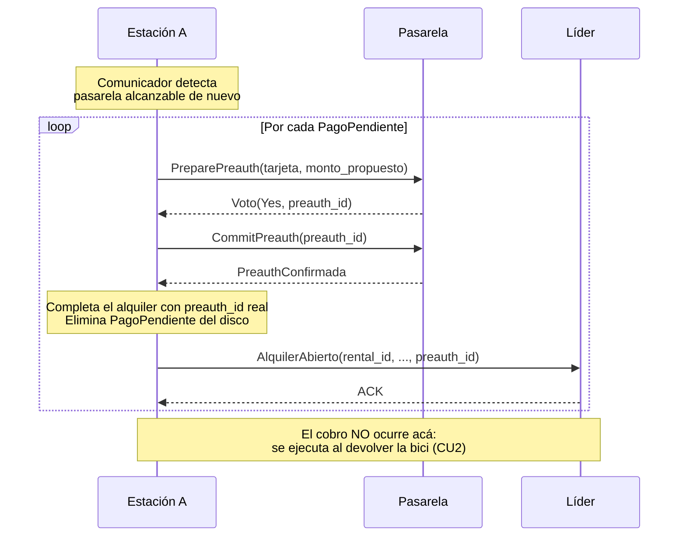

---

### 12.3 Cambios surgidos durante la implementación

Cambios que el diseño en papel no forzaba a tomar y aparecieron al escribir el código.

#### 12.3.1 Modelo de tiempo: `Instant` → `Timestamp`

El diseño usaba `std::time::Instant` para `inicio`/`fin` de los alquileres y los `T0`/`T1` que viajan por la red. `Instant` es **opaco y local a cada proceso**: no se puede serializar ni comparar entre máquinas. Como los timestamps de alquiler viajan por la red para calcular el cobro, se reemplazó por un `Timestamp` propio (milisegundos desde el epoch UNIX), serializable y comparable entre procesos. Todos los `Instant` de las secciones 4 y 5 se leen, en la implementación, como `Timestamp`.

#### 12.3.2 Reconciliación del Caso C con el Caso B, y timeouts como constantes

El diseño original (Caso C, sección 7.1.1) dejaba a la pasarela «esperando reintentos» indefinidamente y preveía una detección de «transacción huérfana a la hora». Al implementar se simplificó y se hizo consistente con el Caso B:

- El coordinador deja **constancia persistida de la decisión COMMIT antes de enviarla** (write-ahead). Si el `CommitPreauth` se pierde o el proceso se cae, un reintento periódico (5 s) lo completa al volver. El re-Commit es seguro porque la pasarela responde idempotentemente.
- La pasarela aplica el **mismo timeout de transacción del Caso B**: si la decisión no le llega en plazo, anula la pre-autorización y libera fondos. Si el reintento del coordinador llega después, recibe `PreauthAnulada`; ese alquiler ya no tiene preauth cobrable y la bici se resuelve por el protocolo de huérfanas al devolverse.

La «transacción huérfana a la hora» desapareció.

**Timeouts: de "configurables en runtime" a constantes con nombre.** El diseño los listaba como configurables. En la práctica quedaron como **constantes con nombre** en el código (los tests las acortan vía constructores `#[cfg(test)]` para no esperar los plazos reales):

| Timeout | Valor | Constante |
|---|---|---|
| Prepare → Voto | 3 s | `TIMEOUT_PREPARE` |
| Voto Yes → Commit/Abort | 10 s | `TIMEOUT_TRANSACCION` |
| Reintento de un Commit decidido sin confirmar | 5 s | `INTERVALO_REINTENTO_COMMITS` |
| Lectura de una consulta TCP (detecta proceso colgado) | 5 s | `TIMEOUT_LECTURA_TCP` |

#### 12.3.3 ACK explícito en el Ring y timeout de lectura TCP

El diseño no contemplaba un nodo **colgado** (vivo a nivel proceso pero que no procesa): acepta la conexión TCP a nivel kernel pero nunca responde. Sin un ACK, la elección se trababa en ese nodo. Se agregó `EventoProcesadoAck` a los mensajes del Ring (sección 5.4) y un **timeout de lectura** (`TIMEOUT_LECTURA_TCP`, 5 s) en las consultas TCP, que es lo que permite detectar a un líder colgado (no solo caído) y disparar la re-elección.

#### 12.3.4 Comunicador compartido; la cola al líder vive en la `Estacion`

- **Comunicador compartido.** El `Comunicador` pasó a vivir en la crate `comun`: tanto la estación como la pasarela usan el mismo manejo de sockets con framing. Trabaja con **bytes y direcciones** y reenvía cada payload al actor de negocio (vía un `Recipient`), que lo deserializa.
- **La `cola_para_lider` se mudó a la `Estacion`.** En el diseño la cola de diferidos vivía en el `Comunicador`. Pero el Comunicador, al ser compartido y agnóstico del dominio, no sabe quién es el líder. La cola pasó a la `Estacion` (`eventos_pendientes`), que sí sabe a quién reintentar (o se aplica el evento a sí misma si ganó la elección).
- **`ServiciosAlcanzables` se generalizó a un mapa por dirección.** En vez de un flag `{ pasarela, lider }`, el Comunicador lleva un `HashMap<SocketAddr, bool>` con el resultado de la última operación TCP saliente hacia cada destino, y re-sondea las direcciones caídas cada ~3 s para detectar que volvieron. Así sigue siendo agnóstico del dominio.

#### 12.3.5 Simplificación del protocolo de bicis huérfanas

El protocolo de huérfanas (sección 8.2.1) se mantuvo en su lógica pero quedó **dirigido por la estación destino** (es ella quien busca al dueño con `BuscarAlquilerPropio` / `AlquilerEncontrado` / `NoLoTengo`). Tres mensajes del diseño original resultaron innecesarios y se eliminaron: `AlquilerNoEncontrado`, `ReprocesarDevolucion` y `BiciHuerfanaConfirmada` (el reproceso es un mensaje interno de la propia destino y la confirmación de huérfana es un evento de auditoría local). También se eliminó `DevolucionCompletada` hacia el usuario: su interacción termina en `DevolucionAceptada`, y el cobro/cierre corren en background.

#### 12.3.6 Persistencia opt-in con escritura atómica

El diseño tenía `archivo_persistencia: PathBuf` siempre presente. En la implementación la persistencia es **opt-in**: se activa con `--estado <ruta>` en la estación y la pasarela, con escritura **atómica** (tmp + rename). El **rol y el `term` no se persisten** (se rearman por config + discovery/elección) y **los slots tampoco** (representan el estado físico de la dársena). Lo que sí sobrevive a un reinicio son los **alquileres propios**, los **pagos pendientes** (alquileres offline sin regularizar) y los **commits/eventos diferidos**.

**Cómo preservar el estado entre reinicios.** Hay que levantar el proceso con `--estado <archivo>` **desde el arranque** (no agregarlo recién en el reinicio): el archivo se escribe cuando hay un cambio de estado, así que si la primera corrida fue sin `--estado` no queda nada que recuperar. Tras un `Ctrl+C`, se vuelve a levantar con el mismo comando y recupera su estado.

```bash
# Levantar con persistencia (un archivo distinto por estación)
cargo run --release --bin estacion -- --id 1 --puerto 8001 --config estaciones.json --estado est1.json
cargo run --release --bin estacion -- --id 2 --puerto 8002 --config estaciones.json --estado est2.json
# La pasarela, igual:
cargo run --release --bin pasarela -- --puerto 9000 --config estaciones.json --estado pasarela.json
```

- **Un archivo de estado por proceso**: si dos estaciones apuntan al mismo archivo, se pisan.
- **Cada bandera va seguida de su valor.** Intercalar `--estado` entre `--config` y su archivo (`--config --estado estaciones.json`) hacía que `--config` tomara `--estado` como valor y el arranque fallara al no encontrar ese "archivo". El parser de argumentos ahora rechaza un valor que sea otra bandera (`--…`) y el error de config nombra el archivo que no pudo leer, así el problema queda explícito.
- Se admite un subdirectorio (`--estado data/est1.json`): si no existe, se crea al primer guardado.

#### 12.3.7 Envelope de mensajes usuario↔estación

Al eliminar el cloud, el usuario manda dos familias de mensajes a la misma estación por el mismo endpoint TCP: **operaciones** (alquiler/devolución) y **consultas** (discovery del líder y disponibilidad). Para distinguirlas se introdujo un envelope:

```rust
enum MensajeUsuario {
    Operacion(MensajeUsuarioAEstacion),
    Consulta(MensajeUsuarioAEstacionConsulta),
}
```

Las consultas (`PreguntarLider`, `ConsultaDisponibilidad`) y sus respuestas (`RespuestaLider`, `EnEleccion`, `LiderDesconocido`, `RespuestaDisponibilidad`) reemplazan a los mensajes usuario↔cloud y cloud↔líder de las secciones 5.2 y 5.3.

#### 12.3.8 Configuración en JSON en vez de TOML

El diseño mostraba la config en TOML. La implementación usa **JSON** para no depender de una crate extra de parsing, respetando la restricción de dependencias del enunciado. El mismo archivo lo usan los tres binarios.

#### 12.3.9 Reorganización de módulos

El actor `Estacion` creció lo suficiente como para dividirlo: su lógica se separó en submódulos por flujo (`estacion/alquiler.rs`, `estacion/devolucion.rs`, `estacion/recuperacion.rs`). La lógica del Ring quedó en `eleccion.rs` (sin red, testeable en aislamiento) y el registro del líder en `registro.rs`. Desaparecieron los módulos pensados para el cloud (`gateway.rs`) y se consolidaron helpers. Respecto del requerimiento «un tipo por archivo»: la mayoría de los tipos viven en su propio archivo; `estacion.rs` concentra unos pocos tipos auxiliares estrechamente acoplados a él (`RolEstacion`, `Alquiler` propio, `PagoPendiente`).

---

### 12.4 Cambios por las pruebas manuales (bugs de concurrencia)

Bugs que aparecieron operando el sistema a mano, con su corrección.

#### 12.4.1 Discovery del líder en la app robusto a caídas

El discovery del usuario preguntaba `PreguntarLider` solo a la **primera** estación de la config, que de ese modo era un punto único de falla para las consultas. Se corrigió para que pregunte a **cada** estación hasta que una responde (función `descubrir_lider`, testeable). Si la estación está viva pero en elección, devuelve `EnEleccion`/`LiderDesconocido` y el usuario reintenta.

#### 12.4.2 Discovery del líder al arrancar (anti split-brain)

El `term` solo protege a un ex-líder si **recibe** un mensaje del Ring. Pero una estación que se reinicia no recibe ninguno por sí sola, y como la config la designaba líder, volvía **creyéndose líder** → quedaban dos líderes. Se corrigió: al arrancar, cada estación pregunta a sus vecinas con `QuienEsLider` y adopta el líder/`term` vigente que le reporten (el de `term` mayor), reincorporándose como follower; solo si nadie responde (arranque en frío) conserva el bootstrap de la config. Mensajes nuevos: `QuienEsLider` / `LiderActual`.

#### 12.4.3 Pasarela que no responde → alquiler offline en el mismo intento

Un timeout del `Prepare` a la pasarela se trataba como un rechazo del alquiler, lo que obligaba al usuario a un segundo intento para entrar en modo offline. Se corrigió: un timeout de la pasarela ahora resuelve el alquiler **offline en el mismo intento** (Caso E, §12.2.4), priorizando la disponibilidad. Un `Voto No` real de la pasarela (tarjeta inválida) sigue abortando el alquiler.

#### 12.4.4 La devolución ya no cierra sin cobrar con la pasarela caída

Un cobro contra una pasarela inalcanzable cerraba la devolución con monto $0. Se corrigió: la estación destino **reintenta el cobro con backoff** hasta que la pasarela vuelve, y recién entonces cierra. La pre-autorización es idempotente, así que reintentar es seguro (si ya estaba cobrada, la pasarela devuelve el monto previo).

---

### 12.5 Limitaciones conocidas y mejoras futuras

- **Partición de red sin quórum (split-brain al sanar).** El discovery al arrancar (§12.4.2) cubre el **reinicio** de una estación, pero no una **partición** sin reinicio: si una estación se aísla y, al no ver al líder, se autoelige (el anillo no exige quórum/mayoría), al sanar la partición pueden quedar momentáneamente dos líderes hasta que una nueva elección propague un `Coordinator` de `term` mayor. Reconciliar dos líderes activos por `term` queda como mejora futura.
- **Pasarela única.** Sigue siendo un único proceso (como en el diseño). Su replicación queda como mejora futura.
- **Líder único global.** Para una red urbana grande convendría agrupar por zonas y elegir un líder por zona (ya mencionado en la sección 11).
- **Topología estática.** La membresía sigue viniendo de la config; el descubrimiento dinámico de estaciones queda fuera de alcance.

---

## 13. Testing y verificación

El diseño original no contemplaba la estrategia de pruebas. Para la entrega final el sistema se validó con **tests unitarios por crate** (la lógica de concurrencia aislada de la red, con timeouts acortados vía constructores `#[cfg(test)]`) y **tests end-to-end** que levantan los binarios reales como procesos separados y operan al usuario por su REPL. En total, ~81 tests unitarios + 3 e2e.

### 13.1 Tests unitarios (por crate)

| Módulo | Qué cubre | # |
|---|---|---|
| `estacion/eleccion.rs` | Algoritmo Ring sin red: acumulación de IDs, cierre del anillo, gana el mayor, incremento de `term`, adopción de `term` mayor/descarte de viejos, anillo de un nodo, dos elecciones simultáneas convergen | 14 |
| `estacion/estacion.rs` | 2PC completo (votos, abort, duplicados), devolución (cobro + cierre, `NoRegistradoAun`, reintento al volver la pasarela/el líder), modo offline (`PagoPendiente`, regularización, `CobroFallido`), caída/colgado del líder y reconstrucción del registro, huérfanas, persistencia, anti split-brain | 29 |
| `estacion/slot.rs` | Votos del slot, reserva/commit/abort, idempotencia de `Prepare`, timeout de reserva (Caso B), aceptar bici | 8 |
| `estacion/registro.rs` | Alta, búsqueda por bici y cierre en el registro del líder | 1 |
| `pasarela/procesador_pagos.rs` | Prepare válido/inválido, idempotencia por `tx`, cálculo de cobro idempotente, persistencia, anulación por timeout (Caso B) | 7 |
| `pasarela/tarifa.rs` | Base + por minuto; menos de un minuto cobra solo la base | 2 |
| `usuario/repl.rs` | Discovery del líder robusto: saltea la primera caída, todas caídas, vivas pero sin líder, una en elección | 4 |
| `usuario/usuario.rs` | Transiciones de estado (`SoloLocal`, con/sin bici, rechazo no cambia estado) | 4 |
| `comun/comunicador.rs` | Marca inalcanzable y re-sondeo, corte simulado descarta tráfico, intercambio TCP/UDP entre dos comunicadores | 3 |
| `comun/config.rs` | Parseo de config de ejemplo, búsqueda por id, dirección del líder | 3 |
| `comun/framing.rs` | Enmarcado/desenmarcado, mensaje partido en varios reads, varios mensajes en un buffer | 3 |
| `comun/persistencia.rs` | Round-trip, archivo inexistente → `None`, archivo corrupto → `None` | 3 |

### 13.2 Tests end-to-end

En `usuario/tests/e2e_repl.rs` se levantan los binarios reales (pasarela + estación + usuario) como procesos separados y se maneja al usuario por su REPL (comandos por stdin), verificando la salida. Es lo más cercano a operar el sistema a mano:

- `flujo_completo_por_la_repl` — alquiler y devolución de punta a punta.
- `alquilar_en_una_estacion_y_devolver_en_otra` — el caso de origen ≠ destino (CU2 real).
- `consulta_de_disponibilidad_por_la_repl` — discovery del líder + consulta (CU3).

### 13.3 Cómo correrlos

```bash
# Desde la raíz del workspace (compila todo antes de ejecutar)
cargo test
```

Los tests e2e requieren que los binarios estén compilados; `cargo test` desde la raíz los compila automáticamente antes de ejecutar.
