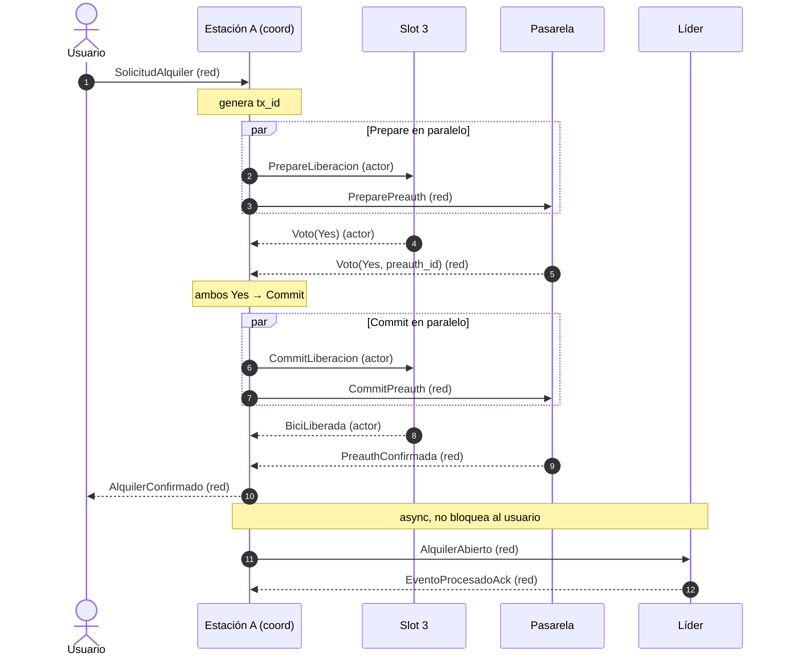
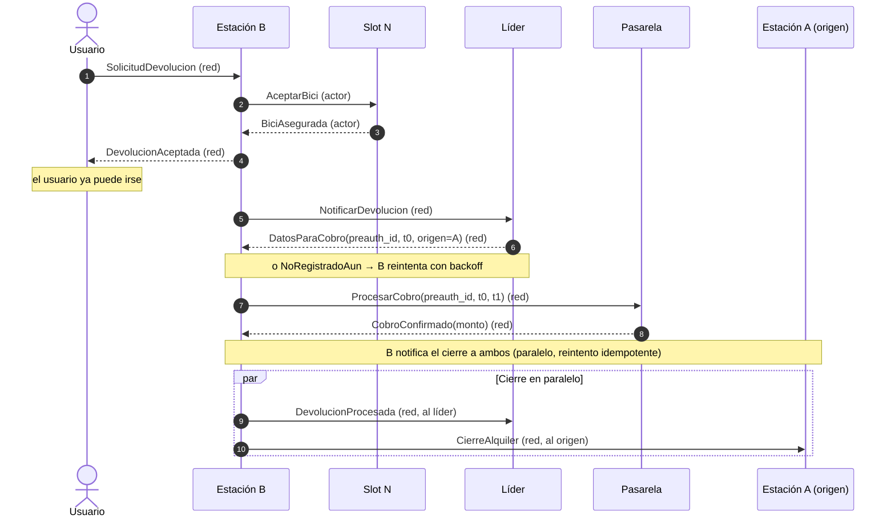
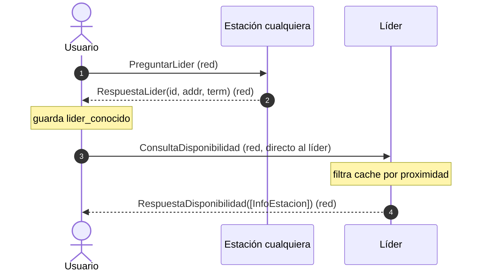
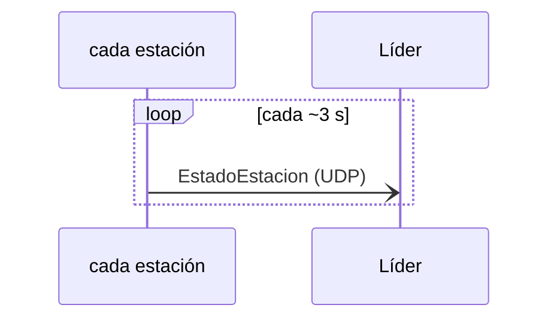
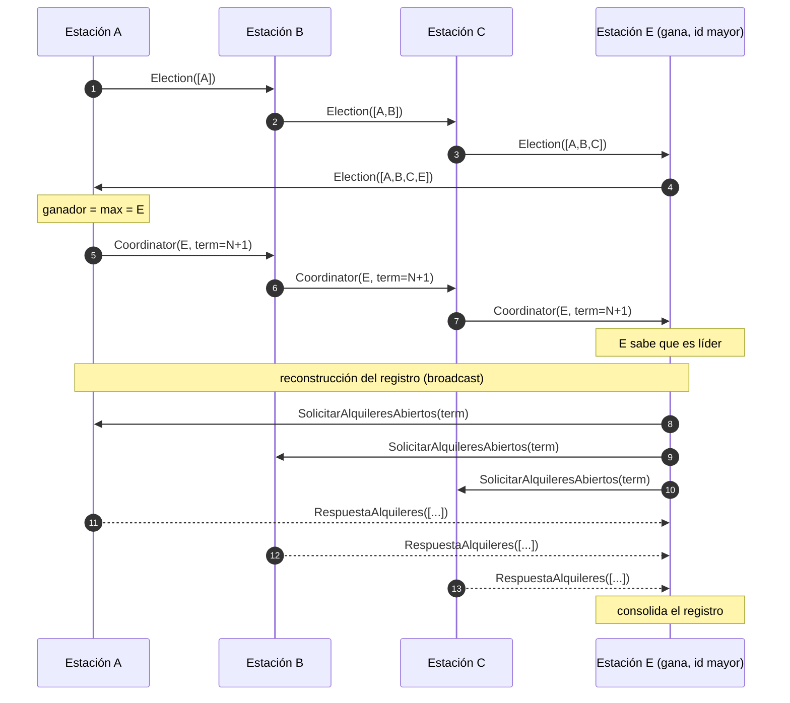

# Casos de uso y mensajes

Resumen práctico de los flujos del sistema, pensado para entender **qué mensaje se manda en cada paso**. Nos centramos en los **caminos felices**; los caminos de error (timeouts, abortos, caídas) están documentados en el `README.md` (secciones 7 y 8) y se implementan en las etapas de tolerancia a fallas.

Convención:
- **(red)** = mensaje que viaja por socket entre procesos (definido en `comun/src/mensajes/`).
- **(actor)** = mensaje interno entre actores del mismo proceso, vía `Addr` (definido en la crate de cada app: `estacion`, `pasarela`). Varios todavía no existen; se agregan en las etapas correspondientes.

Los cuatro casos de uso:

| CU | Nombre | Resumen |
|----|--------|---------|
| **CU1** | Alquiler | El usuario retira una bici de un slot. 2PC entre Slot y Pasarela. |
| **CU2** | Devolución | El usuario deja la bici en otra estación. El líder cierra el alquiler y cobra. |
| **CU3** | Consulta de disponibilidad | El usuario pregunta qué estaciones cercanas tienen bicis/slots. |
| **CU4** | Elección de líder | Las estaciones eligen un nuevo líder cuando el actual cae. |

---

## CU1 — Alquiler (camino feliz)

El usuario se acerca a un slot con bici y pide alquilarla. La estación coordina un **Two-Phase Commit** entre el `Slot` (libera la bici) y la `Pasarela` (pre-autoriza el pago). Si ambos votan `Yes`, se confirma.

**Mensajes que usa:**

| Paso | Mensaje | Tipo |
|------|---------|------|
| Pedido del usuario | `MensajeUsuario::Operacion(SolicitudAlquiler)` | red |
| Prepare al slot | `PrepareLiberacion { tx_id }` | actor |
| Prepare a la pasarela | `MensajeEstacionAPasarela::PreparePreauth` | red |
| Votos | `Voto(Yes)` (slot, actor) · `MensajePasarelaAEstacion::Voto` (red) | ambos |
| Commit al slot | `CommitLiberacion { tx_id }` | actor |
| Commit a la pasarela | `MensajeEstacionAPasarela::CommitPreauth` | red |
| Confirmaciones | `BiciLiberada` (actor) · `MensajePasarelaAEstacion::PreauthConfirmada` (red) | ambos |
| Respuesta al usuario | `MensajeEstacionAUsuario::AlquilerConfirmado` | red |
| Reporte al líder (async) | `MensajeEntreEstacionesTCP::AlquilerAbierto` | red |
| ACK del líder | `MensajeEntreEstacionesTCP::EventoProcesadoAck` | red |

**Resultado:** slot vacío, bici con el usuario, pre-autorización activa, alquiler registrado en la estación origen y en el líder.

---

## CU2 — Devolución (camino feliz)

El usuario llega a una estación distinta (B) y deja la bici en un slot vacío. **La Estación B es quien cobra**: asegura la bici, le pide al líder los datos del alquiler (`DatosParaCobro`), cobra a la pasarela, y notifica el cierre tanto al líder como a la estación de origen. El líder no toca la pasarela ni propaga el cierre: solo entrega los datos y actualiza su registro. Así, si el líder se cae después de dar los datos, B igual termina la devolución por su cuenta.

**Mensajes que usa:**

| Paso | Mensaje | Tipo |
|------|---------|------|
| Pedido del usuario | `MensajeUsuario::Operacion(SolicitudDevolucion)` | red |
| Asegurar la bici | `AceptarBici { bici_id }` → `BiciAsegurada` | actor |
| Aviso al usuario | `MensajeEstacionAUsuario::DevolucionAceptada` | red |
| Aviso al líder | `MensajeEntreEstacionesTCP::NotificarDevolucion` | red |
| Datos para cobrar | `MensajeEntreEstacionesTCP::DatosParaCobro` (o `NoRegistradoAun` → B reintenta) | red |
| Cobro (lo hace B) | `MensajeEstacionAPasarela::ProcesarCobro` → `CobroConfirmado` | red |
| Cierre al líder | `MensajeEntreEstacionesTCP::DevolucionProcesada` | red |
| Cierre al origen | `MensajeEntreEstacionesTCP::CierreAlquiler` | red |

> `DatosParaCobro` y `NoRegistradoAun` se agregan a `comun` en la etapa de la devolución (Etapa 4); por eso todavía no están en el código.

> **Bicis huérfanas:** si el líder recibe una `NotificarDevolucion` de una bici que no tiene en su registro, dispara el subprotocolo de bicis huérfanas (`BuscarAlquilerPropio` / `AlquilerEncontrado` / `NoLoTengo` / `AlquilerNoEncontrado` / `BiciHuerfanaConfirmada`). Camino de recuperación, no feliz.

---

## CU3 — Consulta de disponibilidad (camino feliz)

El usuario pregunta qué estaciones cercanas tienen bicis y slots libres. Ya **no hay proceso `cloud`** (se eliminó en la corrección de la 1ra entrega): el usuario descubre al líder preguntándole a cualquier estación de su config, y después le consulta directo. El líder responde con datos de su cache, que se alimenta de los snapshots `EstadoEstacion` que cada estación manda por UDP.

En paralelo, alimentando la cache del líder:

**Mensajes que usa:**

| Paso | Mensaje | Tipo |
|------|---------|------|
| Discovery | `MensajeUsuario::Consulta(PreguntarLider)` | red |
| Respuesta de discovery | `MensajeEstacionAUsuarioConsulta::RespuestaLider` | red |
| (si no hay líder aún) | `EnEleccion` / `LiderDesconocido` → el usuario reintenta | red |
| Consulta | `MensajeUsuario::Consulta(ConsultaDisponibilidad)` | red |
| Respuesta | `MensajeEstacionAUsuarioConsulta::RespuestaDisponibilidad` | red |
| Alimentación de la cache | `MensajeEntreEstacionesUDP::EstadoEstacion` | red (UDP) |

---

## CU4 — Elección de líder (camino feliz)

Cuando el líder cae (timeout), una estación arranca una elección por **algoritmo Ring**: hace circular un `Election` que acumula ids; el de id mayor gana; se anuncia con `Coordinator`; el nuevo líder reconstruye el registro pidiéndole a cada estación sus alquileres propios.

**Mensajes que usa:**

| Paso | Mensaje | Tipo |
|------|---------|------|
| Circular la elección | `MensajeEntreEstacionesTCP::Election { ids, iniciador }` | red |
| Anunciar al ganador | `MensajeEntreEstacionesTCP::Coordinator { lider, term }` | red |
| Pedir alquileres | `MensajeEntreEstacionesTCP::SolicitarAlquileresAbiertos { term }` | red |
| Responder alquileres | `MensajeEntreEstacionesTCP::RespuestaAlquileres { alquileres }` | red |
| Estación que se reincorpora tarde | `MensajeEntreEstacionesTCP::IngresoTardio` | red |

> Ya **no** existe el paso "anuncio al cloud" (paso 7 del Ring original): los usuarios que consultan durante una elección reciben `EnEleccion` / `LiderDesconocido` (ver CU3) y reintentan solos.

---

## Mapa rápido mensaje → CU

- **`usuario_estacion.rs`**: operaciones → CU1/CU2; consultas/discovery → CU3.
- **`estacion_pasarela.rs`**: `Prepare*`/`Commit*`/`Abort*Preauth` + `Voto` → CU1; `ProcesarCobro` + `Cobro*` → CU2.
- **`estacion_estacion.rs`**: `AlquilerAbierto` → CU1; `NotificarDevolucion`/`DatosParaCobro`/`NoRegistradoAun`/`DevolucionProcesada`/`CierreAlquiler` + `BuscarAlquilerPropio`/`AlquilerEncontrado`/`NoLoTengo` (huérfanas) → CU2; `Election`/`Coordinator`/`EventoProcesadoAck` (ACK del anillo)/`Solicitar*`/`Respuesta*`/`IngresoTardio` → CU4; `EstadoEstacion` (UDP) → CU3.
